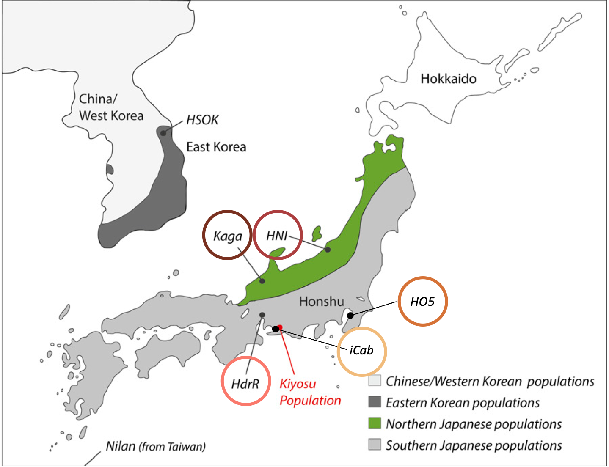
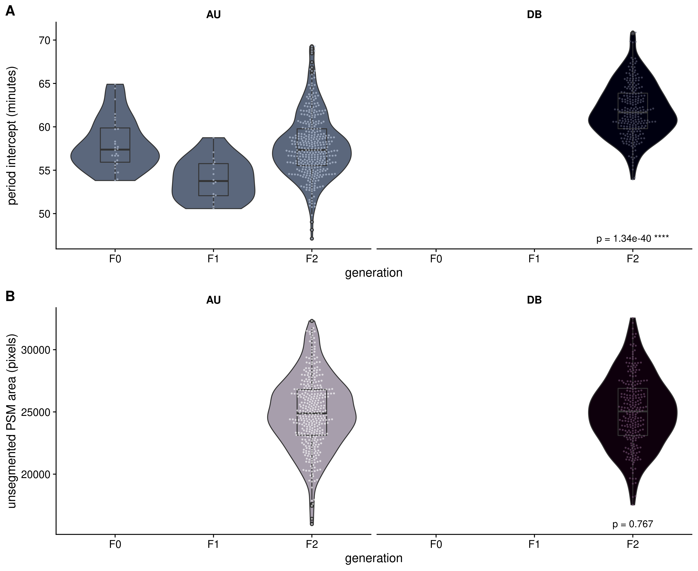
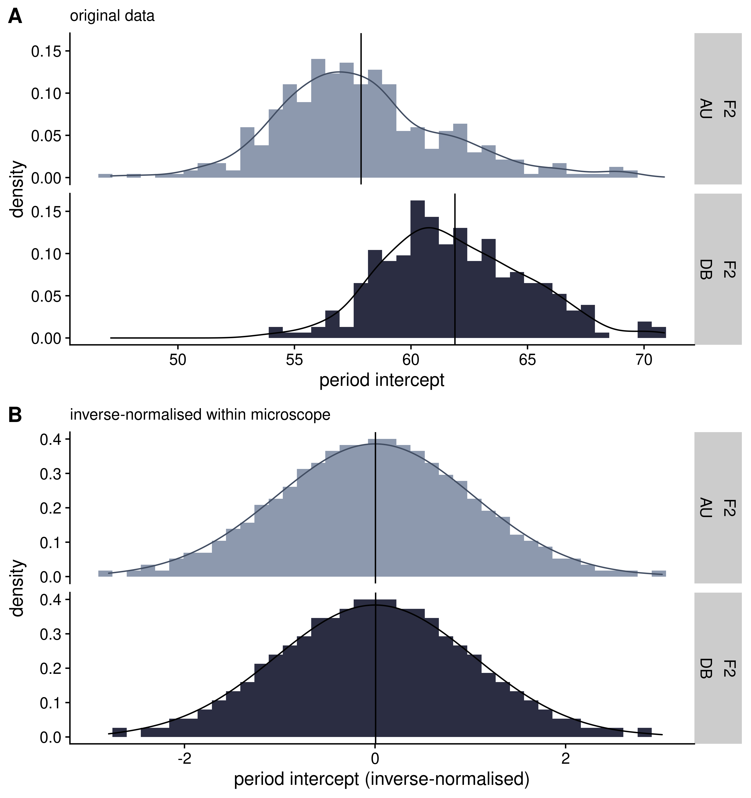
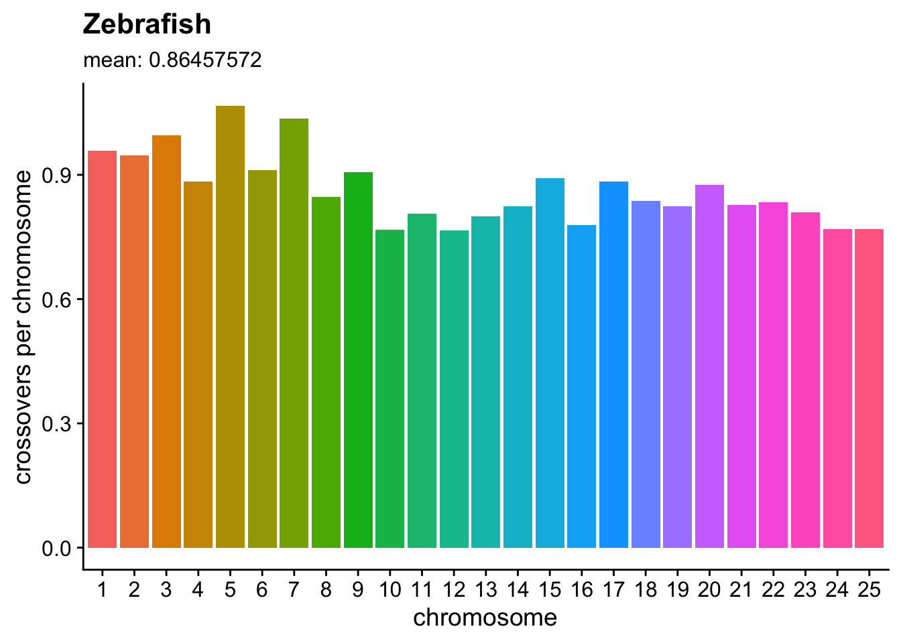

# About {-}

## Summary

Japanese courage: a genetic analysis of complex traits in medaka fish and humans

This thesis primarily explores how an individual's genes interact with the genes of their social companions to create differences in behaviour, using the Japanese medaka fish as a model organism. Chapter 1 sets out the introduction to the diverse topics covered in this thesis. 

Chapter 2 describes several genomic characteristics of the Medaka Inbred Kiyosu-Karlsruhe (MIKK) panel, which comprises 80 inbred lines of medaka that were bred from a wild population residing in Kiyosu, southern Japan. In this chapter I plot the inbreeding trajectory of the MIKK panel, and analyse its evolutionary relationship with other previously established inbred medaka strains; degree of homozygosity; rate of linkage disequilibrium decay; repeat content; and structural variation, all which relate to its utility for the genetic mapping of complex traits.

In Chapter 3, I use a custom behavioural assay to characterise and classify bold-shy behaviours in 5 previously established inbred medaka lines. Here I describe the assay, assess its robustness against confounding factors, and apply a hidden markov model (HMM) to classify the fishes' behaviours across a spectrum of boldness-shyness based on their distance and angle of travel between time points. I describe how the different lines differ in their behaviours over the course of the assay (a direct genetic effect) and how the behaviour of a single "reference" line (*iCab*) differs in the presence of different lines (a social genetic effect).

In Chapter 4, I explain how I applied this behavioural assay to the MIKK panel in order to identify lines that diverge in both their own bold-shy behaviours (the direct genetic effect) and the extent to which they transmit those behaviours onto their tank partners (the social genetic effect). I then describe how we used those divergent lines as the parental lines in a multi-way F2 cross in an attempt to isolate the genetic variants that are associated with both direct and social genetic effects.

In Chapter 5 I describe the bioinformatic processes and genetic association models used to map the variants associated with differences in the period of somite development, based on a separate F2 cross between the southern Japanese *iCab* strain, and the northern Japanese *Kaga* strain. 

Finally, in Chapter 6, I compare and rank all complex traits in the GWAS Catalog based on the extent to which their associated alleles vary across global human populations, using the Fixation Index (Fst) as a metric and the 1000 Genomes dataset as a sample of global genetic variation. In this chapter I set out the bioinformatic pipelines used to process the data, present the distributions of Fst for trait-associated alleles across the genome, and use the Kolmogorov-Smirnov test to compare the distributions of Fst across different traits.

Altogether, this thesis describes some of the genomic characteristics of both medaka fish and humans, and how those variations relate to differences in complex traits, with a particular focus on the genetic causes of adaptive behaviours and the transmission of those behaviours onto one's social companions.

<!--chapter:end:index.Rmd-->

---
zotero: ["PhD"]
bibliography: book.bib
---

# Introduction {#Introduction}

Humankind has long sought to understand the basis of biological variation. What gives rise to the wondrous variety of life forms on Earth? Why do individuals of a particular species differ from one another? How do children inherit traits that are similar to those of their parents, yet on the whole remain distinct from both their parents and their siblings? And are the traits we care about -- our health, our intelligence, our ability to thrive in a changing world -- pre-determined from birth, or continuously pliable throughout our lives? These questions fundamentally concern the natural laws of inheritance, which until  recently remained mysterious and obscure. As a consequence of rapidly-improving technologies, our ability to answer them is becoming increasingly tractable, yet the interplay between genes and environment are still the subject of controversy, especially in relation to human traits such as intelligence.

In this thesis, I explore the extent to which phenotypic variation is determined by an individual's own genes, and how it may be mediated by the genes of one's social companions. I provide particular focus on the phenotype of bold-type behaviours. As genetics is a relatively recent area of study, I first provide a brief history of the field, from the first theories of inheritance proposed by the Ancient Greeks, through Darwin's theory of evolution and Mendel's identification of the units of inheritance, the study of continuous variation by Galton, Pearson, and Fisher, and the "modern evolutionary synthesis"; early genetic mapping by Thomas Morgan and the extensive use of model organisms -- including medaka fish -- to eludicate the principles of genetic variation and inheritance; modern DNA sequences methods and Genome-Wide Association Studies (**GWAS**); and finally the combination of these traditional and modern genetic techniques to study direct and social genetic effects on bold-type behaviours in the medaka fish. 

## A brief history of genetics

### Ancient Greece

Throughout ancient history, the sources of biological variation were completely unknown. With limited technologies available to them, the Ancient Greek philosophers proposed theories for the inheritance of traits that they observed in humans. Around 500 BC, Pythagoras applied his knowledge of triangles to the question of how traits are inherited from one's parents. He proposed the theory known as "spermism", positing that hereditary information was passed down from parent to child via male sperm, with the female only providing the nutrients that would allow it to grow, and, like the theorem that bears his name, that these two sides of the "triangle" would determine the length of the third side: the characteristics of the child [@mukherjeeGeneIntimateHistory2016]. Over a century later, in 380 BC, Plato extended this metaphor in *The Republic* to argue that this principle could be applied in order to perfect humanity, by breeding perfect combinations of parents at perfect times [@mukherjeeGeneIntimateHistory2016]. 

Aristotle later joined the discussion with his treatise *Generation of Animals* [@aristotleGenerationAnimals2021], where he noted that children inherited features from their mothers as well as their fathers, raising cases where human skin colour and other traits from maternal ancestors could skip generations, and thus hereditary information must not only be transmitted through sperm. He suggested an idea of "movement" -- the transmission of information -- from the father's sperm, which sculpts the mother's menstrual blood in the same way a carpenter carves a piece of wood [@mukherjeeGeneIntimateHistory2016]. It was, however, impossible for Aristotle to deduce the form in which the information was conveyed.

### Medieval times

From medieval times through to the 1800s, the prevailing theory of heredity was that a tiny human -- a homunculus -- sat within the sperm, waiting to be inflated upon its introduction to a woman's uterus. But from where did each previous homunculus originate? Logically, the theory would require a homunculus to sit within another homunculus, *ad infinitum* [@mukherjeeGeneIntimateHistory2016]. The inventor of the microscope, Nicolaas Hartsoeker, even thought he observed a homunculus in a sperm he was studying (**Figure \@ref(fig:homunculus-pic)**). But what then triggered the expansion of the human form, involving the development of new parts from embryo to fetus? The answer could only have been some instruction, blueprint, or code, but any specifics remained out of reach.

(ref:homunculus-pic) Preformation, drawn by Nicolaas Hartsoeker in 1695. Image adapted from @homunculusImage.

<div class="figure">

<p class="caption">(\#fig:homunculus-pic)(ref:homunculus-pic)</p>
</div>

### Charles Darwin

During the early 1800s, the prevailing doctrine of the origins of biological variation was Creationism, based on Christianity's literal interpretation of the Bible's Book of Genesis [@campbellKingJamesBible2010]. Any mechanistic description of how species -- and individuals within the same species -- differed from one another was thought to threaten this doctrine, making inquiries of this kind potentially blasphemous, and therefore dangerous. [@mukherjeeGeneIntimateHistory2016]. 

In 1831, two months after graduating from the University of Cambridge, a 22-year-old English clergyman named Charles Darwin (**Figure \@ref(fig:charles-darwin-young-portrait)**) boarded the *HMS Beagle* to commence a voyage around the world that would last for almost five years. Darwin had previously studied medicine and theology, but was drawn to study the natural world, and had apprenticed with his fellow clergyman John Henslow, a botanist and geologist who curated the Cambridge Botanic Garden, who suggested that he join the *Beagle*'s exploratory survey of South America as the "gentleman scientist" they were seeking to assist with the collection of specimens [@mukherjeeGeneIntimateHistory2016]. 

(ref:charles-darwin-young-portrait) Portrait of Charles Darwin from the late 1830s by George Richmond [@charlesDarwinYoung].

<div class="figure">

<p class="caption">(\#fig:charles-darwin-young-portrait)(ref:charles-darwin-young-portrait)</p>
</div>

As the *Beagle* travelled down the eastern coast of South America, Darwin collected a vast amount of living specimens and ancient fossils -- including large extinct mammals such as the megatherium (**Figure \@ref(fig:megatherium)**) -- and shipped them back to England [@mukherjeeGeneIntimateHistory2016]. 

(ref:megatherium) Megatherium fossil collected by Charles Darwin, housed in the Natural History Museum, London. Photograph from @WhatWasMegatherium.

<div class="figure">

<p class="caption">(\#fig:megatherium)(ref:megatherium)</p>
</div>

After rounding Cape Horn and moving northward along the western coast of South America, the *HMS Beagle* eventually reached the Galápagos Islands on the coast of Peru, an archipelago of 18 islands formed from volcanic lava [@mukherjeeGeneIntimateHistory2016]. Over the course of five weeks, Darwin collected carcasses of birds, lizards, and plants [@mukherjeeGeneIntimateHistory2016]. Upon his return to England, Darwin was hailed as a minor celebrity among natural historians due to the collections of specimens he had gathered and shipped back [@mukherjeeGeneIntimateHistory2016]. John Gould -- the ornithologist who lent his (wife's) name to the Gouldian finch (**Figure \@ref(fig:gouldian-finch)**) -- told him that the various birds that Darwin thought were a variety of wrens, warblers, blackbirds, and "Gross-beaks" were in fact all 13 different species of finches [@mukherjeeGeneIntimateHistory2016].

(ref:gouldian-finch) The Gouldian Finch, an Australian native bird described by British ornithological artist John Gould in 1844 and named after his deceased wife Elizabeth [@bancroftPartIntroductionGouldian]. Photograph by Sarah R. Pryke, published in @prykeRedDominatesBlack2006.

<div class="figure">

<p class="caption">(\#fig:gouldian-finch)(ref:gouldian-finch)</p>
</div>

Each island had produced its own variant, and this caused Darwin to consider whether they had all arisen from a common ancestral finch, branching off like the boughs of a tree over time [@mukherjeeGeneIntimateHistory2016]. He understood that animal breeders took advantage of the natural variation in populations to select for desired traits, but he questioned what force had guided the development of these different varieties of finches in the wild [@mukherjeeGeneIntimateHistory2016].

(ref:darwin-finches) Illustration of variation in Galapagos finches by John Gould, published in @darwinNaturalistVoyageJournal1882. Image from @darwinFinches.

<div class="figure">

<p class="caption">(\#fig:darwin-finches)(ref:darwin-finches)</p>
</div>


In 1798, Thomas Malthus, a curate and amateur economist, had published a paper titled *An Essay on the Principle of Population*, in which he argued that the human population was in constant struggle with its limited resource pool, which in turn was affected by droughts, floods, epidemics, and diseases [@mukherjeeGeneIntimateHistory2016]. Darwin read the paper and identified this struggle for resources as the natural hand that selected those who possessed traits that would allow them to be more likely to survive [@mukherjeeGeneIntimateHistory2016]. 

In 1855, Alfred Russel Wallace (**Figure \@ref(fig:alfred-wallace)**) published a paper in the *Annals and Magazine of Natural History*. Like Darwin, he had set off on a voyage to distant lands, and had observed the stunning variation across the Malay Archipelago in populations separated by channels of water [@mukherjeeGeneIntimateHistory2016]. And like Darwin, he also derived his theory on the basis of this variation from Malthus's paper [@mukherjeeGeneIntimateHistory2016]. In June 1858, he sent a draft paper to Darwin outlining his general theory of evolution and natural selection [@mukherjeeGeneIntimateHistory2016]. Darwin panicked and sent both papers to Lyell, who advised Darwin to have both papers presented simultaneously at the meeting of the Linnean Society so that they could both be credited for the discovery [@mukherjeeGeneIntimateHistory2016]. 

(ref:alfred-wallace) Alfred Russel Wallace, taken around 1895. Image from @alfredWallace1895.

<div class="figure">

<p class="caption">(\#fig:alfred-wallace)(ref:alfred-wallace)</p>
</div>

The presentation made few waves at the time, but Darwin proceeded to complete his opus, *On the Origin of Species by Means of Natural Selection* [@darwinOriginSpeciesMeans1859]. The book was met with ecstatic reviews [@mukherjeeGeneIntimateHistory2016]. Yet two crucial questions remained: how was the variation within species generated in the first place, and how were the traits transmitted to future generations? [@mukherjeeGeneIntimateHistory2016]

### Gregor Mendel

Around the time the *Origin of Species* was published, the prevailing theory of heredity was promoted by the French biologist Jean-Baptiste de Lamarck (**Figure \@ref(fig:lamarck)**) [@mukherjeeGeneIntimateHistory2016]. Lamarck's theory involved the transmission of traits that were strengthened or weakened by environmental pressures in one generation -- such as a giraffe having to stretch its neck to reach the leaves on a canopy -- which was then passed down to subsequent generations as a form of "pre-adaptation" [@mukherjeeGeneIntimateHistory2016]. 

(ref:lamarck) Portrait of Jean Baptiste de Lamarck from 1802-1803 by Charles Thévenin [@lamarck1802].

<div class="figure">

<p class="caption">(\#fig:lamarck)(ref:lamarck)</p>
</div>

But by extending that logic, if a human had their arm amputated, their children would be born with shortened arms.^[This theory was experimentally tested by the German embryologist August Weismann, who amputated the tails of mice to determine whether the offspring would be born tailless. The offspring were all born with tails intact [@mukherjeeGeneIntimateHistory2016].] Darwin was convinced that selection acted upon *pre-existing* variation in a population, and proposed that that variation was transmitted by hereditary particles called *gemmules* [@mukherjeeGeneIntimateHistory2016]. During conception, he posited that the gemmules of each parent were blended, like paints. But such blending would result in a monochrome population, preventing the creation of the unique, outlying traits required to drive the variation he observed. Around this time Darwin had recorded notes on an obscure paper titled *Experiments in Plant Hybridization*, but he appeared to have inadvertently skipped the page containing a description of an obscure paper on pea hybrids by an Augustine monk called Gregor Mendel (**Figure \@ref(fig:mendel)**) [@mukherjeeGeneIntimateHistory2016].

(ref:mendel) Photograph from @mendelPhoto.

<div class="figure">

<p class="caption">(\#fig:mendel)(ref:mendel)</p>
</div>

Mendel had aspired to become a teacher, but had failed the teacher's exam multiple times, so in 1853 he had returned to the monastery in Brno, Morvia (in present day Czech Republic), and planted a crop of peas which he had been breeding for about three years [@mukherjeeGeneIntimateHistory2016]. He had collected 34 strains that bred "true", meaning that the offspring were identical to the parents in seven traits [@mukherjeeGeneIntimateHistory2016]:

1. the texture of the seed (smooth versus wrinkled)

1. the colour of seeds (yellow versus green)

1. the colour of the flower (white versus violet)

1. the position of the flower (at the tip of the plant versus the branches)

1. the colour of the pea pod (green versus yellow)

1. the shape of the pea pod (smooth versus crumpled)

1. the height of the plant (tall versus short)

Mendel referred to these alternative versions of a trait as *forms* -- biologists in the 1900s would later refer to them as *alleles*, from the Greek *allos*, referring to different subtypes of the same thing [@mukherjeeGeneIntimateHistory2016]. Mendel produced hybrids of plants with different alleles (known as the **F0** generation) to determine which allele the consequent offspring would possess. For eight years (1857-1864), he created hybrid crosses between the F0 strains (known as the filial 1 hybrid (**F1**) generation), and crossed those with each other too (known as the **F2** generation), recording their values for the above traits as we went [@mukherjeeGeneIntimateHistory2016]. He could soon identify patterns in the reams of data he generated:^[Based around 28,000 plants, 40,000 flowers, and almost 400,000 seeds.] for each of the above 7 traits, the filial 1 hybrid (**F1**) generation expressed only a single allele, which he referred to as the *dominant*; the hidden allele he referred to as *recessive*. However, in the F2 generation the recessive allele reappeared at a ratio of 1:3 [@mukherjeeGeneIntimateHistory2016]. 

From these results, Mendel inferred that the F1 hybrids must retain the information from both parents, while only expressing one version of them [@mukherjeeGeneIntimateHistory2016]. Then when the F1 generation was inter-crossed to produce the F2 generation, the recessive allele would only be expressed when inherited with another recessive allele [@mukherjeeGeneIntimateHistory2016]. In 1865, Mendel presented his paper *Versuche über Pflanzenhybriden* (Experiments on Plant Hybridization)  to a group of farmers, botanists and biologists at the Natural Science Society in Brno [@mukherjeeGeneIntimateHistory2016], and it was later published in the annual *Proceedings of the Brno Natural Science Society* [@mendelVersucheUberPflanzenhybriden1866]. He mailed out 40 copies of the paper to various scientific societies, but was only cited four times between 1866 and 1900, and virtually disappeared from scientific literature [@mukherjeeGeneIntimateHistory2016]. 

In 1900, a Dutch botanist named Hugo de Vries chanced upon Mendel's paper while working on plant hybrids [@mukherjeeGeneIntimateHistory2016]. Likely driven by self-interest in being credited for the discovery, he proceeded to publish his own findings without mentioning the work of Mendel [@mukherjeeGeneIntimateHistory2016]. He noted a patch of primroses named *Oenothera lamarckiana*^[An ironic twist given the plant was named after Lamarck.], which spontaneously generated variants, which he termed *mutants* [@mukherjeeGeneIntimateHistory2016]. It became clear to de Vries that variation in populations arose spontaneously, at random, rather than in the Lamarckian mode of contemporaneous reaction to environmental pressures [@mukherjeeGeneIntimateHistory2016]. De Vries's paper was read by Carl Correns, a botanist in Tübingen, Germany, who had also come across the work of Mendel, and pressured de Vries into acknowledging Mendel's work in the subsequent version of his publication [@mukherjeeGeneIntimateHistory2016].

A few years earlier, the English botanist William Bateson (**Figure \@ref(fig:bateson)**) had published a book titled *Materials for the study of variation* [@batesonMaterialsStudyVariation1901], in which he noted that biological variation occurs continuously for some traits, and dimorphically for others [@mukherjeeGeneIntimateHistory2016]. In 1900, while on a train from Cambridge to London, Bateson read the second version of de Vries's paper, and was immediately struck by the significance of Mendel's original study [@mukherjeeGeneIntimateHistory2016]. He independently confirmed Mendel's findings, and began to promote Mendel's work, including by publishing an English translation of Mendel's original paper [@drueryExperimentsPlantHybridization1901]. In 1905, Bateson coined a word for the study of these units of inheritance: *genetics*, from the Greek *genno*, meaning "to give birth" [@mukherjeeGeneIntimateHistory2016]. A few years later, in 1909, the botanist Wilhelm Johannsen coined a distinct word to denote the unit of inheritance: the *gene* [@mukherjeeGeneIntimateHistory2016]. 

(ref:bateson) Portrait of William Bateson, date and author unknown [@batesonPhoto].

<div class="figure">

<p class="caption">(\#fig:bateson)(ref:bateson)</p>
</div>

### Statistical genetics: Francis Galton, Karl Pearson and Ronald Fisher

Francis Galton (**Figure \@ref(fig:galton)**) was the cousin of Charles Darwin, born in the same year as Mendel (1822), and travelled to Egypt and Sudan in 1844, spurring his lifelong obsession with the differences between human races [@mukherjeeGeneIntimateHistory2016]. His reading of Darwin's *Origin of Species* in 1859 galvanised him, and he set out to explore the measurement and variance of heredity in humans, with an emphasis on height, intelligence, temperament, and physical prowess [@mukherjeeGeneIntimateHistory2016].^[Among Galton's somewhat eccentric activities, he would stroll through England and Scotland secretly tabulating beauty by ranking the women he met as "attractive", "indifferent," or "repellent" using pinpricks on a card in his pocket [@mukherjeeGeneIntimateHistory2016].] He coined the phrase *nature versus nurture* to distinguish between hereditary and environmental influences [@galtonMenScienceTheir1874a].

(ref:galton) Portrait of Francis Galton, taken in the 1850s or early 1860s, originally scanned from @pearsonLifeLettersLabours2011 [@galtonPhoto].

<div class="figure">

<p class="caption">(\#fig:galton)(ref:galton)</p>
</div>

Through surveys he sent out to men and women in the mid-1880s, he requested they mail him detailed measurements on the height, weight, eye colour, intelligence, and artistic abilities of parents, grandparents, and children in return for a substantial fee [@mukherjeeGeneIntimateHistory2016]. With this data he discovered that tall parents indeed tend to have tall children, albeit on average, although the distribution of heights within a generation fit the shape of a normal distribution, or 'bell-curve' [@mukherjeeGeneIntimateHistory2016]. In a surprising twist, he also discovered that the mean height of the sons of the tallest fathers tended to be slightly lower than the father's height, and closer to the population's average -- a phenomenon he described as *regression to the mean* [@mukherjeeGeneIntimateHistory2016]. The *ancestral law of heredity* sparked an intellectual war with Bateson, through which they attempted to reconcile the dominant/recessive theory with the quantitative theory proposed by Galton [@mukherjeeGeneIntimateHistory2016]. 

Spurred by a desire to apply this new science to the advancement of humankind, and by a fear the the "unfit" were outbreeding the "fit" [@taberyStruggleUnderstandInteraction2014], in 1883 Galton coined the term *eugenics* for his project to improve the human population through selective breeding [@watsonDNASecretLife2009]. It was his vision for a "science which deals with all influences that improve the inborn qualities of race" [@galtonEugenicsItsDefinition1904; @taberyStruggleUnderstandInteraction2014]. Driven by fear of a world overrun by imbeciles, he wrote:

> What nature does blindly, slowly and ruthlessly, man may do providently, quickly, and kindly. As it lies within his power, so it becomes his duty to work in that direction.

In the 1890s, in an attempt to tease out the respective contributions of nature and nurture, Galton proposed the first study on human twins. Since twins share identical genetic material, he reasoned, they represent a natural experiment where any substantial similarities between them could be attributed to genes, while any differences were the consequence of environment [@mukherjeeGeneIntimateHistory2016]. However, these studies were hampered by Galton's failure to distinguish between identical and non-identical twins.

In Galton's later years, he adopted the English mathematician Karl Pearson (**Figure \@ref(fig:pearson)**) as his protégé. From 1893 to 1904, Pearson built upon the work of his mentor, developing a number of statistical techniques for biometry, including the chi-squared test [@pearsonCriterionThatGiven1900], standard deviation [@pearsonIIIContributionsMathematical1894], correlation and regression coefficients [@pearsonMathematicalContributionsTheory1898], and establishing the foundations of principal components analysis [@pearsonLIIILinesPlanes1901]. Pearson extended the application of statistics beyond heredity and into the fields of inheritance, variation, correlation, and natural and sexual selection [@penceEarlyHistoryChance2015]. Pearson also inherited his mentor's enthusiasm for eugenics.

(ref:pearson) Portrait of Karl Pearson in 1910 [@pearsonPhoto].

<div class="figure">

<p class="caption">(\#fig:pearson)(ref:pearson)</p>
</div>

When Galton died in 1911, he bequeathed money to University College London for a Galton Eugenics Professorship, a position that was given to his protégé and biographer, the London-born Karl Pearson, who was also the head of the newly created Department of Applied Statistics [@kevlesNameEugenicsGenetics1995; @hardenGeneticLotteryWhy2021], the world's first university statistics department.

The mathematician Ronald Fisher (**Figure \@ref(fig:fisher)**) at Caius College in Cambridge began to apply his skills to elucidating how continuous traits, like height, could be driven by genetic variation [@mukherjeeGeneIntimateHistory2016]. In 1918, Fisher published his analysis in a paper entitled "The Correlation between Relatives on the Supposition of Mendelian Inheritance" [@fisherXVCorrelationRelatives1919], where he described how the combination of a large number of Mendelian alleles acting on the same trait would result in a normal distribution, and thereby sparked the field now known as *quantitative genetics*. This reconciliation between Mendelian inheritance and observed continuous traits was later referred to by Julian Huxley as the "modern evolutionary synthesis" [@huxleyEvolutionModernSynthesis1942; @taberyStruggleUnderstandInteraction2014].

* Fisher's work was also later supplemented by that of J. B. S. Haldane and Sewall Wright, who collectively created the field of population genetics [@provineOriginsTheoreticalPopulation2001; @taberyStruggleUnderstandInteraction2014].

* In @fisherXVCorrelationRelatives1919 he also developed the concept of *variance*, as the square of the standard deviation developed by Pearson.

<div class="figure">

<p class="caption">(\#fig:fisher)(ref:fisher)</p>
</div>

* In @fisherXVCorrelationRelatives1919, the author noted:

> For stuture the coefficient of correlation between brothers is about .54, which we may interpret by saying that 54% of their variance is accounted for by ancestry alone, and that 46% must have some other explanation.

* Fisher called this calculation an "analysis of variance", by which he could partition the *causes* of variation [@taberyStruggleUnderstandInteraction2014].

* Fisher later moved to the Rothamsted Agricultural Research Station in Harpenden, where he crerated many of the statistical methodologies -- such as tests of significance and the design of experiments -- that continue to be used by statisticians today [@taberyStruggleUnderstandInteraction2014]. 

* With Winifred A. Mackenzie, Fisher studies the response of 12 different potato varieties to different manure-based fertilizer treatments, where they set up a plot of two treatments (treatment/no treatment), with three replicate plots within each treatment, and three rows within each replicate plots with different manure treatments (either manure, manure + potassium sulfate, or manure + potassium chloride) [@fisherStudiesCropVariation1923]. From this data Fisher generated the first ANOVA table, listing the various causes of variation along with their respective contribution to total variation in crop yield [@taberyStruggleUnderstandInteraction2014].

* Interaction arose in the ANOVA if there was a deviation from the main effects adding up to fully accounting for the variation, in whcih case there was "non-additivity" [@taberyStruggleUnderstandInteraction2014].

* Fisher was also an ardent eugenicist. He helped create the Cambridge University Eugenics Society in 1911, hosting meetings in his rooms, organising public lectures by well-known eugenicists, assisting at the First Internvaional Eugenics Congress, and even delivering his own eugenic lectures [@mazumdarEugenicsHumanGenetics2005; @taberyStruggleUnderstandInteraction2014]. 

* He was also a member of the British Eugenics Society, and helped establish the Society's Committee for Legalising Sterilisation. His statistical innovations were developed in part to make eugenic assessments of the relative importance of nature and nurture when it came to evaluating traits like feeble-mindedness [@taberyStruggleUnderstandInteraction2014].

Eugenics policies were implemented in the United States, Sweden, Nazi Germany, and other countries, which resulted in the forced sterilisations and deaths of millions [@rutherfordHowArgueRacist2020].

Ultimately, eugenics was adopted as a policy by the Nazi regime, resulting in the genocide of around a million Jews, Poles, and Gypsies. The association between eugenics and the horrors of World War II became inextricable, and the eugenics movement was all but finished [@mukherjeeGeneIntimateHistory2016].

### Genetic mapping: Thomas Morgan, Tetsuo Aida and Theodosius Dobzhansky

There remained the question of where the gene resides. In the 1890s, Theodor Boveri, a German embryologist working with sea urchins in Naples, identified the chromosome as the location of the gene [@mukherjeeGeneIntimateHistory2016]. In 1907, on a trip to the United States to give talks on Mendel's discovery, he met the American cell biologist Thomas Hunt Morgan [@mukherjeeGeneIntimateHistory2016]. Morgan sought to extend Boveri's work by exploring the architecture of genes, using the fruit fly, *Drosophila melanogaster*, as a model organism [@mukherjeeGeneIntimateHistory2016]. 

Around 1905 Morgan began to breed *Drosophila*, identifying visible variants that he could track over generations, including white versus red eyes, forked versus straight bristles, sable-coloured bodies, curved legs; bent, bat-like wings; disjointed abdomens, and deformed eyes [@mukherjeeGeneIntimateHistory2016]. Through repeated crossing experiments, Morgan discovered that some genes were transmitted together at a higher rate than chance alone. He proposed that these genes were physically "linked" to one another, implying that they were situated on some string within the chromosome [@mukherjeeGeneIntimateHistory2016]. This advanced the understanding of a gene from a purely theoretical unit of inheritance to a physical unit [@mukherjeeGeneIntimateHistory2016]. He further discovered that, occasionally, a gene that was otherwise linked to another could "cross over" from one parental strand to the other, generating offspring with a mixture of parental alleles [@mukherjeeGeneIntimateHistory2016].

While Morgan was carrying out his experiments with *Drosophila*, Japanese researchers were also studying Mendelian inheritance with the Japanese medaka fish, *Oryzias latipes*. Following three articles published by three separate professors in Japanese on the recessive inheritance of medaka colour variants [@fukamachi100YearsMedaka2021], a teacher named Tatsuo Aida (**Figure \@ref(fig:aida)**) published the first article in English about medaka in 1921 [@aidaInheritanceColorFreshWater1921]. The study involved a total of 22 crosses of two generations, and among other findings discovered recombination between the X and Y chromosome -- the world's first demonstration in any species of Y-linked inheritance [@naruseMedakaModelOrganogenesis2011a]. The editor, William Castle, was so impressed by this last finding that he added the following footnote to the paper:

> It should be pointed out, in justice to the author, that his observations go beyond those of Schmidt in the important respect of showing the occurrence of crossing over between the X and the Y chromosome.

<div class="figure">

<p class="caption">(\#fig:aida)(ref:aida)</p>
</div>

(ref:aida-fig) Figure from @aidaInheritanceColorFreshWater1921 showing the different medaka colour variants used in the study.

<div class="figure">

<p class="caption">(\#fig:aida-fig)(ref:aida-fig)</p>
</div>

In the 1930s, Theodosius Dobzhansky (**Figure \@ref(fig:dobzhansky)**), a Ukrainian biologist who had trained with Morgan, used *Drosophila pseudoobscura* to investigate how genetic variation drove evolution [@mukherjeeGeneIntimateHistory2016]. Using a single population of flies that he raised in different temperatures while controlling for all other environmental variables, he found that after four months, the genetic ratios in the two sub-populations had changed [@mukherjeeGeneIntimateHistory2016]. Through this experiment, he determined that genetic variation was the norm across biology; that the adaptive benefit of a given variant would depend on the particular environment that an individual found itself in, and that most phenotypes were driven by many genes interacting with each other and the environment, while also subject to chance [@mukherjeeGeneIntimateHistory2016]. 

(ref:dobzhansky) Undated photo of Theodosius Dobzhansky from @coyneTheodosiusDobzhanskyHybrid2016, reprinted courtesy of UW-Madison Archives, #S05461.

<div class="figure">

<p class="caption">(\#fig:dobzhansky)(ref:dobzhansky)</p>
</div>

### The discovery of the structure of DNA

By the early 1940s, it was known that genes resided in chromatin, the mixture of proteins and nucleic acids that compose chromosomes. After some flirtation with proteins as the molecule of inheritance, Oswald Avery finally proved that it was in fact deoxyribonucleic acid (**DNA**) that was "the material substance of the gene" -- the "cloth from which genes were cut" [@mukherjeeGeneIntimateHistory2016].  After Rosalind Franklin, James Watson, and Francis Crick, and Maurice Wilkins (**Figure \@ref(fig:all-four)**) had discovered the structure of DNA using X-ray crystallography in 1953 [@mukherjeeGeneIntimateHistory2016]. The double helix also suggested a copying mechanism [@mukherjeeGeneIntimateHistory2016]. 

(ref:all-four) Composite image of Rosalind Franklin (1956), James Watson (1980s), Francis Crick (1980s) and Maurice Wilkins (early 1990s) from @DNAThenNow reprinted courtesy of Cold Spring Harbor Laboratory Library and Archive, James D. Watson Collection; Wilkins photo courtesy of TVNZ.

<div class="figure">

<p class="caption">(\#fig:all-four)(ref:all-four)</p>
</div>

### The development of DNA sequencing

Frederick Sanger (**Figure \@ref(fig:sanger)**), a biochemist at the University of Cambridge, applied a similar methodology as the one he used to decode the sequence of a protein to determine the sequence of a gene [@mukherjeeGeneIntimateHistory2016]. But rather than breaking the molecule down into its components, he reversed the process by identifying each base as it was added to the strand during DNA replication [@mukherjeeGeneIntimateHistory2016]. In 1977 he published what became known as the "Sanger method", using radio-labelled nucleic acids to identify the precise order and type of nucleotides that made up a DNA sequence [@sangerDNASequencingChainterminating1977], earning him a second Nobel prize in Chemistry in 1980 [@NobelPrizeChemistry].

(ref:sanger) Undated photo of Frederick Sanger from @sanger.

<div class="figure">

<p class="caption">(\#fig:sanger)(ref:sanger)</p>
</div>

These technological breakthroughs eventually led to the first draft of the human genome being published in 2001 by a large international consortium [@internationalhumangenomesequencingconsortiumInitialSequencingAnalysis2001a], while the full sequence (including heterochromatic regions) was only completed in 2022 [@nurkCompleteSequenceHuman2022]. The improvement in sequencing technologies has continued to progess to the stage where a $100 human genome is on the horizon [@pennisi100GenomeNew2022], and long-read technologies developed by Pacific Biosciences and Oxford Nanopore Technologies are allowing for single reads of over 2 megabases in length [@payneBulkVisGraphicalViewer2019] and the direct sequencing of DNA modifications [@wangNanoporeSequencingTechnology2021]. These developments are making genetic technologies ever more accessible and informative, paving the way for greater insights into the genetic basis of phenotypic differences. Yet despite these technological advances, the relative contribution of genetics and environment to differences in complex traits remains unclear -- especially in humans -- and is therefore an active area of research.

## Genetic and environmental causes of variation in complex traits

Individual differences in human traits have now been studied for more than a century, yet the causes of variation in human traits remain uncertain and controversial [@poldermanMetaanalysisHeritabilityHuman2015]. Specifically, the partitioning of observed variability into underlying genetic and environmental sources and the relative importance of additive and non-additive genetic variation continue to be debated [@poldermanMetaanalysisHeritabilityHuman2015].

A simplified causal model for the inheritance of traits from one's parents is presented in **Figure \@ref(fig:pheno-causal-model)**, adapted from @morrisPopulationPhenomenaInflate2020. The ancestry of each parent determines both their genotypes and phenotypes (yellow lines). The parents' genotypes directly affect their own phenotypes (black arrows genotype → phenotype). The parents then transmit half of each of their alleles *directly* to their offspring (black arrows from genotype → genotype), while the non-transmitted alleles also affect their offspring *indirectly* through their effect on the parents' phenotypes (red lines), a phenomenon known as "**dynastic effects**" [@kongNatureNurtureEffects2018]. In addition, the parents' phenotypes can be correlated through "**assortative mating**" (green line), which also has the consequence of creating correlations between the genotypes that affect those phenotypes [@howeGeneticEvidenceAssortative2019]. 

(ref:pheno-causal-model) Causal model of offspring phenotypes. Ancestry causes differences in both genotypes and phenotypes of the parents (yellow lines). Dynastic effects are transmitted through parental parental phenotypes (red lines). Assortative mating creates associations between the phenotypes of the parents (green line), which will also lead to genotypic correlations. Arrows represent direction of effect. Figure adapted from @morrisPopulationPhenomenaInflate2020.

<div class="figure">

<p class="caption">(\#fig:pheno-causal-model)(ref:pheno-causal-model)</p>
</div>

This model only includes environmental factors related to the parents' phenotypes, yet the phenotype of an individual is continuously affected by all other environmental influences it is exposed to throughout its lifetime [@plominNatureNurtureGenetic2005]. It is impossible to parse out the respective contributions of each of these factors at the individual level, but the problem becomes tractable by examining genotypic and phenotypic variation within groups of individuals.

### Heritability

Fisher's analysis of variance methodology allowed for the partitioning of variance into components that are attributable to different factors. If the total observed phenotypic variation within a population is represented by $V_{P}$, then it can be decomposed as follows with respect to genetic and environmental factors:

$$
V_{P} = V_{G} + V_{E}
$$
$V_{G}$ is the total proportion of phenotypic variance attributable to genetic factors, $V_{E}$ is that attributable to environmental factors (i.e. all non-genetic factors). *Broad-sense heritability* ($H^2$) measures the proportion of phenotypic variance that is attributable to genetic factors [@falconerIntroductionQuantitativeGenetics1996]:

$$
H^2 = \frac{V_G}{V_P}
$$

*Narrow-sense heritability* ($h^2$) measures the proportion of phenotypic variance attributable to *additive* genetic variance, excluding variance caused by Mendelian dominant/recessive phenomena, and epistasis (the interaction of alleles at different loci) [@batesonMendelPrinciplesHeredity1909; @falconerIntroductionQuantitativeGenetics1996; @posthumaTheoryPracticeQuantitative2003]:

$$
h^2 = \frac{V_A}{V_P}
$$

As heritability is measured as a fraction of total phenotypic variance, it is liable to change depending on the level of environmental variation present in the study population [@visscherHeritabilityGenomicsEra2008]. However, for a given study population, and assuming they individuals are raised under the "normal" range of environmental circumstances, one can subtract the environmental variance ($V_E$) from the total phenotypic variance ($V_P$) to give an estimate of the trait's heritability $V_G$ [@falconerIntroductionQuantitativeGenetics1996].

Environmental variance cannot be removed experimentally because it includes by definition all non-genetic variance, and much of this is beyond experimental control. However, elimination of genotypic variance can be achieved experimentally [@falconerIntroductionQuantitativeGenetics1996] by either using human or animal identical twins, or by creating highly inbred lines.

In humans, the twin study design has been used widely to disentangle the relative contributions of genes and environment for a variety of traits. The classical twin design is based on contrasting the trait resemblance of monozygotic (**MZ**) and dizygotic (**DZ**) twin pairs [@poldermanMetaanalysisHeritabilityHuman2015]. MZ twins share approximately 100% of genotypes, whereas DZ twins, like siblings, share on average 50% of their genotypes [@knopikBehavioralGenetics2019]. Assuming they share the same environment (an point I return to below), a rough estimate of heritability can be obtained by comparing the respective correlations of MZ twins and DZ twins with the phenotype of interest. If $r_{MZ}$ and $r_{DZ}$ are the correlation coefficients observed between pairs of MZ and DZ twins for a trait of interest, $h^2$ = additive genetic influences, and $C$ = common environmental influences, then Falconer's formula tells us:

$$
r_{MZ} = h^2 + C \\
r_{DZ} = \tfrac{1}{2}h^2 + C \\
\tfrac{1}{2}h^2 = r_{MZ} - r_{DZ} \\
\mathrm{Therefore}: \\
h^2 = 2\times(r_{MZ} - r_{DZ})
$$
Narrow-sense heritability $h^2$ can therefore be estimated by doubling the difference between the correlation coefficients of MZ versus DZ twins. A 2015 meta-analysis of virtually all human twin studies that had been performed to that date included 2,748 twin studies assessing ~18,000 traits and ~14.5M twin pairs. The results showed that across all traits, $h^2$ is 0.488 and $C$ is 0.174 [@poldermanMetaanalysisHeritabilityHuman2015]. Moreover, in 69% of studies $2r_{DZ} = r_{MZ}$ (implying that the shared environment $C$ is equivalent across both MZ and DZ twin pairs). This suggests that for most traits, shared environmental or non-additive genetic variation do not make a substantial contribution to phenotypic variation. 

However, that study found that several behavioural traits were inconsistent with this model. These traits included conduct disorder, higher-level cognitive functions, mental and behavioural disorders due to the use of alcohol or tobacco, anxiety disorder, and weight maintenance. For these traits, either or both non-additive genetic influences or shared environmental influences are therefore needed to explain the observed patterns of twin correlations [@poldermanMetaanalysisHeritabilityHuman2015]. Indeed, @kongNatureNurtureEffects2018 showed that parents' non-transmitted alleles can affect a child through their impacts on the parents and other relatives, a phenomenon the authors call "genetic nurture", comprising 29.9% of the transmitted polygenic score.

Beyond twin-studies, the advent of next-generation sequencing technologies has enabled the dense genotyping of large samples of individuals, leading to the development of new methods for analysing the genetic influences on human traits. The most widespread of these methods is known as the Genome-Wide Association Analysis (**GWAS**).

### Genome-Wide Association Analysis (GWAS)

GWAS aim to identify genetic variants associated with traits by comparing the allele frequencies of individuals who share similar ancestries, but differ in values for the trait in question [@uffelmannGenomewideAssociationStudies2021]. As of 2021, over 5,700 GWAS have been performed for more than 3,330 human traits [@uffelmannGenomewideAssociationStudies2021]. 

The standard GWAS process involves first genotyping individuals using SNP microarrays, which target common genetic variants, or by sequencing their full exomes or genomes, respectively referred to as Whole Exome Sequencing (**WES**) and Whole-Genome Sequencing (**WGS**). One then uses principal components analysis (**PCA**) to restrict the analysis individuals who share common ancestry, in order to avoid population stratification effects [@uffelmannGenomewideAssociationStudies2021]. Missing genotypes can be imputed using a genetic reference panel such as the 1000 Genomes Project [@10002015global]. Finally, an association test can be run, which includes an individual-specific random effect term to account for genetic relatedness among individuals.

Since it became possible to sequence the genotypes of individuals at scale, it has been an ongoing point of debate as to how best to model the effects that genetic variants have on a trait of interest. The standard linear regression model now used for GWAS can be written as follows:

$$
\textbf{Y} \sim \textbf{W} \alpha ~+~{X_s}{\beta_s} + g + e \\
g \sim N(0,\sigma^2_A\psi) \\
e \sim N(0,\sigma^2_e \textbf{I})
$$
where, for each individual, $\textbf{Y}$ is a vector of phenotype values, $\textbf{W}$ is a matrix of covariates including an intercept term, $\alpha$ is a corresponding vector of effect sizes, $X_s$ is a vector of genotype values for all individuals at SNP $s$, $\beta_s$ is the corresponding fixed effect size of genetic variant $s$ (also known as the SNP effect size), $g$ is a random effect that captures the polygenic effect of other SNPs, $e$ is a random effect of residual errors, $\sigma^2_{A}$ measures additive genetic variation of the phenotype, $\psi$ is the standard genetic relationship matrix, $\sigma^2_e$ measures residual variance, and $\textbf{I}$ is an identity matrix [@uffelmannGenomewideAssociationStudies2021]. 

Population structure and unequal relatedness among individuals in a given cohort can lead to false discoveries [@ewensTransmissionDisequilibriumTest1995; @membersofthecomplextraitconsortiumNatureIdentificationQuantitative2003]. This is because individuals who share common ancestries will share both variants that do affect the trait of interest, and variants that do not, and these variants will be correlated with one other due to that shared ancestry. Therefore, if an association is found between the causal variants and a trait of interest, the non-causal variants that are correlated with the causal variants will also be found to be statistically associated with the trait.

GWAS output a $p$-value and directional effect size (commonly denoted as $\beta$) for each tested SNP. Significance of SNPs are determined by either Bonferroni correction ($\alpha / M_{SNPs}$, commonly set as $p < 5 \times 10^{-8}$ for human studies), or by running permutations of the phenotype (and covariates) and selecting the lowest $p$-value from those permutations as the significance threshold.

The summed effect sizes of significant SNPs should theoretically reach the heritability estimates from twin studies, however until recently they fell far short, leading to a discussion on the sources of this "missing heritability" [@manolioFindingMissingHeritability2009]. GWAS are limited by sample size, as extremely large samples are required to detect rare variants, and variants with small effect sizes. Short-read sequencing technologies are also unable to detect large "structural" variants, which may have large effects on the phenotype of interest. However, this issue has largely been resolved through improvements in genotyping [@yangCommonSNPsExplain2010], and tools such as GCTA which estimates the variance explained by *all* SNPs in the genome, rather than testing the association of individual SNPs that may be in linkage disequilibrium with each other [@yangGCTAToolGenomewide2011].

### Animal models

It is unfeasible to explore the relationship between genes and environment experimentally in humans due to the insufficient ability to manipulate either class of variables. Since the rediscovery of Mendel's work, researchers have resorted to using model organisms, with which it is possible to control for both. 

The genetics of model organisms may be controlled to a degree by establishing inbred strains. Mendel used self-fertilising plants, which without sexual reproduction are effectively inbred strains. At that time, inbred strains of mammals were unknown. But through the repeated mating of siblings over successive generations, as the individuals within each line inherit the same same haplotype from their related parents, they become almost genetically identical to one another, with the added benefit that their genotypes can be replicated across time in subsequent generations. 

In the early 1900s, researcher began to develop inbred lines of guinea pigs and mice for the purpose of genetic research. In 1906, an inbreeding experiment involving guinea-pigs was started by George M. Rommel of the Animal Husbandry Division of the United States Department of Agriculture [@eatonQuartercenturyInbreedingGuineapigs1932]. The experiment was taken over in 1915 by Sewall Wright, who used them to develop his mathematical theory of inbreeding, eventually introducing the inbreeding coefficient $F$ as the correlation between uniting gametes in 1922 [@wrightCoefficientsInbreedingRelationship1922].
  
Contemporaneously, the Harvard undergraduate Clarence Cook Little and his supervisor William Ernest Little collaborated with Abbie Lathrop, a breeder of fancy mice and rats which she marketed to rodent hobbyists and keepers of exotic pets, and later began selling in large numbers to scientific researchers [@steensmaAbbieLathropMouse2010]. In 1902, Castle bought some of Lathrop's mice for his laboratory [@steensmaAbbieLathropMouse2010]. The most frequently used laboratory mouse strain for the past 80 years, C57BL/6J ("Black J"), is derived from one of Lathrop's animals -- mouse number 57 -- bred by Little [@steensmaAbbieLathropMouse2010].

The utility of inbred strains eventually led to the establishment of "panels" of inbred strains for several model organisms including the thale cress (*Arabidopsis thaliana*) [@bergelsonIdentifyingGenesUnderlying2010], common bean (*Phaseolus vulgaris L*) [@johnsonSegregationPerformanceRecombinant1999], tomato (*Lycopersicon esculentum*) [@saliba-colombaniEfficiencyRFLPRAPD2000], maize (*Zea mays*) [@limamiGeneticPhysiologicalAnalysis2002], nematode (*Caenorhabditis elegans*) [@evansQTLGeneElegans2021], fruit fly (*Drosophila melanogaster*) [@mackayChartingGenotypePhenotype2018], and mouse (*Mus musculus*) [@saulHighDiversityMousePopulations2019].

Although the mouse is an appropriate model for humans due to their orthologous mammalian organ systems and cell types, inbred strains of this organism descend from individuals that had already been domesticated, and therefore do not represent the genetic variation present in wild populations. Furthermore, the large panels of inbred mice such as the Collaborative Cross (**CC**) [@threadgillCollaborativeCrossRecombinant2011], Diversity Outcross (**DO**)[@svensonHighResolutionGeneticMapping2012] and B6-by-D2 (**BXD**)[@peirceNewSetBXD2004] are derived from only a small number of individuals. As gene-environment studies seek to ultimately understand their effects on traits "in the wild" (such as with humans), there is accordingly a need for a panel of inbred vertebrates that represents the genetic variation present in natural populations.

### The Medaka Inbred Kiyosu-Karlsruhe (MIKK) panel

The medaka fish (*Oryzias latipes*) has been studied as a model organism in Japan for over a century [@wittbrodtMedakaModelOrganism2002], and is gaining recognition elsewhere as a powerful genetic model for vertebrates [@spivakovGenomicPhenotypicCharacterization2014]. In addition to possessing a number of desirable traits that are characteristic of model organisms (including their small-size, short reproduction time, and high fertility), medaka are also – uniquely among vertebrates – resilient to inbreeding from the wild. 

This resilience to inbreeding has allowed (predominantly Japanese) researchers to develop several inbred strains that have been maintained for over 100 generations. One of the most famous inbred medaka strains, *HdrR*, was derived from Tatsuo Aida's collection of southern Japanese medaka fish [@fukamachi100YearsMedaka2021]. Other prominent strains include *HO5* and *iCab* from southern Japan, and *Kaga* and *HNI* from northern Japan. The locations of the originating populations of these strains are set out in **Figure \@ref(fig:line-locations)**. 

(ref:line-locations) Image adapted from [@spivakovGenomicPhenotypicCharacterization2014], showing the locations of the originating populations of the 5 inbred medaka lines used in this study. 

<div class="figure">

<p class="caption">(\#fig:line-locations)(ref:line-locations)</p>
</div>

Since 2010, the Birney Group at EMBL-EBI, in collaboration with the Wittbrodt Group at COS, University of Heidelberg and the Loosli Group at the Karlsruhe Institute of Technology (KIT), have been working to establish the world’s first panel of vertebrate inbred strains – now known as the Medaka Inbred Kiyosu-Karlsruhe Panel (**MIKK panel**). The MIKK Panel was bred from a wild population caught near Kiyosu in Southern Japan, and now comprises 80 inbred, near-isogenic "lines" [@fitzgeraldMedakaInbredKiyosuKarlsruhe2022].

The MIKK Panel was created to map genetic variants associated with quantitative traits at a high resolution, and to explore the interactions between those variants and any environmental variables of interest. The purpose of the companion papers @fitzgeraldMedakaInbredKiyosuKarlsruhe2022 and @legerGenomicVariationsEpigenomic2022 was to introduce the MIKK panel to the scientific community, and describe the genetic characteristics of the MIKK panel that would make it a useful resource for other researchers who wish to explore the genetics of quantitative traits in vertebrates. My contributions to these papers involved visualising the inbreeding trajectory of the panel (Chapter \@ref(inbreeding-sec)), exploring the evolutionary history of the MIKK panel's founding population (Chapter \@ref(introgression-sec)), measuring the levels of homozygosity across the panel (Chapter \@ref(nuc-div)), assessing its allele-frequency distribution and rate of linkage disequilibrium (LD) decay (Chapter \@ref(ld-decay-sec)), and characterising the structural variants present in a smaller sample of lines using Oxford Nanopore long-read sequencing data (Chapter \@ref(mikksv-sec)).

The fundamental utility of the MIKK panel arises from:

  a. its representation of the genetic variation that exists in a wild population. 
  
  a. the ability to replicate individuals with near-identical genotypes, allowing one to modify environmental variables while keeping the genetics constant to determine the strength of those environmental effects.
  
  a. the presence of numerous inbred lines that can by placed in the same environment, allowing one to infer the strength of the genetic effect
  
  a. the enrichment of rare variants, which are likely to have a larger effect size [@parkDistributionAlleleFrequencies2011; @theuk10kconsortiumUK10KProjectIdentifies2015], and are therefore more more likely to be discovered.

### The F2 cross

The F2 cross is a traditional method for mapping genetic variants associated with traits of interest. A schema for the method is presented in **Figure \@ref(fig:F2-cross-schema)**. In essence, it involves starting with two inbred strains that diverge for the trait of interest (the 'parental strains', or F0 generation F0). One then crosses the parental strains to create a generation of F1 hybrid individuals who each possess, for every pair of their chromosomes, one chromosome from each of their parents. The individuals in this F1 generation are genetically identical to their parents with respect to their germ line. Finally, one inter-crosses the F1 generation to create a set of F2 individuals that share unique combinations of the original F0 strains' genotypes, and tend to display values for the trait of interest that span across the spectrum between the extreme values of their parents.

(ref:F2-cross-schema) Schema of the F2-cross experimental setup. The F0 generation comprises two medaka strains that have extreme, opposing values for a trait of interest, represented by the colours red and blue. Below them is an illustrative single pair of chromosomes. The chromosomes within each pair are depicted as the same colour, as the strains are homozygous through successive generations of inbreeding. Their F1 offspring is heterozygous for each pair of their 24 chromosomes, and all F1 individuals are therefore almost genetically identical to one another (with the exception of somatic mutations and the regions of the genome that were not homozygous in the parental generations). The F1 individuals are then inter-crossed with one another to produce the F2 generation, which, due to recombination events during gamete formation, have unique combinations of the parental strains' genotypes, and tend to span the phenotypic spectrum between the extremes of their F0 parental strains, represented by their colours.

<div class="figure">

<p class="caption">(\#fig:F2-cross-schema)(ref:F2-cross-schema)</p>
</div>

By combining this traditional genetic mapping method with modern sequencing technologies, researchers are not only able to map genetic variants associated with a phenotype of interest at a higher resolution than in humans, but also functionally validate those variants by "knocking in" (or out) a discovered allele in an embryo to confirm that it has the effect predicted. Many studies have already made use of this combined method (CITE), known as a "Genome-Wide Linkage Analysis", which applies modern genetic association statistical methods that have been refined over the last decade in humans, known as *Genome-Wide Association Analysis*, or **GWAS**.

## Studied phenotypes

### Genetic control of somite period development

During the development of an embryo, somites are the earliest primitive segmental structures that form from  presomatic mesoderm cells (**PSM**) [@kimPeriodSomiteSegmentation2011]. They later differentiate into vertebrae, ribs, and skeletal muscles, thereby establishing the body's anterior-posterior axis. **Figure \@ref(fig:mouse-embryo)** depicts a number of formed somites in a 9.5-day-old mouse embryo. 

(ref:mouse-embryo) Image of a mouse embryo at day 9.5 from @gridleyLongShortIt2006, showing somites in darker colours. 

<div class="figure">

<p class="caption">(\#fig:mouse-embryo)(ref:mouse-embryo)</p>
</div>

Somite formation occurs rhythmically and sequentially, with the time between the formation of each pair of somites referred to as the "period". The period of somite formation varies greatly between species: ~30 minutes for zebrafish, 90 minutes for chickens, 2-3 hours for mice, and 5-6 hours for humans [@hubaudSignallingDynamicsVertebrate2014; @matsudaSpeciesspecificSegmentationClock2020]. **Figure \@ref(fig:somite-seg-ali)** shows the a series of time-stamped images of somite segmentation in medaka fish, generated by Ali Seleit. 

(ref:somite-seg-ali) Time-stamped images of somite segmentation in medaka, generated by Ali Seleit.

<div class="figure">

<p class="caption">(\#fig:somite-seg-ali)(ref:somite-seg-ali)</p>
</div>

The period of somite formation is controlled by a molecular oscillator, known as the 'segmentation clock', which drives waves of gene expression in the Notch, fibroblast growth factor (FGF), and Wnt pathways, forming a signalling gradient that regresses towards the tail in concert with axis elongation [@gomezControlSegmentNumber2008]. Over the course of elongation, the wave period increases (i.e. each somite takes longer to form), and the PSM progressively shrinks until it is exhausted, eventually terminating somite formation [@gomezControlSegmentNumber2008]. 

It is not fully understood how the phase waves of the segmentation clock are initially established [@falkImagingOnsetOscillatory2022]. @matsudaSpeciesspecificSegmentationClock2020 found that period differences between mouse and human occur at the single-cell level (i.e. not due to intercellular communication), and are driven by biochemical reaction speeds - specifically, mRNA and protein degradation rates, transcription and translation delays, and intron and splicing delays. To identify the genetic basis of these biochemical differences, our collaborators Ali Seleit and Alexander Aulehla at EMBL-Heidelberg used a CRISPR-Case9 knock-in approach [@seleitEndogenousProteinTagging2021] to establish a medaka *Cab* strain with an endogenous, fluorescing reporter gene (Her7-Venus) for the oscillation signalling pathway. This method allows them to image somite formation and extract quantitative measures for segmentation clock dynamics. 

In medaka, it is known that the southern Japanese *Cab* strain and the northern Japanese *Kaga* strain have divergent somite periodicity, where *Kaga*'s tends to be faster, and *Cab*'s slower (**Figure \@ref(fig:F0-Cab-Kaga-HdrR)**). 

### Behaviour

Behaviour is a complex trait that is affected by both genes and environment, and for social animals such as humans and medaka, one’s social environment is considered likely to constitute a large component of the environmental effect [@ruzzanteBehaviouralGrowthResponses1990; @youngNeurobiologyHumanSocial2008]. Apart from social aspects, an organism must face many “hostile forces of nature” throughout its life [@bussEvolutionaryPersonalityPsychology1991; @darwinOriginSpeciesMeans1859], such as food shortages, predation, harsh climate, and diseases. Adaptive behaviours allow individuals to navigate such dangers and maximise the likelihood of their survival at both the individual and population level [@limaBehavioralDecisionsMade1990].

Boldness-shyness is thought to be a fundamental axis of behavioural variation in many species, with an obvious causal relationship to an individual’s likelihood of survival, and consequently with natural selection at the population level [@sloanwilsonShynessBoldnessHumans1994]. It represents an evolutionary trade-off between acquiring benefits (in terms of food or mates) and avoiding harms (in terms of predators or conspecific competitors), with each situation accompanied by its own optimal degree of risk [@limaBehavioralDecisionsMade1990]. It is both heritable [@svartbergShynessBoldnessPredicts2002; @brownHeritableExperientialEffects2007], and subject to change following different life experiences or under different environmental conditions [@brownHeritableExperientialEffects2007].

Boldness-shyness has been studied extensively with fish. Shy individuals tend to react to novelty by reducing their activity and becoming more vigilant, whereas bold individuals show higher levels of activity and exploratory behaviour [@brownCorrelationBoldnessBody2007]. One assay commonly used to measure this behavioural domain is referred to as the ‘open field’ assay, where fishes are observed while swimming freely in an experimental setting [@brownCorrelationBoldnessBody2007; @lalandFishCognitionBehavior2011; @lucon-xiccatoComparisonAnxietylikeSocial2022; @lucon-xiccatoDevelopmentOpenFieldBehaviour2020; @lucon-xiccatoIndividualDifferencesCognition2017; @matsunagaHabituationMedakaOryzias2010]. 

Another is the ‘novel object’ assay, where a novel object is introduced to the fishes’ environment to simulate a threat [@brownCorrelationBoldnessBody2007; @schjoldenDoesIndividualVariation2005; @wilsonShyboldContinuumPumpkinseed1993; @wrightEpistaticRegulationBehavioural2006; @wrightInterIntrapopulationVariation2003]. Where both assays were performed on the same fish, the behaviours exhibited were found to be correlated across assays, indicating that both were measuring the same boldness-shyness axis [@brownCorrelationBoldnessBody2007]. [**there is also an aspect of habituation in both parts of the test that should be mentioned**]

#### Social genetic effects

The specific environmental factor is the so-called indirect or social genetic effect, which describes the indirect interactions between an individual’s genes and the genes of their companions [@baudGeneticVariationSocial2017]. Social genetic effects have been shown to exert influence on various traits in mice including anxiety, wound healing, immune function, and body weight [@baudGeneticVariationSocial2017], and various traits related to development and survival in many species of livestock [@ellenProspectsSelectionSocial2014]. However, in those studies the social interactions were maintained throughout development, and it is unclear whether social genetic effects can still exert influence on adaptive behaviours during discrete, time-limited interactions.

* [@kongNatureNurtureEffects2018] showed that parents' non-transmitted alleles can affect a child through their impacts on the parents and other relatives, a phenomenon the authors call "genetic nurture", comprising 29.9% of the transmitted polygenic score.

* @hwangEstimatingIndirectParental2020 discovered that indirect parental genetic effects could influence offspring phenotypes, through the alleles that they *do not* pass on to their children, but which drive the parents' own behaviour, which ultimately influences the child's outcomes. Their strategy involved creating "virtual" mothers and fathers by estimating the genotypic dosages of parental genotypes using physically genotyped data from relative pairs. They applied the approach to 19,066 sibling pairs from the UK Biobank and showed a polygenic score consisting of imputed parental educational attainment SNP dosages is strongly related to offspring educational attainment even after correcting for offspring genotype at the same loci. 


<!--chapter:end:01-Introduction.Rmd-->

---
zotero: ["PhD"]
bibliography: book.bib
---

# Genomic variations in the MIKK panel {#MIKK-genomes-chap}

This project was carried out in collaboration with Felix Loosli's group at the Karlsruhe Institute of Technology (KIT), and Joachim Wittbrodt's group in the Centre for Organismal Studies (COS) at the University of Heidelberg.

This chapter sets out my contributions to the the following pair of papers published in the journal *Genome Biology*, on both of which I am joint-first author:

-  @fitzgeraldMedakaInbredKiyosuKarlsruhe2022

-  @legerGenomicVariationsEpigenomic2022

## The Medaka Inbred Kiyosu-Karlruhe (MIKK) panel

Biological traits are the product of an interaction between an organism’s genes and its environment, often described as the relationship between "nature and nurture".[@plominNatureNurtureGenetic2005] This is especially true for complex traits such as behaviour, which I investigate in Chapters \@ref(Pilot-chap) and \@ref(MIKK-F2-chap).

It is unfeasible to explore the relationship between genes and environment experimentally in humans due to the insufficient ability to manipulate either set of variables. Researchers accordingly resort to using model organisms, with which it is possible to control for both. The genetics of model organisms may be controlled to a degree by establishing inbred strains through the repeated mating of siblings over successive generations. Eventually, as the individuals within each line inherit the same same haplotype from their related parents, they become almost genetically identical to one another, with the added benefit that their genotypes can be replicated across time in subsequent generations. This utility has led to the establishment of "panels" of inbred strains for several model organisms including the thale cress (*Arabidopsis thaliana*),[@bergelsonIdentifyingGenesUnderlying2010] common bean (*Phaseolus vulgaris L*),[@johnsonSegregationPerformanceRecombinant1999] tomato (*Lycopersicon esculentum*),[@saliba-colombaniEfficiencyRFLPRAPD2000] maize (*Zea mays*),[@limamiGeneticPhysiologicalAnalysis2002] nematode (*Caenorhabditis elegans*),[@evansQTLGeneElegans2021] fruit fly (*Drosophila melanogaster*) [@mackayChartingGenotypePhenotype2018], and mouse (*Mus musculus*) [@saulHighDiversityMousePopulations2019].

Although the mouse is an appropriate model for humans due to their orthologous mammalian organ systems and cell types, inbred strains of this organism descend from individuals that had already been domesticated, and therefore do not represent the genetic variation present in wild populations. Furthermore, the large panels of inbred mice such as the Collaborative Cross (CC),[@threadgillCollaborativeCrossRecombinant2011] Diversity Outcross (DO)[@svensonHighResolutionGeneticMapping2012] and B6-by-D2 (BXD)[@peirceNewSetBXD2004] are derived from only a small number of individuals. As gene-environment studies seek to ultimately understand their effects on traits "in the wild" (such as with humans), there is accordingly a need for a panel of inbred vertebrates that represents the genetic variation present in natural populations.

The medaka fish (*Oryzias latipes*) has been studied as a model organism in Japan for over a century,[@wittbrodtMedakaModelOrganism2002] and is gaining recognition elsewhere as a powerful genetic model for vertebrates.[@spivakovGenomicPhenotypicCharacterization2014] In addition to possessing a number of desirable traits that are characteristic of model organisms (including their small-size, short reproduction time, and high fertility), medaka are also – uniquely among vertebrates – resilient to inbreeding from the wild. 

Since 2010, the Birney Group at EMBL-EBI, in collaboration with the Wittbrodt Group at COS, University of Heidelberg and the Loosli Group at the Karlsruhe Institute of Technology (KIT), have been working to establish the world’s first panel of vertebrate inbred strains – now known as the Medaka Inbred Kiyosu-Karlsruhe Panel (**MIKK panel**). The MIKK Panel was bred from a wild population caught near Kiyosu in Southern Japan, and now comprises 80 inbred, near-isogenic "lines".[@fitzgeraldMedakaInbredKiyosuKarlsruhe2022] 

The MIKK Panel was created to map genetic variants associated with quantitative traits at a high resolution, and to explore the interactions between those variants and any environmental variables of interest. The purpose of the companion papers @fitzgeraldMedakaInbredKiyosuKarlsruhe2022 and @legerGenomicVariationsEpigenomic2022 was to introduce the MIKK panel to the scientific community, and describe the genetic characteristics of the MIKK panel that would make it a useful resource for other researchers who wish to explore the genetics of quantitative traits in vertebrates. My contributions to these papers involved visualising the inbreeding trajectory of the panel (Chapter \@ref(inbreeding-sec)), 
exploring the evolutionary history of the MIKK panel's founding population (Chapter \@ref(introgression-sec)), measuring the levels of homozygosity across the panel (Chapter \@ref(nuc-div)), assessing its allele-frequency distribution and rate of linkage disequilibrium (LD) decay (Chapter \@ref(ld-decay-sec)), and characterising the structural variants present in a smaller sample of lines using Oxford Nanopore long-read sequencing data (Chapter \@ref(mikksv-sec)).

## Genomic characterisation of the MIKK panel

### MIKK panel DNA sequence dataset {#non-sib-calls}

For the preparation of @fitzgeraldMedakaInbredKiyosuKarlsruhe2022, 79 of the 80 extant MIKK panel lines -- together with several wild Kiyosu samples and individuals from the established *iCab* medaka strain -- had their DNA sequenced from brain samples using Illumina short-read sequencing technology. Tomas Fitzgerald from the Birney Group at EMBL-EBI then aligned these sequences to the *HdrR* medaka reference and called variants to produce the **MIKK Illumina call set** in the form of a .vcf file containing single nucleotide polymorphism (SNP) and small insertion-deletion (INDEL) calls for each line. To avoid allele frequency biases introduced by the 16 pairs/triplets of "sibling lines" (see \@ref(inbreeding-sec)), I removed each pair’s arbitrarily-labelled second sibling line from the variant call set, leaving 63 MIKK panel lines (**MIKK non-sibling call set**), and used only those calls for the analyses in Chapters \@ref(nuc-div) and \@ref(ld-decay-sec).

For the preparation of @legerGenomicVariationsEpigenomic2022, 12 MIKK panel lines had their DNA sequenced from brain samples using Oxford Nanopore Technologies (ONT) long-read sequencing technology. Adrien Leger from the Birney Group at EMBL-EBI then aligned these sequences to the *HdrR* medaka reference, and called variants to produce the **MIKK ONT call set** in the form of a .vcf file containing structural variants calls for each line with tags for insertions (INS), deletions (DEL), duplications (SUP), inversions (INV) and translocations (TRA). The work described below used these variant call sets as the primary datasets.

### Assessing the inbreeding trajectory of the MIKK panel {#inbreeding-sec}

The MIKK panel was bred from a wild population of medaka found in the Kiyosu area near Toyohashi, Aichi Prefecture, in southern Japan.[@spivakovGenomicPhenotypicCharacterization2014] From this wild population, the Loosli Group at KIT set up random crosses of single mating pairs to create 115 'founder families'. For each founder family, they then set up between two and five single full-sibling-pair inbreeding crosses, which resulted in 253 F1 lines. Lines derived from the same founder family are referred to as 'sibling lines'. Over the course of the next eight generations of inbreeding, they used only one mating pair per line. I generated **Fig. \@ref(fig:InbreedingFigure)A** and **B** from the inbreeding data provided by the Loosli Group. **Fig. \@ref(fig:InbreedingFigure)A** shows the number of lines that survived over the course of the first 14 generations of the inbreeding program, and the various causes for the termination of other lines. **Fig. \@ref(fig:InbreedingFigure)B** shows the average fecundity levels of the surviving lines at generation F16. In addition, the Birney Group at EMBL-EBI generated morphometric data for the MIKK panel lines to demonstrate the distribution of physical phenotypes across the MIKK panel. I used this data on relative eye diameters to generate **Fig. \@ref(fig:InbreedingFigure)C**.

(ref:InbreedingFigure) Inbreeding, fecundity and eye size in the MIKK panel lines. **A**: Status of all MIKK panel lines during the first 14 generations of inbreeding, showing cause of death for non-extant lines. **B**: Average fecundity of MIKK panel lines in generation F16, as measured during peak egg production in July 2020. **C**: Distribution of mean relative eye size for female and male medaka across all MIKK panel lines.

<div class="figure">

<p class="caption">(\#fig:InbreedingFigure)(ref:InbreedingFigure)</p>
</div>

### Introgression with northern Japanese and Korean medaka populations {#introgression-sec}

To explore the evolutionary history of the MIKK panel's founding population, we sought to determine whether there was evidence of introgression between that southern Japanese population, and northern Japanese and Korean medaka populations. To this end, I used the 50-fish multiple alignment from Ensembl release 102 to obtain the aligned genome sequences for the established medaka inbred lines *HdrR* (southern Japan), *HNI* (northern Japan), and *HSOK* (Korea), as well as the most recent common ancestor of all three strains.[@IndexPubRelease102] Using the phylogenetic tree provided with the dataset, and the *ape* R package,[@paradisApeEnvironmentModern2019] I identified the most recent common ancestor of those three strains. For each locus with a non-missing base for *HdrR*, I assigned the allele in that ancestral sequence as the 'ancestral' allele, and the alternative allele as the 'derived' allele, and then combined that dataset with the MIKK Illumina call set and variant calls for the southern Japanese *iCab* strain (see \@ref(non-sib-calls)). 

I then carried out an ABBA BABA analysis to calculate a modified 'admixture proportion' statistic $\hat{f}_d$[@martinEvaluatingUseABBA2015] as a measure of the proportion of shared genome in 500-kb sliding windows between the MIKK panel and either *iCab*, *HNI*, or *HSOK* (**Fig. \@ref(fig:ABBABABA)**), using the scripts provided by the first author of @martinEvaluatingUseABBA2015 on their GitHub page.[@martinSimonhmartinGenomicsGeneral2022]

(ref:ABBABABA) **Figure 2**: ABBA-BABA analysis. **A**. Phylogenetic tree generated from the Ensembl release 102 50-fish multiple alignment, showing only the medaka lines used in the ABBA-BABA analysis. **B**. Schema of the comparisons carried out in the ABBA-BABA analysis. **C**. Circos plot comparing introgression ($\hat{f}_d$) between the MIKK panel and either *iCab* (yellow), *HNI* (orange), or *HSOK* (purple), calculated within 500-kb sliding windows using a minimum of 250 SNPs per window.

<div class="figure">

<p class="caption">(\#fig:ABBABABA)(ref:ABBABABA)</p>
</div>

Based on the genome-wide mean $\hat{f}_d$, the MIKK panel shares approximately 25% of its genome with *iCab*, 9% with *HNI*, and 12% with *HSOK*. These results provide evidence that the MIKK panel's originating population has more recently introgressed with medaka from Korea than with medaka from northern Japan. This supports the findings in @spivakovGenomicPhenotypicCharacterization2014, where the authors found little evidence of significant interbreeding between southern and northern Japanese medaka since the populations diverged. Although the proportional difference between *HNI* and *HSOK* is small, this further supports the general finding that northern and southern Japanese medaka strains show low levels of interbreeding that may be a result of geographical isolation or genome divergence.[@katsumuraMedakaPopulationGenome2019]

### Nucleotide diversity {#nuc-div}

As a  means of assessing genetic diversity in the MIKK panel, I calculated nucleotide diversity ($\hat{\pi}$) within 500-kb non-overlapping windows across the genome of the 63 lines in the MIKK non-sibling call set (see \@ref(non-sib-calls)), and compared this to the nucleotide diversity in 7 wild medaka from the same Kiyosu population from which the MIKK panel was derived. Mean and median nucleotide diversity in both the MIKK panel and wild Kiyosu medaka were close to 0, and slightly higher in the MIKK panel (mean: MIKK = 0.0038, wild = 0.0037; median: MIKK = 0.0033, wild = 0.0031). The patterns of varying nucleotide diversity across the genome are shared between the MIKK panel and wild Kiyosu medaka, where regions with high levels of repeat content tend to have higher nucleotide diversity (r = 0.386, p \< 0.001) (**Fig. \@ref(fig:NucleotideDiversity)**). I also calculated $\hat{\pi}$ for each line individually, and as expected, levels of $\hat{\pi}$ around the (XX/XY) sex determination region of 1:~16-17 Mb are elevated in all lines relative to the consistently low levels found in most other chromosomes.

(ref:NucleotideDiversity) Circos plot with nucleotide diversity ($\hat{\pi}$) calculated within 500-kb non-overlapping windows for 63 non-sibling lines from the MIKK panel (*green*) and 7 wild Kiyosu medaka samples from the same originating population (*purple*); proportion of sequence classified as repeats by RepeatMasker (*blue*); and mean mapping quality (*pink*).

<div class="figure">

<p class="caption">(\#fig:NucleotideDiversity)(ref:NucleotideDiversity)</p>
</div>

The higher level of $\hat{\pi}$ observed within specific regions on several chromosomes -- such as chromosomes 2, 11, and 18 -- correspond closely to the regions we identified as containing large (>250 kb) inversions that appear to be shared across at least some of the MIKK panel (**Fig. \@ref(fig:SVInvs)**). These regions are also enriched for large deletions and duplications.[@legerGenomicVariationsEpigenomic2022] Inversions cause permanent heterozygosity [@hoffmannChromosomalInversionPolymorphisms2004], and duplications and deletions may have increased the density of called SNPs in these regions [@fredmanComplexSNPrelatedSequence2004], so the observed depressions in homozygosity at these loci may be the result of such large structural variants that are present in the MIKK panel's genomes.

Overall, this analysis confirms that the MIKK panel shows similar levels of homozygosity compared to classical laboratory inbred medaka strains, and possesses a strong increase in isogenic genotypes compared to wild medaka from the original wild population.

(ref:SVInvs) Inversions identified in 9 MIKK panel lines using a combination of Oxford Nanopore Technologies long-read and Illumina short-read sequences (see Chapter \@ref(mikksv-sec) below).

<div class="figure">

<p class="caption">(\#fig:SVInvs)(ref:SVInvs)</p>
</div>

### LD decay {#ld-decay-sec}

I analysed the MIKK panel's allele frequency distribution and linkage disequilibrium (LD) structure to assess their likely effects on genetic mapping. To remove allele-frequency biases introduced by the presence of sibling lines in the MIKK panel, I used only the MIKK non-sibling call set (see Chapter \@ref(non-sib-calls)). 

To assess how accurately one may be able to map genetic variants using the MIKK panel relative to a human dataset, I compared the MIKK panel’s minor allele frequency (MAF) distribution and LD structure against that of the 2,504 humans in the 1KG Phase 3 release.[@GlobalReferenceHuman2015] To prepare the **"1KG call set"**, I first downloaded the .vcf files for each autosome from the project’s FTP site (ftp://ftp.1000genomes.ebi.ac.uk/vol1/ftp/release/20130502/), then merged them into a single VCF using GATK.[@mckennaGenomeAnalysisToolkit2010] I then used PLINK[@changSecondgenerationPLINKRising2015; @purcellPLINK] to calculate the minor allele frequencies for all non-missing, biallelic SNPs in both the MIKK non-sibling and IKG call sets (*N* SNPs = 16,395,558 and 81,042,381 respectively) (**Fig. \@ref(fig:LDdecay)A**). As expected, the 1KG and MIKK panel calls are similarly enriched for low-frequency variants, albeit to a lesser extent in the MIKK panel, which is likely due to its smaller sample size.

To determine the rate of LD decay in the MIKK panel and compare it to that in the 1KG sample, for both the MIKK non-sibling and 1KG call sets, I used PLINK to compute $r^2$ on each autosome for all pairs of non-missing, biallelic SNPs with MAF $>$ 0.10 within 10 kb of one another (for 1KG and the MIKK panel respectively ~ 5.5M and ~ 3M SNPs, with a total number of pairwise $r^2$ observations of 204,152,922 and 146,785,673). I then grouped the $r^2$ observations for each pair of SNPs based on their distance from one another into non-overlapping bins of 100 bp in length, and calculated the mean $r^2$ in each of those bins to generate **Fig. \@ref(fig:LDdecay)B** using the mean $r^2$ and left boundary of each bin.

(ref:LDdecay) Minor allele frequency distributions and LD decay for biallelic, non-missing SNPs in the 1000 Genomes Phase 3 variant calls (N = 2,504) (1KG), and the MIKK panel Illumina-based calls excluding one of each pair of sibling lines (N = 63), across all autosomes (1KG: chrs 1-22; MIKK: chrs 1-24). **A**: Histogram of allele frequencies in the 1KG and MIKK panel calls. **B**: LD decay for each autosome, calculated by taking the mean $r^2$ of pairs of SNPs with MAF $>$ 0.1 within non-overlapping 100 bp windows of distance from one another, up to a maximum of 10 kb. LD decays faster on chromosome 2 for the MIKK panel due to its higher recombination rate.

<div class="figure">

<p class="caption">(\#fig:LDdecay)(ref:LDdecay)</p>
</div>

Based on the 1KG calls under these parameters, LD decays in humans to a mean $r^2$ of around 0.2-0.35 at a distance of 10 kb, whereas the MIKK panel reaches this level within 1 kb, with a mean $r^2$ of 0.3-0.4 at a distance of ~100 bp. This implies that when a causal variant is present in at least two lines in the MIKK panel, one may be able to map causal variants at a higher resolution than in humans. We note that LD decays faster in chromosome 2 of the MIKK panel relative to the other chromosomes. This suggests that it has a much higher recombination rate, which is consistent with the linkage map described in @naruseDetailedLinkageMap2000, showing a higher genetic distance per Mb for this chromosome. This higher recombination rate in chromosome 2 may in turn be caused by its relatively high proportion of repeat content (**Fig. \@ref(fig:repeats)**).

(ref:repeats-fig) Repeat content in the *HdrR* genome based on RepeatMasker results obtained by Jack Monahan. **A**. Proportion of repeat content per-chromosome. **B**. log10 of repeat lengths and counts per repeat class. "Misc" includes all repeats assigned to their own specific class, for example "(GAG)n" or "(GATCCA)n". **C**.  Circos plot showing repeat length (radial axes) by locus (angular axis) and repeat class (track). 

<div class="figure">

<p class="caption">(\#fig:repeats)(ref:repeats-fig)</p>
</div>

## Structural variation in the MIKK panel {#mikksv-sec}

As an alternative to the variation pangenome approach described in @legerGenomicVariationsEpigenomic2022, I explored the structural variants (SVs) present in 9 of the MIKK panel lines in a reference-anchored manner, similar to many human studies. Differences in SVs between panel lines is another important class of genetic variation that could cause or contribute to significant phenotypic differences. Here we used ONT data obtained for 9 of the 12 selected lines allowing us to characterise larger SVs in the MIKK panel and to create a more extensive picture of genomic rearrangements compared to available medaka reference genomes. Adrien Leger from the Birney Group at EMBL-EBI first called structural variants using only the ONT long reads, producing a set of structural variants classified into five types: deletions (DEL), insertions (INS), translocations (TRA), duplications (DUP) and inversions (INV). I then "polished" the called DEL and INS variants with Illumina short reads to improve their accuracy. The polishing process filtered out 7.4% of DEL and 12.8% of INS variants, and adjusted the breakpoints (i.e. start and end positions) for 75-77% of DEL and INS variants in each sample by a mean of 23 bp for the start position, and 33 bp for the end position. This process produced a total of 143,326 filtered SVs.

The 9 "polished" samples contained a mean per-sample count of approximately 37K DEL variants (12% singletons), 29.5K INS variants (14%), 3.5K TRA variants (9%), 2.5K DUP (7%) and 600 INV (7%) (**Fig. \@ref(fig:SV-main)D**). DEL variants were up to 494 kb in length, with 90% of unique DEL variants shorter than 3.8 kb. INS variants were only up to 13.8 kb in length, with 90% of unique INS variants shorter than 2 kb. DUP and INV variants tended to be longer, with a mean length of 19 and 70.5 kb respectively (**Fig. \@ref(fig:SV-main)A**). **Fig. \@ref(fig:SV-main)E** shows the per-sample distribution of DEL variants across the genome. Most large DEL variants over 250 kb in length were common among the MIKK panel lines. A number of large DEL variants appear to have accumulated within the 0-10 Mb region of chromosome 2, which is enriched for repeats in the HdrR reference genome (**Fig. \@ref(fig:repeats)**).

SVs were generally enriched in regions covered by repeats. While only 16% of bases in the *HdrR* reference were classified as repeats (irrespective of strand), those bases overlapped with 72% of DEL, 63% of DUP, 81% of INV and 35% of TRA variant regions. However, repeat bases only overlapped with 21% of INS variants. We also assessed each SV's probability of being loss-of-function (pLI)[@lekAnalysisProteincodingGenetic2016] by calculating the logarithm of odds (LOD) for the pLI scores of all genes overlapping the variant (**Fig. \@ref(fig:SV-main)B,C**). 30,357 out of 134,088 DEL, INS, DUP and INV variants overlapped at least one gene, and 9% of those had a score greater than 10, indicating a high probability that the SV would cause a loss of function. Two INS variants on chr2 had an outlying LOD score of 57 as a result of overlapping medaka gene ENSORLG00000003411, which has a pLI score of 1 -- the highest intolerance to variants causing a loss of function. This gene is homologous with human genes *SCN1A*, *SCN2A* and *SCN3A*, which encode sodium channels and have been associated with neuronal and sleep disorders. We did not find evidence that longer SVs tended to have a higher probability of causing a loss of function (**Fig. \@ref(fig:SV-main)B**).

(ref:SV-cap) Polished SVs in 9 MIKK panel lines sequenced with ONT. DEL: deletion; INS: insertion; TRA: translocation; DUP: duplication; INV: inversion. **A**. Aggregate log10 counts and lengths of distinct SVs by type, excluding TRA. **B**. pLI LOD scores in distinct SVs by SV type. **C**. Histogram of LOD scores by SV type. **D**. Total and singleton counts of SV types per sample. **E**. Circos plot showing per-sample distribution and lengths of DEL variants across the genome.


<div class="figure">

<p class="caption">(\#fig:SV-main)(ref:SV-cap)</p>
</div>

We compared these polished INS and DEL calls with the high-quality graph-based alternative paths and large-scale deletions, respectively (see section titled *Novel genetic sequences and large-scale insertions and deletions in the MIKK panel* in @legerGenomicVariationsEpigenomic2022). We found that 2 of the 19 regions covered by graph-based alternative paths, and 4 of the 16 regions covered by graph-based deletions, had no SVs that overlapped those regions at all, which suggests they would have been missed entirely when using a reference-anchored approach alone.

With the exception of one alternative path on chromosome 20, the alternative paths were not captured by INS variants, which only covered up to 63% of the bases in each region, and in many cases substantially less. On the other hand, for 8 of the 16 graph-based deletions, the DEL variants covered at least 85% of the bases in those regions. The other 8 graph-based deletions were either not at all covered by DEL variants, or only slightly. This indicates that the reference-based approach is better at detecting large-scale deletions than alternative paths ("insertions"), but still misses around half of such variants relative to the graph-based approach.

## Conclusions

Taken together, these analyses show that the MIKK panel is highly homozygous, with LD characteristics that will favour high-resolution genetic mapping relative to humans. In the future, the SV analysis performed on a subset of the MIKK panel will be expanded across the entire panel, which will permit the inclusion of both large- and small-scale variants in genetic linkage studies. I proceeded to use the MIKK panel to analyse bold/shy behaviours, as I describe in Chapter \@ref(MIKK-F2-chap), with a view to carrying out an F2-cross linkage study to identify genetic variants associated with differences in the behaviours of an individual, and the extent to which they transmit those behaviours to their social companions. However, before carrying out this study, we first ran a "pilot" study on 5 previously-established inbred lines to validate our behavioural assay. This is the subject of the following chapter.

<!--chapter:end:02-MIKK_genome.Rmd-->

# Classification of bold/shy behaviours in 5 inbred medaka lines {#Pilot-chap}


Taking advantage of the rich genetic resources offered by medaka we established an OFT to examine the performance of isogenic inbred strains for an inter-strain comparative analysis of the boldness-shyness behaviour of medaka. We used a combined open-field and novel-object assay involving assaying pairs for fish, to determine: a) whether there were consistent differences in bold-shy behaviours exhibited by 5 established inbred strains of medaka fish (*iCab*, *HdrR*, and *HO5* from southern Japan, and *Kaga* and *HNI* from northern Japan); and b) whether there were consistent differences in bold-shy behaviours exhibited by a given strain (*iCab*) dependent on the strain that it was partnered with. The former was intended to measure the effect of an individual’s own genes on its behaviour (a direct genetic effect), and the latter to measure the effect of the genes of the focal fish’s tank partner on the behaviour of the focal fish (social genetic effect). Our experimental design allowed us to assess both direct and indirect effects on behaviour simultaneously, and to infer the degree to which variation in bold-shy behaviours is attributable to the differences in an individual’s own genetics, the differences in the genetics of their social companions, and stochastic variation. A schema for the experimental plan is shown in **Figure \@ref(fig:behavioural-schema)**.

(ref:behavioural-schema) Schema for experimental plan. *iCab*-*iCab* pairings are the control condition. To explore direct genetic effects on behaviour, we compare the behaviours of test fishes from different lines, and infer that the differences between lines are caused by the differences in their genetics (direct genetic effects). To explore social genetic effects, we use the same data but turn our focus to the reference fish, and infer that the differences we observe between their behaviours are caused by the differences in their social environments, which are in turn driven by the different genetics in the test fish lines (social genetic effects). 

<div class="figure">

<p class="caption">(\#fig:behavioural-schema)(ref:behavioural-schema)</p>
</div>


[Wrap up the findings in one or two sentences:
We find inter-strain differences that are statistically significant
Social genetic effects that influence behaviour of a strain depending on the partner (or genetic configuration of the test pair, not sure whether this sounds ok)]

To detect 

## Results

### Data collection {#pilot-data-collection}

Our behavioural assay is 20 minutes long, comprising two consecutively-run 10-minute components: a) an ‘open field’ component, where the fishes are introduced to the test tank and left to swim around freely; and b) a ‘novel object’ component, where a small black plastic cylinder is added to the tank at the beginning of the second 10-minute period, after which the fishes are again left to swim around freely. The assay is run on pairs of fish. Medaka is a seasonal breeder in which photoperiod has a strong effect on physiology and behaviour [@lopez-olmedaLongPhotoperiodImpairs2021]. In this study we tested fish that were acclimated to summer conditions. To avoid confounding mating behaviours between males and females and associated aggressive interactions between males we used only female fish in all experiments. To increase the throughput of the assay, the test tank was divided into four quadrants with barriers, allowing us to run the assay on four pairs of fish simultaneously. Two test tanks situated side-by-side were used, allowing to run 8 concurrent assays. The experimental setup used is shown in Figure \@ref(fig:assay-setup).

(ref:assay-setup) **A**: Experimental setup, with two test boxes side-by-side (denoted as “L” for left and “R” for right). Each test box contains one test tank, separated by removable barriers into quadrants, allowing for the simultaneous assay of four pairs of fish per test tank. The interior of the box is ambiently illuminated by LED lights, and a camera is suspended over the centre of each test tank to record the videos. **B**: Four pairs of fishes in a test tank with labelled quadrants (I, II, III, IV) and strains (*iCab* or *HdrR*). C: Paths of *iCab* reference fish and *HdrR* test fish from the video at panel (B) at 110 seconds. 

<div class="figure">

<p class="caption">(\#fig:assay-setup)(ref:assay-setup)</p>
</div>

Between 11 and 16 June 2019, I assayed a total of 307 pairs of fish, comprising the following counts for each strain pairing: 68 *iCab/iCab*, 60 *iCab/HdrR*, 76 *iCab/HNI*, 47 *iCab/Kaga*, and 56 *iCab/HO5*. The locations of the lines' originating populations are shown in **Figure \@ref(fig:line-locations)**. The fish from the iCab strain was denoted as the "reference fish", and was introduced to the test tank first. The “test fish” which was either another iCab fish (for the control condition), or a fish from one of the other four strains that were assayed in this experiment (*HdrR*, *HNI*, *Kaga*, *HO5*). The order in which the strains were assayed across the six days was randomly determined prior to the collection of the data. The test tanks were also rinsed between runs to remove any substances released by subjects during previous runs that could influence the behaviour of the subjects that followed.

(ref:line-locations) Image adapted from [@spivakovGenomicPhenotypicCharacterization2014], showing the locations of the originating populations of the 5 inbred medaka lines used in this study. 

<div class="figure">

<p class="caption">(\#fig:line-locations)(ref:line-locations)</p>
</div>

### Tracking

We split the videos by quadrant and assay component, and tracked the movement of the fishes with the open-access software package *idtrackerai* [@romero-ferreroIdtrackerAiTracking2019]. Each individual fish was tracked across at least 85% of frames in each video, with 78% of videos tracked for over 99% of frames. The failure to track both fishes across all frames was usually caused by instances where a fish was situated behind the novel object or quadrant divider, rendering it invisible to the camera. A random selection of 20 videos was reviewed to search for instances of mislabeled fishes due to software errors. We found none, which is consistent with the reliability of the software as reported by its authors. We therefore concluded that such instances would be absent or very rare and thus negligible. 

To identify which fish was the reference or test fish, we could generally distinguish between the strains based on their colour, as *iCab* pigmentation is light-brown, *HO5* are light-brown with an orange hue, *HdrR* females are white, and *HNI* and *Kaga* are grey. Where the reference fish was indistinguishable in colour from the test fish, we identified the fish that was introduced to the test tank first, and followed it by eye through to the first frame of the assay. In cases of *iCab*-*iCab* pairings, we randomly assigned the individuals to either the “reference” or “test” fish.

We then used the coordinates of the fishes in each frame to calculate the distance and angle travelled by each fish between a fixed time interval, for example every 0.05 seconds. Distance was calculated between points B → C, and angle was calculated between points A → B → C. We used these distance and angle variables to train a HMM with the *hmmlearn* Python package [@HmmlearnHmmlearn2022] in order to classify the movements as discrete behaviours or “modes of movement”.

### Effect of covariates

We examined the effects of several covariates, including date of assay, time of assay, tank quadrant, and tank side. To achieve this, we calculated the mean speed of individuals in *iCab*-*iCab* pairings ($N$ = 136) over the course of the entire 20-minute video (including both open field and novel object assays), and ran a multi-way ANOVA with all covariates (**Figure \@ref(fig:covariate-effects)**). We found significant differences for date of assay and and tank quadrant (p = 0.0139 and 0.0108), but not for time of assay or tank side. This may have been driven by a difference in the way the assay was performed on the first day of the experiment (11 June 2019), where we used a thick fabric sheet to cover the front of the box rather than the wooden doors shown in **Figure \@ref(fig:assay-setup)**, as they were only installed the following day. The greater level of external light and sound permeating through the fabric may have caused the fishes to exhibit slower movement on that first day, and when the data from that day is excluded, the p-values for date of assay and tank quadrant increase to 0.0477 and 0.0469 respectively.

(ref:covariate-effects) Effect of covariates on mean speed of iCab individuals when paired with another iCab over the course of the full video (including both open field and novel object assays). *P*-values were calculated from a multi-way ANOVA with all four covariates included as terms, and adjusted for false discovery rate.

<div class="figure">

<p class="caption">(\#fig:covariate-effects)(ref:covariate-effects)</p>
</div>

### Choice of time interval and number of HMM states {#pilot-hmm-params}

HMMs are well-suited for classifying the hidden states that generate stochastic, sequential observations. To determine the optimal parameters for the HMM’s classification of behaviours, we sought to reduce overfitting (which tends to favour using a lower number of HMM states) while maximising the ability to distinguish between strains based on the relative time they spent in each HMM state (which tends to favour a higher number of HMM states). We additionally considered the time interval between which the distance and angle of travel was measured.

**Figure \@ref(fig:compare-params)** sets out the comparison of HMM parameters on two measures designed to quantify, respectively, the level of overfitting (‘mean concordance between cross-validated HMM states’), and the quantification of differences between strains (‘summed Kruskal-Wallis statistic comparing frequency of time spent in each HMM state across medaka strains) (Methods). 

(ref:compare-params) Comparison between HMM parameters. Horizontal axis: Mean concordance between states assigned by HMMs through a 2-fold cross-validation process. Vertical axis: Kruskal-Wallis statistic comparing strains based on the proportion of time spent in each HMM state, summed across all states. Size of points correspond to the interval, in seconds, between which the distance and angle of travel was calculated (Methods).

<div class="figure">

<p class="caption">(\#fig:compare-params)(ref:compare-params)</p>
</div>

Based on these results and a visualisation of the polar plots for each combination of state number and time interval, we excluded combinations with 15 or more states due to an asymmetry across states that would create difficulties for interpreting their biological meaning (Supplementary material). For the downstream analysis we selected the combination of 14 states with a 0.08-second interval between time points, because out of the remaining combinations it appeared to optimally balance the level of overfitting and detection of differences between strains. 

The distances and angles of travel for the 14 states are shown in Figure 4, generated from 10,000 randomly-selected data points (i.e. movements). Each point represents the radial distance in log10(pixels) that a fish travelled from its previous location (B → C), and the polar angle travelled from A → B → C, where A → B is always aligned vertically along the 0-180° axis. For example, a point at 45° far from the pole represents a fast, forward movement to the right, and a point at 260° close to the pole represents a slow, backward movement to the left.

(ref:pilot-polar) Classification of movements by the 14-state HMM, based on distance (in log<sub>10</sub>(pixels)) and angle of travel between a time interval of 0.08 seconds from points B → C for distance, and points A → B → C for angle. Each point represents the distance and angle at point C, and A → B is aligned vertically along the 0-180° radial axis. The figure shows an illustrative 10,000 data points (movements), randomly selected from the full dataset. States are sorted in ascending order by mean distance.

<div class="figure">

<p class="caption">(\#fig:pilot-polar)(ref:pilot-polar)</p>
</div>

We next sought to determine whether there was a difference in the proportion of time spent in each state between the 5 inbred strains (implying the presence of direct genetic effects), and between the *iCab* reference fishes depending on the inbred strains of their tank partner (implying the presence of social genetic effects).  

### Direct and social genetic effects on bold/shy behaviour

#### Direct genetic effects

To determine whether the test fish strains differed in the proportions of time they spent in each state, we ran separate multi-way ANOVAs for each combination of assay component (open field or novel object) and state (states 1 to 14): 

$$
frequency_{assay component,state} = \beta_{1}(test fish strain) + \beta_{2}(date) + \beta_{3}(time) + \beta_{4}(quadrant) + \beta_{5}(tank side)
$$

The proportion of time each individual spent within a state was first inverse-normalised within each combination of assay and state, and the date of assay, time of assay, tank quadrant, and tank side were included as covariates. P-values were then adjusted for the False Discovery Rate (**FDR**).

The states that showed a significant difference are set out in **Table \@ref(tab:pilot-dge-tbl)**. The test fish strains differed significantly in the proportion of time spent in a given state (p < 0.05, FDR-adjusted) for 11 out of 14 states in the open field assay (4.45x10<sup>-24</sup> < p < 1.06x10-2), and 7 out of 14 states for the novel object assay (5.53x10<sup>-16</sup> < p < 4.2x10-3), with the strain of the test fish explaining up to ~28% of the variance in the proportion of time spent in a given state. For some states, there was also a significant difference between quadrants, date of assay, and tank side (open field: 1.03e-09 < p < 1.18x10-2; novel object: 1.75x10-8 < p < 4.9x10-2). Full tables for all states and variables are provided in the Supplementary Material.


Table: (\#tab:pilot-dge-tbl)Significant differences in the proportion of time spent in each HMM state across test fish strains for the open field and novel object assay components.

|Assay        |State |Variance explained (%) |p-value (FDR-adjusted) |
|:------------|:-----|:----------------------|:----------------------|
|open field   |1     |26.62                  |3.60e-22               |
|open field   |2     |21.94                  |6.18e-18               |
|open field   |3     |28.21                  |4.45e-24               |
|open field   |4     |17.73                  |2.12e-15               |
|open field   |5     |7.48                   |2.78e-05               |
|open field   |6     |5.60                   |2.48e-04               |
|open field   |7     |5.46                   |3.11e-04               |
|open field   |8     |5.79                   |1.08e-04               |
|open field   |9     |7.36                   |8.96e-06               |
|open field   |10    |3.78                   |1.06e-02               |
|open field   |13    |4.66                   |3.42e-03               |
|novel object |1     |17.19                  |7.28e-14               |
|novel object |2     |14.28                  |2.92e-11               |
|novel object |3     |19.30                  |5.53e-16               |
|novel object |4     |13.12                  |1.26e-10               |
|novel object |6     |4.12                   |4.20e-03               |
|novel object |7     |8.93                   |1.84e-06               |
|novel object |9     |10.68                  |9.87e-08               |

**Figure \@ref(fig:pilot-dge-time)** depicts the time dependence of HMM states over the course of the video, and the regions of the test tank that were most frequently occupied by the different strains. Figures A and H show the HMM states with panels coloured red to indicate the states that were found to significantly differ between test fish strains. **Figures \@ref(fig:pilot-dge-time)B** and **E** show how each individual test fish, grouped by inbred strain, moved through HMM states throughout the course of the video, with each tile coloured by the state most frequently-occupied by the individual within 2-second intervals. Figures **\@ref(fig:pilot-dge-time)C** and **F** show the same data, recalculated as densities within each strain, with only the states that showed significant differences between strains in colour, and the remaining states consolidated and coloured grey. There is an especially clear difference between strains in the proportions of time spent in the slowest-moving states (i.e. states 1 to 3) at the beginning of each assay component, with an increase across all strains in the novel object assay, likely as a consequence of having less room to move, as well as the fear response that the novel object was designed to elicit. The differences are clearest when comparing the southern Japanese medaka strains (*iCab*, *HdrR*, and *HO5*) against the northern Japanese strains (*Kaga* and *HNI*). In addition, we note that *Kaga* tends to spend more time in the fast- and forward-moving state 13 at the beginning of the assay than at other times, which suggests that for that strain, such movements may be the manifestation of a stress response. **Figures \@ref(fig:pilot-dge-time)D** and **G** show, as densities, the regions of the tank that were most frequently occupied by each strain. Although the northern Japanese strains *Kaga* and *HNI* were similarly fast-moving relative to the southern Japanese strains, in the open field assay component they appear to favour different regions of the tank – where *HNI* occupied the central regions of the tank with more frequency, *Kaga* tended to prefer swimming along the boundaries of the tank.

(ref:pilot-dge-time) Differences between test fish strains in the HMM states they occupied during the open field (top) and novel object (bottom) assay components. **A and H**: 14 HMM states with panels coloured red to indicate significant differences between test fish strains in the proportion of time spent in those states during the separate assay components. **B and E**: Transitions between HMM states across time for each individual test fish, grouped by strain. Tiles are coloured by the state most frequently occupied by each fish within 2-second intervals. **C and F**: Densities within each strain for the occupation of states that significantly differed between strains (colour), with other states consolidated (grey). **D and G**: Densities of the test tank locations occupied by each strain, calculated within 900 grid points (30x30).

<div class="figure">

<p class="caption">(\#fig:pilot-dge-time)(ref:pilot-dge-time)</p>
</div>

#### Social genetic effects {#pilot-sge}

To determine whether the *iCab* reference fishes altered their behaviour depending on the inbred strain of their tank partner, we carried out the same analysis and model as above using only data from the *iCab* reference fishes. The states that showed a significant difference are set out in **Table \@ref(tab:pilot-sge-tbl)**. The *iCab* reference fishes differed significantly in the proportion of time they spent in a given state depending on the strain of their tank partner ($p$ < 0.05, FDR-adjusted) for 5 out of 14 states in the open field assay (2.04x10<sup>-6</sup> < $p$ < 2.11x10<sup>-2</sup>), and 7 out of 14 states for the novel object assay (4.76x10<sup>-7</sup> < $p$ < 4.06x10<sup>-2</sup>). The strain of the tank partner explained up to ~9% of the variance in the proportion of time the *iCab* reference spent in a given state. Full tables for all states and variables are provided in the Supplementary Material. 


Table: (\#tab:pilot-sge-tbl)Significant differences in the proportion of time spent in each HMM state by iCab reference fishes depending on the strain of their tank partner during the open field and novel object assay components.

|Assay        |State |Variance explained (%) |p-value (FDR-adjusted) |
|:------------|:-----|:----------------------|:----------------------|
|open field   |1     |8.52                   |5.88e-06               |
|open field   |2     |9.09                   |2.04e-06               |
|open field   |3     |7.97                   |1.77e-05               |
|open field   |5     |3.92                   |4.29e-03               |
|open field   |12    |2.97                   |2.11e-02               |
|novel object |1     |7.94                   |8.73e-06               |
|novel object |2     |9.38                   |4.76e-07               |
|novel object |3     |8.73                   |1.58e-06               |
|novel object |6     |4.76                   |1.23e-03               |
|novel object |8     |2.80                   |4.06e-02               |
|novel object |10    |3.81                   |8.43e-03               |

We observe that the proportions of time the *iCab* reference fishes spent in different states do differ based on the strains of their tank partner, and that their behavioural patterns tend to reflect those of the test fish strains they are paired with (**Figure \@ref(fig:pilot-sge-time)**). Thus, the *iCab* reference fishes spend less time in the slower-moving states when in the presence of the faster-moving northern Japanese strains *Kaga* and *HNI*, which in turn shows that the test fishes are transmitting their behaviours to some degree to their *iCab* tank partners.The differences in the behaviours of *iCab* reference fishes based on the strain of their tank partners are not as large as those between the test fish strains. However, unlike what was observed with the test fishes, here there is a greater number of states that show significant differences during the novel object component of the assay compared to the open field component. This suggests that when movement is restricted, or when in the presence of a potential threat, the behaviour of the test fish tank partner has more of an influence on the *iCab* reference fish’s behaviour than otherwise.

(ref:pilot-sge-time) Differences between HMM states occupied by the reference fish when paired with different test fish strains during the open field (top) and novel object (bottom) assay components. **A and H**: 14 HMM states with panels coloured red to indicate significant differences between the reference fishes under different strain-pairings in the proportion of time spent in those states during the separate assay components. The HMM states are the same as those in **Figure \@ref(fig:pilot-dge-time)**, but coloured with a different palette. **B and E**: Transitions between HMM states across time for each individual *iCab* reference fish, grouped by the strain of its tank partner. Tiles are coloured by the state most frequently occupied by each fish within 2-second intervals. **C and F**: Densities within each strain-pairing for the occupation of states that significantly differed between strain-pairings (colour), with other states consolidated (grey). **D and G**: Densities of the test tank locations occupied by the iCab reference fishes when paired with different strain, calculated within 900 grid points (30x30).

<div class="figure">

<p class="caption">(\#fig:pilot-sge-time)(ref:pilot-sge-time)</p>
</div>

Finally, to develop a metric to quantify the degree to which the *iCab* reference fishes’ behaviour is influenced by the strain of its tank partner, we calculated the proportions of time that the pairs of fish spent simultaneously occupying the same HMM state. **Figure \@ref(fig:pilot-cooc-heat)** shows that when paired with the slowest-moving *HdrR* strain, the *iCab* reference fishes spent more time co-occupying the slow- and forward-moving state 2, whereas they tended to co-occupy the fast- and forward-moving state 11 when paired with the faster-moving northern *Kaga* and *HNI* strains. When paired with another *iCab*, they preferred to co-occupy the slow-moving and pan-directional state 4. For each combination of assay component and state, we then ran a Kruskal-Wallis test to determine whether there were differences in the frequencies of state co-occupancy under different strain pairings ($p$ < 0.05, FDR-adjusted), and found significant differences for states 1 to 6 for the open field component (1.1x10<sup>-8</sup> < $p$ < 4.1x10<sup>-2</sup>), and states 1 to 4 and 7 for the novel object component (1.6x10<sup>-6</sup> < $p$ < 2.5x10<sup>-2</sup>). The heatmaps show that *iCab* tends to co-occupy state 4 at the highest frequency when paired with another *iCab*, which suggests that this pan-directional, slow-moving state is a more comfortable or natural state for *iCab* to occupy, particularly when under stress.

(ref:pilot-cooc-heat) Frequency of HMM state co-occupancy between pairs of fish, calculated across all all videos per strain-pairing.

<div class="figure">

<p class="caption">(\#fig:pilot-cooc-heat)(ref:pilot-cooc-heat)</p>
</div>


## Discussion

In this chapter have described an assay for measuring bold-shy behaviours in medaka fish that can reliably detect differences: (a) between individuals from different inbred strains – allowing for the quantification of direct genetic effects on behaviour; and (b) between the behaviour of individuals when paired with tank partners from a different strain – allowing for the quantification of social genetic effects on behaviour. 

I found that behaviours exhibited during the assay show minimal variance across the covariates of date of assay, time of assay, tank quadrant, and tank side. This creates confidence that the genetic effects that we observed – both direct and indirect – are not unduly affected by these variables.

I have shown that a Hidden Markov Model (HMM) allows an adequate classification of movements based on the direction and angle of travel within set time intervals. The HMM method has previously been used to classify maternal behaviour patterns in mice [@carolaHiddenMarkovModel2011], and I have extended the application here to bold-shy behaviours in medaka fish. In principle, this method can be expanded to include additional behavioural features such as proximity to the wall or other objects, inwards/outwards orientation, proximity to the tank partner, and other metrics related to leader-follower dynamics, a possibility that will be tested in future studies.

The HMM classification of behaviours also facilitated the ranking of behaviours by speed and angle of movement, which may be further interpreted in terms of biology and adaptation styles. However, even though the HMM classifies the slowest-moving states as separate modes of movement, one should be cautious when attributing biological meaning to their differences, because even when a fish is almost completely still, the fish object’s centroid (upon which the variables of distance and angle of travel are calculated) will tend to move by one or several pixels through minor changes in the segmentation of the object, and are thus subject to greater noise than the faster-moving states. 

I have found that inbred strains of medaka fish can be distinguished by the proportion of time they spend in certain states. The slowest states, capturing no or minimal movement, were the states that most clearly separated the strains, and these differences appeared most clearly at the beginning of the open field and novel object assays. This suggests that for southern Japanese strains such as *iCab*, *HdrR*, and *HO5*, the “freeze” reflex is caused by anxiety, which eventually dissipates over time indicating habituation. Similar observations showing initial anxiety as shown by freezing behaviour and subsequent habituation have been made in other studies using open field assays with *iCab* fish [@lucon-xiccatoComparisonAnxietylikeSocial2022].

On the other hand, the northern Japanese strains *Kaga* and *HNI* spent little time in the slow-moving states at the beginning of the video, which indicates either that their habituation sets in earlier, or that their stress and anxiety is expressed to a lesser degree as freezing behaviour. The former appears to be more likely for *Kaga*, as in the open field assay, it spends more time in the faster-moving states at the beginning of the video and then slows down thereafter, which suggests that its higher level of movement may be induced by stress. It is interesting then that once the novel object is introduced, *Kaga* tends to move slowly like the other strains. Obviously introduction to a novel environment and exposure to a potentially dangerous object elicits different behavioural patterns in this strain. Taken together with the overt thigmotaxis behaviour (i.e. moving along the sides of the tank during the open field assay component) relative to other strains, its behaviour may suggest an “escape-seeking” response. It will be interesting to carry out further experiments to determine under which fear-inducing conditions *Kaga* reacts with this more frantic style of movement rather than the freeze response that it displays in the novel object component in common with the other strains, and to explore its physiological basis.

With respect to social genetic effects, we have found that a fish’s behaviour is affected by the differential behaviour of its tank partner, although the effect is less powerful than the direct genetic effect on a fish’s own biology. These social genetic effects are detectable when observing the proportions of time the reference fishes spend in certain states over the course of the video, and can be quantified by measuring the frequency of state co-occupancy with their tank partners. 

It is also interesting to find that *iCab* prefers to co-occupy the slow, pan-directional state 4 when paired with another individual from the same strain. As the strains are raised exclusively in the company of individuals from the same strain, that type of behaviour may represent a more comfortable – yet still cautious – mode of movement, or a type of mimicry that tends to occur when in the company of individuals that are more genetically or socially familiar.

In this study we only used one strain as the reference fish, but future experiments can expand on this analysis by using different strains as the reference, thereby exploring how a strain’s genetics influence the degree of their behavioural plasticity, and how the distinct behaviours of strains may interact in intriguing ways.

In summary we show that the OFT experimental setup in combination with the HMM analysis can reliably detect both direct and social genetic effects. This creates the opportunity to carry out a similar study on a larger panel of inbred strains, such as the MIKK panel [@fitzgeraldMedakaInbredKiyosuKarlsruhe2022], with a view to identifying the genetic variants associated with not only these differences in behaviour, but also the differences in the degree to which an individual transmits their behaviour onto their social companions. This in turn will shed light on longstanding biological questions concerning the direct and indirect influences on behaviour, their physiological bases, and their adaptive purposes. This is the subject of the following chapter.

<!--chapter:end:03-Pilot.Rmd-->

# Genetic loci associated with somite development periodicity {#Somite-chap}


## Background

During the development of an embryo, somites are the earliest primitive segmental structures that form from  presomatic mesoderm cells (**PSM**) [@kimPeriodSomiteSegmentation2011]. They later differentiate into vertebrae, ribs, and skeletal muscles, thereby establishing the body's anterior-posterior axis. **Figure \@ref(fig:mouse-embryo)** depicts a number of formed somites in a 9.5-day-old mouse embryo. 

(ref:mouse-embryo) Image of a mouse embryo at day 9.5 from @gridleyLongShortIt2006, showing somites in darker colours. 

<div class="figure">

<p class="caption">(\#fig:mouse-embryo)(ref:mouse-embryo)</p>
</div>

Somite formation occurs rhythmically and sequentially, with the time between the formation of each pair of somites referred to as the "period". The period of somite formation varies greatly between species: ~30 minutes for zebrafish, 90 minutes for chickens, 2-3 hours for mice, and 5-6 hours for humans [@hubaudSignallingDynamicsVertebrate2014; @matsudaSpeciesspecificSegmentationClock2020]. **Figure \@ref(fig:somite-seg-ali)** shows the a series of time-stamped images of somite segmentation in medaka fish, generated by Ali Seleit. 

(ref:somite-seg-ali) Time-stamped images of somite segmentation in medaka, generated by Ali Seleit.

<div class="figure">

<p class="caption">(\#fig:somite-seg-ali)(ref:somite-seg-ali)</p>
</div>

The period of somite formation is controlled by a molecular oscillator, known as the 'segmentation clock', which drives waves of gene expression in the Notch, fibroblast growth factor (FGF), and Wnt pathways, forming a signalling gradient that regresses towards the tail in concert with axis elongation [@gomezControlSegmentNumber2008]. Over the course of elongation, the wave period increases (i.e. each somite takes longer to form), and the PSM progressively shrinks until it is exhausted, eventually terminating somite formation [@gomezControlSegmentNumber2008]. 

It is not fully understood how the phase waves of the segmentation clock are intially established [@falkImagingOnsetOscillatory2022]. @matsudaSpeciesspecificSegmentationClock2020 found that period differences between mouse and human occur at the single-cell level (i.e. not due to intercellular communication), and are driven by biochemical reaction speeds - specifically, mRNA and protein degradation rates, transcription and translation delays, and intron and splicing delays. To identify the genetic basis of these biochemical differences, our collaborators Ali Seleit and Alexander Aulehla at EMBL-Heidelberg used a CRISPR-Case9 knock-in approach [@seleitEndogenousProteinTagging2021] to establish a medaka *Cab* strain with an endogenous, fluorescing reporter gene (Her7-Venus) for the oscillation signalling pathway. This method allows them to image somite formation and extract quantitative measures for segmentation clock dynamics. 

In medaka, it is known that the southern Japanese *Cab* strain and the northern Japanese *Kaga* strain have divergent somite periodicity, where *Kaga*'s tends to be faster, and *Cab*'s slower (**Figure \@ref(fig:F0-Cab-Kaga-HdrR)**). 

(ref:F0-Cab-Kaga-HdrR) Comparison of period for three inbred medaka strains (*Cab*, *Kaga* and *HdrR*). Kaga's period is lower, and therefore it takes less time to form each somite than *Cab*. Figure generated by Ali Seleit.

<div class="figure">

<p class="caption">(\#fig:F0-Cab-Kaga-HdrR)(ref:F0-Cab-Kaga-HdrR)</p>
</div>

Our collaborators accordingly set up a one-way F2 cross experiment as described in Chapter \@ref(MIKK-F2-cross), using the reporter-carrying *Cab* strain and the *Kaga* strain as the parental F0 strains, in order to identify genetic loci associated with these differences in clock dynamics. They inter-crossed the hybrid F1 generation to create a sample of 622 F2 individuals, imaged the developing embryos of these F2 samples, and used pyBOAT [@schmalAnalysisComplexCircadian2022] to extract the oscillation features during somite development. **Figure \@ref(fig:somite-period-ali)** shows a series of raw images used by pyBOAT to track the elongation of a medaka tail during somitogenesis, with the identified posterior tip of the embryo labelled with a blue circle.

(ref:somite-period-ali) Screenshots of vertebral elongation in an F2 individual captured by Ali Seleit during imaging. The blue circle represents the point tracked by pyBOAT over time, generating the quantitative phenotype data on period development used in this study.  

<div class="figure">

<p class="caption">(\#fig:somite-period-ali)(ref:somite-period-ali)</p>
</div>

## Phenotypes of interest {#somite-phenotype}

### Somite development period

**Figure \@ref(fig:ali-somite-period-lines)** shows the period data generated by pyBOAT for this study, for 100 illustrative F2 samples over 300 minutes. The same data can be represented by boxplots as shown in **Figure \@ref(fig:ali-somite-period-box)**. I experimented with using the F2 individuals' mean period and period intercept as the phenotype of interest. The two measures are highly correlated ($Pearson's~r =$ 0.84, $p$ < 2.2x10<sup>-16</sup>), so after displaying the distributions for both measures in Figure \@ref(fig:somite-phenos), I proceed to only discuss the analysis of period intercept, as it would appear to potentially be more robust to the changes in slope that can be observed in Figure \@ref(fig:ali-somite-period-lines).

(ref:ali-somite-period-lines) PyBOAT results for 100 illustrative F2 samples, showing the period length in minutes over the course of 300 minutes. Period tends to increase over time, meaning that as the embryo develops, each successive somite takes longer to form. Figure generated by Ali Seleit.

<div class="figure">

<p class="caption">(\#fig:ali-somite-period-lines)(ref:ali-somite-period-lines)</p>
</div>

(ref:ali-somite-period-box) Period measurements for 70 F2 individuals displayed as boxplots with each individual's median and interquartile range. Figure generated by Ali Seleit.

<div class="figure">

<p class="caption">(\#fig:ali-somite-period-box)(ref:ali-somite-period-box)</p>
</div>

### PSM area

In the proceeding analyses, I also included a second phenotype of interest: the total size of the PSM prior to the formation of any somite segments. As the measure is simply based on the total number of pixels covered by the embryo object, I considered it to be potentially more robust than the period measurements, and therefore included it as a type of positive control for the genetic association analyses on the period phenotype. The measurements for PSM area comparing F0 *Cab* and *Kaga* strains are set out in **Figure \@ref(fig:ali-psm-F0)**.

(ref:ali-psm-F0) Measurements of unsegmented PSM area in pixels for the F0 individuals from the *Cab* strain ($N = 19$) and *Kaga* strain ($N = 10$). *Kaga* tends to have a smaller PSM than *Cab*. Figure generated by Ali Seleit.

<div class="figure">

<p class="caption">(\#fig:ali-psm-F0)(ref:ali-psm-F0)</p>
</div>

### Comparisons between F0, F1 and F2 generations

The distributions across the F0, F1 and F2 generations are curious (**Figure \@ref(fig:somite-phenos)**). I expected to observe an F2 distribution with a similar median to the F1, and a variance that spanned across the extremes of the F0 strains. Instead, I observed that for the period phenotypes, the F2 generation had a mean that was slightly higher than the median of the higher-period F0 *Cab* strain, and many F2 samples exceed the period values in those F0 samples. Our collaborators assured me that these observations were unlikely to be caused by technical issues. The *Cab* and *Kaga* strains originate from different Japanese medaka populations (southern and northern respectively) that are understood to be at the point of speciation (see Chapter \@ref(MIKK-genomes-chap)), so this slower period may be driven by a biological incompatibility between their genomes in cases where they do not have a complete chromosome from each parent (as the F1 generation does). I nevertheless proceeded with the genetic analysis with a view to potentially discovering the reason for this unusual distribution.

(ref:somite-phenos) Comparisons between the F0, F1 and F2 generations for the three phenotypes of interest. Here, the F0 only includes *Cab* individuals. **A**: period intercept. **B**: period mean. **C**: unsegmented PSM area. $P$-values are derived from Kruskal-Wallis tests comparing the F2 individuals across microscopes. 

<div class="figure">

<p class="caption">(\#fig:somite-phenos)(ref:somite-phenos)</p>
</div>

Another important issue to note is that the F2 individuals were sequenced using different microscopes, denoted as 'AU' and 'DB'. Our collaborators noticed that there was a difference between the microscopes in their temperatures of 0.7-0.8°C, translating to a 4-minute difference in the F2 means for the period intercept measure (Kruskal-Wallis = 177.97, $p$ = 1.34x10<sup>-40</sup>), and a 3.5-minute difference in the F2 means for the period mean measure (Kruskal-Wallis = 141.79, $p$ = 1.08x10<sup>-32</sup>). This difference would need to be accounted for in the downstream analysis through either adjusting the phenotype prior to running the genetic association model, or by including microscope as a covariate in the model. No significant was found for the PSM area. To resolve this difference between microscopes for the period intercept data, I elected to transform it for the F2 generation by inverse-normalising the period intercept within each microscope (**Figure \@ref(fig:invnorm-intercept)**). I then used this transformed data in the downstream analysis.

(ref:invnorm-intercept) Comparison of the period intercept phenotype data for the F2 generation before (**A**) and after (**B**) inverse-normalisation.

<div class="figure">

<p class="caption">(\#fig:invnorm-intercept)(ref:invnorm-intercept)</p>
</div>

## Genetic sequencing data

Our collaborators extracted DNA from the F0, F1, and F2, and sequenced the F0 and F1 samples with the Illumina platform at high coverage (~26x for *Cab* and ~29x for *Kaga*), as measured by samtools [@danecekTwelveYearsSAMtools2021]. **Figure \@ref(fig:F0-coverage)** sets out the mean sequencing depth within each chromosome and across the whole genome for the *Cab* and *Kaga* F0 samples. Our collaborators then sequenced the F2 samples at low coverage (~1x), which would be sufficient to map their genotypes back to the genotypes of their parental strains (see Chapter \@ref(somite-f2-sequencing) for further details).

<div class="figure">

<p class="caption">(\#fig:F0-coverage)(ref:F0-coverage)</p>
</div>

## F0 homozygosity and F1 heterozygosity

Before proceeding to map the F2 sequences to the genotypes of the F0 generation, I first investigated the levels of homozygosity in the F0 *Cab* and *Kaga* strains, as this would have an effect on the resolution of our genetic mapping. That is to say, for regions where either parent is consistently heterozygous, it would be difficult to determine the parent from which a particular F2 individual derived its chromosomes at that locus. I therefore aligned the high-coverage sequencing data for the F0 *Cab* and *Kaga* strains to the medaka *HdrR* reference (Ensembl release 104, build ASM223467v1) using BWA-MEM2, sorted the aligned .sam files, marked duplicate reads, and merged the paired reads with picard [@Picard2019toolkit], and indexed the .bam files with Samtools [@liSequenceAlignmentMap2009]. 

To call variants, I followed the GATK best practices (to the extent they were applicable) [@mckennaGenomeAnalysisToolkit2010; @depristoFrameworkVariationDiscovery2011; @vanderauweraGenomicsCloudUsing2020] with GATK's HaplotypeCaller and GenotypeGVCFs tools [@poplinScalingAccurateGenetic2018], then merged all calls into a single .vcf file with picard [@Picard2019toolkit]. Finally, I extracted the biallelic calls for *Cab* and *Kaga* with bcftools [@danecekTwelveYearsSAMtools2021], counted the number of SNPs within non-overlapping, 5-kb bins, and calculated the proportion of SNPs within each bin that were homozgyous. 

**Figure \@ref(fig:somite-f0-cab)** is a circos plot generated with circlize [@guCirclizeImplementsEnhances2014] for the *Cab* F0 strain used in this experiment, featuring the proportion of homozygous SNPs per 5-kb bin (green), and the total number of SNPs in each bin (yellow). As expected for a strain that has been inbred for over 10 generations, the mean homozygosity for this strain is high, with a mean proportion of homozygosity across all bins of 83%. 

(ref:somite-f0-cab) Proportion of homozygous SNPs within 5 kb bins in the *Cab* F0 generation genome (green), and number of SNPs in each bin (yellow).

<div class="figure">

<p class="caption">(\#fig:somite-f0-cab)(ref:somite-f0-cab)</p>
</div>

However, the levels of homozygosity in the *Kaga* strain used in this experiment was far lower, with a mean homozygosity across all bins of only 31%. This was a surprise, as it is an established strain of X generations, and we therefore expected the level of homozygosity to be commensurate with that observed in the *Cab* strain. 

(ref:somite-f0-kaga) Proportion of homozygous SNPs within 5 kb bins in the *Kaga* F0 generation genome (red), and number of SNPs in each bin (yellow).

<div class="figure">

<p class="caption">(\#fig:somite-f0-kaga)(ref:somite-f0-kaga)</p>
</div>

To determine whether the low levels of observed homozygosity in Kaga was affected by its alignments to the southern Japanese *HdrR* reference, we also aligned the F0 samples to the northern Japanese *HNI* reference (**Figure \@ref(fig:somite-f0-kaga-hni)**. This did not make differences to the levels of observed homozygosity in either sample, which gave us confidence that the low homozygosity observed in *Kaga* was not driven by reference bias. 

(ref:somite-f0-kaga-hni) Proportion of homozygous SNPs within 5 kb bins in the *Kaga* F0 generation genome when aligned to the *HNI* reference (red), and number of SNPs in each bin (yellow).

<div class="figure">

<p class="caption">(\#fig:somite-f0-kaga-hni)(ref:somite-f0-kaga-hni)</p>
</div>

## F1 homozygosity {#f1-homozygosity}

I next examined the level of heterozygosity in the F1 generation from the *Cab*-*Kaga* cross. **Figure \@ref(fig:somite-f1)** shows the level of heterozygosity across the genome of the F1 hybrid in brown measured by the proportion of heterozygous SNPs within 5-kb bins (brown), and the number of SNPs in each bin (yellow). Approximately half the chromosomes show inconsistent heterozygosity, with a mean heterozygosity across all bins of 67%. This lower level of heterozygosity than expected was likely caused by the low levels of heterozygosity in the *Kaga* F0 parent. 

(ref:somite-f1) Proportion of heterozygous SNPs within 5 kb bins in the *Cab*-*Kaga* F1 cross (brown), and number of SNPs in each bin (yellow).

<div class="figure">

<p class="caption">(\#fig:somite-f1)(ref:somite-f1)</p>
</div>

For the purpose of mapping the F2 sample sequences to the genomes of their parental strains, I selected only biallelic SNPs that were homozygous-divergent in the F0 generation (i.e. homozygous reference allele in *Cab* and homozygous alternative allele in *Kaga* or vice versa) *and* heterozygous in the F1 generation. The number of SNPs that met these criteria per chromosome are set out in **Figure \@ref(fig:snp-counts-per-chrom)**. 

(ref:snp-counts-per-chrom) Number of SNPs per chromosome that were homozygous-divergent in the F0 *Cab* and *Kaga* generations, and heterozygous in the F1 generation.

<div class="figure">

<p class="caption">(\#fig:snp-counts-per-chrom)(ref:snp-counts-per-chrom)</p>
</div>

## F2 genotyping {#somite-f2-sequencing}

To maximise the efficiency of our sequencing runs, our collaborators "shallow-sequenced" the F2 generation with the short-read Illumina platform at a depth of ~1x. We then aligned these sequences to the *HdrR* reference with BWA-MEM2 [@vasimuddinEfficientArchitectureawareAcceleration2019], sorted the reads and marked duplicates with Picard [@Picard2019toolkit], then indexed the resulting BAM files with samtools [@danecekTwelveYearsSAMtools2021]. Genotyping these shallow sequences with the same method as used for the high-coverage sequences for the F0 and F1 generation would be inappropriate. We therefore used a different method whereby we used *bam-readcount* [@khannaBamreadcountRapidGeneration2022] to count the reads that supported either the *Cab* or the *Kaga* allele for all SNPs that met the criteria described above in section \@ref(f1-homozygosity), summed the read counts within 5 kb blocks, and calculated the frequency of reads within each bin that supported the *Kaga* allele. This generated a value for each bin between 0 and 1, where 0 signified that all reads within that bin supported the *Cab* allele, and 1 signified that all reads within that bin supported the *Kaga* allele. Bins containing no reads were imputed with a value of 0.5. 

I then used these values for all F2 individuals as the input to a Hidden Markov Model (HMM) with the software package *hmmlearn* [@HmmlearnHmmlearn2022], which I applied to classify each bin as one of three states, with state 0 corresponding to homozygous-*Cab*, 1 corresponding to heterozygous, and 2 corresponding to homozygous-*Kaga*. 
Across each chromosome of every sample, the output of the HMM was expected to produce a sequence of states. Based on previous biological knowledge that crossover events occur on average less than once per chromosome [@haenelMetaanalysisChromosomescaleCrossover2018] (see **Figure \@ref(fig:zebrafish-co-per-chrom)** for the average crossover rates per chromosome in zebrafish), I expected to observe the same state persisting for long stretches of the chromosome, only changing to another state between 0 and 3 times, and rarely more. 


(ref:zebrafish-co-per-chrom) Crossovers per chromosome based on data provided in @haenelMetaanalysisChromosomescaleCrossover2018, where "crossovers per chromosome" for each chromosome $c$ was calculated by $\frac{crossover~rate_{c}(cM / Mb) \times length_{c}(Mb)} {100}$. The medaka genome is shorter in length than zebrafish genome (~800 Mb compared to ~1,300 Mb), which according to the authors would suggest that medaka likely has a higher average crossover rate than what is presented in this figure.

<div class="figure">

<p class="caption">(\#fig:zebrafish-co-per-chrom)(ref:zebrafish-co-per-chrom)</p>
</div>


**Figure @\ref(fig:hmm-standard)** shows how adjusting the HMM parameters changed the called genotypes for 10 F2 samples on chromosome 18. Allowing the HMM to train itself for the transition probabilities and emission variances, the HMM produced an apparently noisy output (**Figure @\ref(fig:hmm-standard)A**). Fixing the transition probabilities to make it very likely for a state to transition back to itself rather than to another state.

(ref:hmm-standard) HMM states called for each bin across chr18 for 10 F2 samples. States 0, 1, and 2 correspond to homozygous *Cab*, heterozygous, and homozygous *Kaga*. Each point represents a 5-kb bin. Y-axis is the proportion of reads within each bin that align to the *Kaga* allele. X-axis is the bp location of the start of each bin. **A**: Standard HMM with all model parameters trained on the data. **B**. HMM with fixed transition probabilities of 0→0 or 1→1 or 2→2 = 0.999; 0→1 or 2→1 = 0.00066; 0→2 or 2→0 = 0.000333; 1→0 or 1→2 = 0.0005. **C**-**F** retain those transition probabilities but with different fixed emission variances of 0.01 (**C**), 0.33 (**D**), 0.8 (**E**), and 1 (**F**). 

<div class="figure">

<p class="caption">(\#fig:hmm-scatter-diagnoses)(ref:hmm-standard)</p>
</div>

I used these genotype-block calls to generate the recombination karyoplots shown in **Figures \@ref(fig:karyo-wi-missing)** and **\@ref(fig:karyo-no-missing)**. 

(ref:karyo-wi-missing) Recombination blocks in 622 F2 samples based on the ratio of reads mapping to either the *Cab* or *Kaga* allele within 5-kb bins, with homozygous-*Cab* blocks in green, heterozoygous blocks in navy blue, and homozygous *Kaga* blocks in red. Most blocks show 0-2 crossover events, as expected, with some regions showing higher numbers of crossovers interpreted as noise. Unfilled regions are those with no state called by the HMM due to a lack of reads mapping to SNPs within those 5-kb bins.

<div class="figure">

<p class="caption">(\#fig:karyo-wi-missing)(ref:karyo-wi-missing)</p>
</div>


<div class="figure">

<p class="caption">(\#fig:karyo-no-missing)(ref:karyo-no-missing)</p>
</div>

**Figure \@ref(fig:prop-sites-total)** shows the proportion of 5-kb bins called as either homozygous-*Cab*, heterozygous, or homozygous-*Kaga* within each F2 sample (points). The ordinary expectation for the ratios would be 0.25, 0.5, and 0.25 respectively. However, we observe a skew towards homozygous-*Cab* and away from homozygous *Kaga*. This may have been caused by the low homozygosity observed in *Kaga*. 

(ref:prop-sites-total) Proportions of 5-kb blocks called as either homozygous-*Cab*, heterozygous, or homozygous-*Kaga*.

<div class="figure">

<p class="caption">(\#fig:prop-sites-total)(ref:prop-sites-total)</p>
</div>

## Genome-wide linkage anlaysis

Finally, I used the called recombination blocks as pseudo-SNPs in a genetic linkage analysis. To detect associations between the pseudo-SNPs and the three phenotypes of interest, I used a mixed linear model (**MLM**) as implemented in GCTA [@yangGCTAToolGenomewide2011]. That paper describes the model as follows:

$$
\textbf{y} = \textbf{X}\beta + \textbf{Wu} + \epsilon \\
var(\textbf{y}) = \textbf{V} = \textbf{WW}'\sigma^2_{u} + \textbf{I}\sigma_{\epsilon}^2
$$
Where $\textbf{y}$ is a $n$ x 1 vector of phenotypes with $n$ being the sample size, $\textbf{W}$ is a standardised genotype matrix, $\textbf{u}$ is a vector of SNP effects, and $\epsilon$ is a vector of residual effects. I additionally used the leave-one-chromosome-out implementation of GCTA's MLM, with excludes the chromosome on which the candidate SNP is located when calculating the GRM. 

As described above in \@ref(somite-phenotype), the microscope used to image the embryos (either AU or DB) differed by several degrees in heat, which likely caused differences in the measurements observed. We accordingly experimented with including microscope as a covariate, either alone or together with the genotype for the reporter locus (either homozygous or heterozygous), or excluding it altogether. In an attempt to avoid complications resulting from its inclusion, we also tried inverse-normalising the period phenotype within each microscope group, transforming the phenotype to fit a normal distribution across both microscopes. 

To set the significance threshold, I permuted the phenotype across samples using 10 different random seeds, together with all covariates when included, and ran a separate linkage model for each permutation. I then set the lowest $p$-value from all 10 permutation as the significance threshold for the non-permuted model. I additionally applied a Bonferroni correction to our $p$-values by dividing $\alpha$ (0.05) by the number of pseudo-SNPs in the model, and set this as a secondary threshold. 

### Period intercept

**Figure \@ref(fig:somite-manhattan)** is a Manhattan plot of the genetic linkage results for the period intercept phenotype, inverse-normalised across microscopes. The regions found to be significant based on the permutations' minimum $p$-value are set out in **Table \@ref(tab:somite-sig-int-tbl)**.

(ref:somite-manhattan) Manhattan plot of the genetic linkage results for the period intercept phenotype, inverse-normalised across microscopes. Pseudo-SNPs with $p$-values lower than the permutation significance threshold are highlighted in red.

<div class="figure">

<p class="caption">(\#fig:somite-manhattan)(ref:somite-manhattan)</p>
</div>


Table: (\#tab:somite-sig-int-tbl)Significant 5-kb bin ranges for period intercept below the minimum p-value from 10 permutations.

| Chromosome| Bin start|  Bin end| Length (kb)|
|----------:|---------:|--------:|-----------:|
|          3|  31880001| 35420000|        3540|
|          4|  18090001| 18095000|           5|
|         10|   2995001|  3690000|         695|

These regions contained a total of 46,872 SNPs imputed from the genotype of the F0 parental strains. 
I ran Ensembl's Variant Effect Predictor [@mclarenEnsemblVariantEffect2016] over these SNPs to identify those that would be most likely to have functional consequences. The full counts of SNPs falling into each category of 'consequence' are set out in **Table \@ref(tab:int-consequence-tbl)**. From this process I identified 38 genes that included a missense variant, 1 that included a missense variant and a start lost (ENSORLG00000014616), ane 1 that included a missense variant and a stop lost (ENSORLG00000015149).


Table: (\#tab:int-consequence-tbl)Variant Effect Predictor results for SNPs in the bins.

|Consequence                              | Count|
|:----------------------------------------|-----:|
|intron variant                           | 47211|
|intergenic variant                       | 20045|
|upstream gene variant                    |  7304|
|downstream gene variant                  |  5229|
|3 prime UTR variant                      |  1082|
|synonymous variant                       |   694|
|missense variant                         |   383|
|5 prime UTR variant                      |   201|
|splice region variant,intron variant     |   126|
|missense variant,splice region variant   |    19|
|splice region variant,synonymous variant |    17|
|stop gained                              |     3|
|splice donor variant                     |     1|
|start lost                               |     1|
|stop lost                                |     1|
|stop lost,splice region variant          |     1|

Our collaborators then combined these results with bulk RNA-seq that they had performed on F0 *Cab* and *Kaga* individuals, to determine which of these genes are expressed in the tail during embryogenesis. This allowed them to reduce to the list to 29 genes, and a gene ontology analysis of this found that the list of genes was enriched for body axis, somitogenesis, and segmentation (**Table \@ref(tab:psm-final-genes)**). For this list of genes, our collaborators are now in the process of knocking in the protein-altering *Cab* allele into *Kaga* embryos, and *vice versa*, to functionally validate these variants.


Table: (\#tab:psm-final-genes)Target genes for functional validation expressed in the unsegmented PSM and containing protein alterations. Table generated by Ali Seleit.

| chromosome_name|ensembl_gene_id    |description                                               |Role                                                       |
|---------------:|:------------------|:---------------------------------------------------------|:----------------------------------------------------------|
|               3|ENSORLG00000014656 |mesoderm posterior protein 2-like                         |Somitogenesis                                              |
|               3|ENSORLG00000014659 |mesp                                                      |Somitogenesis                                              |
|              10|ENSORLG00000020474 |protocadherin 10b                                         |Somitogenesis                                              |
|               3|ENSORLG00000014616 |NA                                                        |Possible role in Somitogenesis (MAP-kinase)                |
|              10|ENSORLG00000020551 |FAT atypical cadherin 4                                   |Possible role in Somitogenesis (PCP, Yap1 regulator)       |
|              10|ENSORLG00000020531 |neurogenin 1                                              |Possible role in Somitogenesis (BHLH-TF regulation of Wnt) |
|               3|ENSORLG00000015149 |ADAM metallopeptidase with thrombospondin type 1 motif 18 |Extracellular matrix                                       |
|               3|ENSORLG00000015418 |matrix metallopeptidase 15                                |Extracellular matrix                                       |
|              10|ENSORLG00000020488 |transforming growth factor beta induced                   |Extracellular matrix                                       |
|               3|ENSORLG00000028055 |NA                                                        | Signal trasduction (Rho)                                  |
|              10|ENSORLG00000020481 |ArfGAP with RhoGAP domain, ankyrin repeat and PH domain 3 | Signal transduction (GTPase activator RhoGap)             |
|              10|ENSORLG00000020525 |TBC1 domain family member 2A-like                         |Signal transduction Gtpase activator, cadherin recycling   |
|               3|ENSORLG00000015260 |synapse associated protein 1                              |TOR acitivity                                              |
|              10|ENSORLG00000028553 |NA                                                        |NA                                                         |
|               3|ENSORLG00000015460 |dpy-19 like C-mannosyltransferase 3                       |glycosylation                                              |
|              10|ENSORLG00000022010 |beta-1,4-galactosyltransferase 1                          |glycosylation                                              |
|              10|ENSORLG00000020498 |protein NipSnap homolog 3A                                |Mitochondria                                               |
|              10|ENSORLG00000020494 |nitric oxide associated 1                                 |Mitochondria                                               |
|              10|ENSORLG00000020504 |ATP-binding cassette sub-family A member 1                |Metabolism (cholestrol efflux)                             |
|               3|ENSORLG00000015118 |phosphorylase kinase regulatory subunit beta              |Metabolism                                                 |
|              10|ENSORLG00000020493 |RE1 silencing transcription factor                        |RNA pol II (transcritpion regulation                       |
|               3|ENSORLG00000015365 |solute carrier family 7 member 6 opposite strand          |RNA pol II (nuclear export)                                |
|              10|ENSORLG00000029052 |exosome component 3                                       |rRNA + RNA binding                                         |
|               3|ENSORLG00000015278 |adhesion G protein-coupled receptor G3                    |G-protein coupled receptor                                 |
|               3|ENSORLG00000015287 |adhesion G-protein coupled receptor G5                    |G-protein coupled receptor                                 |
|              10|ENSORLG00000025674 |matrin-3                                                  |inner nuclear protein (chromatin architecture              |
|              10|ENSORLG00000023325 |matrin-3                                                  |inner nuclear protein (chromatin architecture              |
|              10|ENSORLG00000022388 |poly(A) binding protein interacting protein 2             |Translation repressor                                      |
|               3|ENSORLG00000015096 |integrin alpha FG-GAP repeat containing 1                 |NA possibly T cell activation                              |

### PSM area

**Figure \@ref(fig:psm-manhattan)** is a Manhattan plot of the genetic linkage results for the PSM area phenotype. The regions found to be significant based on the permutations' minimum $p$-value are set out in **Table \@ref(tab:somite-sig-psm-tbl)**, although they exceed the Bonferroni correction threshold as well. I note that this ~6 Mb significant region on chromosome 3 does not overlap at all with the significant region discovered for the period intercept phenotype. 

(ref:psm-manhattan) Manhattan plot of the genetic linkage results for the PSM area phenotype. Pseudo-SNPs with $p$-values lower than the permutation significance threshold are highlighted in yellow.

<div class="figure">

<p class="caption">(\#fig:psm-manhattan)(ref:psm-manhattan)</p>
</div>


Table: (\#tab:somite-sig-psm-tbl)Significant 5-kb bin range for PSM area below the minimum p-value from 10 permutations.

| CHROM| Bin start|  Bin end| Length (kb)|
|-----:|---------:|--------:|-----------:|
|     3|  20375001| 26285000|        5910|

This region contained a total of 29,096 SNPs imputed from the genotype of the F0 parental strains. 
I ran Ensembl's Variant Effect Predictor [@mclarenEnsemblVariantEffect2016] over these SNPs to identify those that would be most likely to have functional consequences. The full counts of SNPs falling into each category of 'consequence' are set out in **Table \@ref(tab:psm-consequence-tbl)**. From this process I identified 114 genes that included a missense variant, and 1 that included a both a missense variant and a start lost (ENSORLG00000010863, a centriole, cilia and spindle-associated protein).


Table: (\#tab:psm-consequence-tbl)Variant Effect Predictor results for SNPs in the bins.

|Consequence                              | Count|
|:----------------------------------------|-----:|
|intron variant                           | 23189|
|intergenic variant                       |  9171|
|downstream gene variant                  |  8894|
|upstream gene variant                    |  8491|
|3 prime UTR variant                      |  2104|
|synonymous variant                       |  1141|
|missense variant                         |   716|
|5 prime UTR variant                      |   433|
|splice region variant,intron variant     |   184|
|splice region variant,synonymous variant |    18|
|missense variant,splice region variant   |     7|
|stop gained                              |     2|
|splice donor variant                     |     1|
|start lost                               |     1|

Our collaborators then combined these results with bulk RNA-seq that they had performed on F0 *Cab* and *Kaga* individuals, to determine which of these genes are expressed in the unsegmented tail during embryogenesis. This allowed them to reduce to the list to 96 genes, although they were not apparently associated with a specific gene ontology. As with the period intercept phenotype, our collaborators are now in the process of knocking in the *Cab* allele into *Kaga* embryos, and *vice versa*, to functionally validate these variants.

<!--chapter:end:04-somites.Rmd-->

# Genetic linkage study of bold/shy behaviours in the MIKK panel {#MIKK-F2-chap}


The purpose of the study described in this chapter was to run the behavioural analysis described in Chapter \@ref(Pilot-chap) over the MIKK panel described in Chapter \@ref(MIKK-genomes-chap), identify the lines that diverged in both (a) their own behaviour; and (b) the level of transmission of their behaviour onto their *<span style='color: #424B4D;'>iCab</span>* reference tank partner, and then use them as the parental strains in an F2 cross to attempt to identify the genetic variants associated with those differences.

## The F2 cross experimental setup {#MIKK-F2-cross}

The F2 cross is a traditional method for mapping genetic variants associated with traits of interest. A schema for the method is presented in **Figure \@ref(fig:F2-cross-schema)**. In essence, it involves starting with two inbred strains that diverge for the trait of interest (the 'parental strains', or F0 generation F0). One then crosses the parental strains to create a generation of F1 hybrid individuals who each possess, for every pair of their chromosomes, one chromosome from each of their parents. The individuals in this F1 generation are genetically identical to their parents with respect to their germ line. Finally, one inter-crosses the F1 generation to create a set of F2 individuals that share unique combinations of the original F0 strains' genotypes, and tend to display values for the trait of interest that span across the spectrum between the extreme values of their parents.

(ref:F2-cross-schema) Schema of the F2-cross experimental setup. The F0 generation comprises two medaka strains that have extreme, opposing values for a trait of interest, represented by the colours red and blue. Below them is an illustrative single pair of chromosomes. The chromosomes within each pair are depicted as the same colour, as the strains are homozygous through successive generations of inbreeding. Their F1 offspring is heterozygous for each pair of their 24 chromosomes, and all F1 individuals are therefore almost genetically identical to one another (with the exception of somatic mutations and the regions of the genome that were not homozygous in the parental generations). The F1 individuals are then inter-crossed with one another to produce the F2 generation, which, due to recombination events during gamete formation, have unique combinations of the parental strains' genotypes, and tend to span the phenotypic spectrum between the extremes of their F0 parental strains, represented by their colours.

<div class="figure">

<p class="caption">(\#fig:F2-cross-schema)(ref:F2-cross-schema)</p>
</div>

## Data collection - F0 generation

In November 2019 I traveled to the fish facility managed by our collaborator, Felix Loosli at KIT in Karlsruhe, and over the course of 11 days from 11 to 21 November 2019, I ran the behavioural assay described in Chapter \@ref(pilot-data-collection) another 206 times. I again used the *<span style='color: #424B4D;'>iCab</span>* strain as the reference fish, and for the test fish I used either an individual from one of the MIKK panel lines, individuals captured from the same Kiyosu population as the MIKK panel but permitted to breed freely within a separate tank in the facility ('Kiyosu closed-capture', or 'Kiyosu CC'), or individuals from a related but different species of medaka from the Philippines, *Oryzias luzonensis*. I ensured that I performed at least 2 assay runs for each MIKK panel line that was available, generating a minimum of 8 test fish replicates per line. As there were four pairs of fish in the test tank during each run, the complete dataset comprises 824 videos of pairs of fish, which I further divided by assay component (open field and novel object) to create 1648 videos. 

I again used the software *idtrackerai* [@romero-ferreroIdtrackerAiTracking2019] to track the movement of the fishes across frames of each video. After adjusting the software parameters for each video to maximise the number of frames that were successfully tracked, I was left with 1610 out of the 1648 videos (~97.7%) where both fishes were tracked over at least 85% of frames, and I only included these 1610 videos in the downstream analysis. The first question to address was whether the MIKK panel lines differed in their behaviours. I therefore computed each individual fish's mean speed (measured as the distance traveled in pixels per 0.08 seconds) over the course of the full 20-minute video, grouped them by line, and plotted the results presented in **Figure \@ref(fig:mikk-mean-speed)**. I continue to use the same order and colour palette for the MIKK panel lines as in this Figure throughout the rest of this Chapter.

(ref:mikk-mean-speed) Mean speed of the MIKK panel and other strains over the course of the entire 20-minute video (measured as the distance traveled in pixels per 0.05 seconds). *<span style='color: #424B4D;'>iCab</span>* fishes in the *<span style='color: #424B4D;'>iCab</span>*-*<span style='color: #424B4D;'>iCab</span>* control condition are at the top, the MIKK panel lines are sorted by their group median, and the Kiyosu closed capture and *O. luzonensis* fishes are at the bottom.

<div class="figure">

<p class="caption">(\#fig:mikk-mean-speed)(ref:mikk-mean-speed)</p>
</div>

This figure shows that there are clear differences between some MIKK panel lines at the extremes, and that the lines differ in the amount of within-line variance observed (shown plotted against the lines' median speed in **Figure \@ref(fig:mikk-mean-speed-variance)**). These figures acted as a general guide to determine which lines to select as the parental strains in the F2 cross. To identify genetic variants directly associated with bold-shy behaviours, I sought to select lines that showed either high or low levels of movement, and preferably low within-line variance. 

(ref:mikk-mean-speed-variance) Line median (vertical axis) and line variance (horizontal axis) for individual mean speed across the full 20-minute video (i.e. both the open field and novel object assay components).

<div class="figure">

<p class="caption">(\#fig:mikk-mean-speed-variance)(ref:mikk-mean-speed-variance)</p>
</div>

To illustrate the differences between certain lines in terms of both direct and social genetic effects, in **Figure \@ref(fig:extreme-paths)** I have plotted the tracked paths for 3 lines 5 minutes into the 10-minute open field assay component: the slowest line <span style='color: #FB737A;'>22-1</span>, one of the other slowest lines <span style='color: #FF66A6;'>18-2</span>, and the fastest line <span style='color: #F8766D;'>10-1</span>. The fishes are coloured by their line, with *<span style='color: #424B4D;'>iCab</span>* in dark grey. There appears to be a social genetic effect when comparing the behaviour of *<span style='color: #424B4D;'>iCab</span>* when paired with the similarly slow-moving lines <span style='color: #FB737A;'>22-1</span> and <span style='color: #FF66A6;'>18-2</span>. At the other extreme, line <span style='color: #F8766D;'>10-1</span> has moved extremely quickly, spending much of its time moving along the boundaries of their test tanks. I understand from our collaborator Felix Loosli, a fish behaviour expert, that this movement along the boundaries of a tank is typical of medaka when introduced to a novel environment, and we observe it too with *<span style='color: #424B4D;'>iCab</span>* when it is paired with line <span style='color: #FB737A;'>22-1</span>. 

(ref:extreme-paths) Path plots for lines 22-1 (**A**), 18-2 (**B**) and 10-1 (**C**) 5 minutes into the open field assay for the first (left) and second (right) run with each line. The paths of *<span style='color: #424B4D;'>iCab</span>* individuals are coloured in dark grey, with the other lines depicted in their representative colours.

<div class="figure">

<p class="caption">(\#fig:extreme-paths)(ref:extreme-paths)</p>
</div>

Although lines <span style='color: #FB737A;'>22-1</span> and <span style='color: #F8766D;'>10-1</span> were the most extreme in terms of mean speed, I ruled them out of selection for the F2 cross for the following reasons. Our collaborators informed us that through a separate analysis on heartbeat phenotypes across the MIKK panel, they discovered that the heart of line <span style='color: #FB737A;'>22-1</span> often stops beating for up to minutes at a time. This may explain the lack of movement observed during our assay. The behaviours they exhibit may therefore not represent a phenotype related to the boldness-shyness axis, but rather an organ failure.

On the other hand, line <span style='color: #F8766D;'>10-1</span> appeared to habituate to the open field assay component by slowing down, rather than speeding up (**Figure \@ref(fig:10-1-dens)**). That is to say, as the assay progressed, they slowed down their movement, and this suggests that their typical response to stress is to move faster rather than slower. However, as I am using speed as a proxy for boldness (where a quicker habituation to the assay, indicated by an increase in movement, suggests greater boldness), this would create difficulties in attributing a functional interpretation of behaviours in the F2 individuals, and for this reason I excluded line <span style='color: #F8766D;'>10-1</span>.

(ref:10-1-dens) Tile and density plots for line <span style='color: #F8766D;'>10-1</span>, showing the reduction in the frequency of higher-movement states over the course of the open field assay component (**A** and **B**), with the novel object assay component (**C** and **D**) for comparison. 

<div class="figure">

<p class="caption">(\#fig:10-1-dens)(ref:10-1-dens)</p>
</div>

## HMM states

To explore the behaviours of the MIKK panel at a finer resolution, as for the pilot study described in \@ref(Pilot-chap), I again applied a hidden markov model (**HMM**) to classify the fishes' movements based on their distance and angle of travel between time intervals. I used the same method to select the best choice of time interval and number of states (**Figure \@ref(fig:mikk-param-comp)**). 

(ref:mikk-param-comp) Comparison between HMM parameters. Horizontal axis: Mean concordance between states assigned by HMMs through a 2-fold cross-validation process. Vertical axis: Kruskal-Wallis statistic comparing strains based on the proportion of time spent in each HMM state, summed across all states. Size of points correspond to the interval, in seconds, between which the distance and angle of travel was calculated (Methods).

<div class="figure">

<p class="caption">(\#fig:mikk-param-comp)(ref:mikk-param-comp)</p>
</div>

Here I observed the same phenomenon where the parameter combinations that performed the best showed an asymmetry between some states that would make interpretation difficult. For example, a time interval of 0.08 seconds combined with a state space of 17 caused state 4 to appear to get carved out of state 3 (**Figure \@ref(fig:mikk-hmm-asym)**).

(ref:mikk-hmm-asym) The best apparent combination of parameters (0.08 time interval with a 17-state space) created an asymmetry between states 3 and 4, which would causes difficulties in interpreting their biological relevance. 

<div class="figure">

<p class="caption">(\#fig:mikk-hmm-asym)(ref:mikk-hmm-asym)</p>
</div>

The best combination of parameters without this asymmetry was a time interval of 0.05 seconds with a state space of 15 (see the polar plots for the states in **Appendix \@ref(fig:hmm-states-05)**). However, due to a glitch in the video recording software, several videos recorded on 13 November 2019 were incorrectly recorded with a frame rate of 14 instead of the desired 30. The insufficient number of frames for those videos meant that it was impossible to measure the distance and angle of travel between a time interval as low as 0.05 seconds. So that these videos could be included in the dataset, I accordingly selected the combination of 15 states and a 0.08-second interval for all downstream analyses.

(ref:mikk-hmm-sym) The HMM states used for the downstream analysis, with the model classified based on the distance of travel (log~10~ pixels, radial axis) and angle of travel (angle). A straight forward movement would sit around 0°, a left movement around 270°, and a right movement around 90°. 

<div class="figure">

<p class="caption">(\#fig:mikk-hmm-sym)(ref:mikk-hmm-sym)</p>
</div>


## Social genetic effects

As discussed above, in this project our traits of interest include not only direct genetic behaviours, but also social genetic behaviours. I therefore sought to identify the MIKK panel lines that transmitted their behaviour onto the reference *<span style='color: #424B4D;'>iCab</span>* tank partners either to the greatest or least extent. I formulated two methods to measure this, referred to as a) HMM state co-occupancy; and b) reference deviation. The first, HMM state co-occupancy, measured the proportions of time that the *<span style='color: #424B4D;'>iCab</span>* reference fish spent in the same HMM state as its tank partner. The second, deviation of the reference fishes' deviation from the behaviour exhibited in the control condition, seeks to quantify the extent to which the *<span style='color: #424B4D;'>iCab</span>*'s behaviour changes when partnered with 

### State co-occupancy

**Figure \@ref(fig:F0-sge-cooc-box)** sets out the proportions of total time for each assay sub-component that each pair of individual fish spent in the same HMM state, grouped by line and ranked in the same order as their group median for individual mean speed as shown above in **Figure \@ref(fig:mikk-mean-speed)**. **\@ref(fig:F0-sge-cooc-box)A** shows the data as boxplots, with $p$-values from the Kruskal-Wallis test comparing all groups. **Figure \@ref(fig:F0-sge-cooc-box)B** shows the same data but with each group's median represented by columns to make it easier to compare group medians. Of the slower-moving lines, <span style='color: #FF699C;'>8-2</span> and <span style='color: #FF66A6;'>18-2</span> tend to show relatively higher state co-occupancy in the open field component, but during the novel object component, the slow-moving line <span style='color: #FF61CC;'>139-4</span> has the highest median co-occupancy of all lines. Of the faster-moving lines, <span style='color: #F17D50;'>43-2</span> and <span style='color: #F57A5F;'>13-2</span> showed the highest state co-occupancy during the open field assay component. However, the moderate-to-fast line <span style='color: #49B500;'>21-2</span> had relatively high state co-occupancy during both assay components.

(ref:F0-sge-cooc-box) Frequency of HMM state co-occupancy

<div class="figure">

<p class="caption">(\#fig:F0-sge-cooc-box)(ref:F0-sge-cooc-box)</p>
</div>

To visualise which states are driving the higher co-occupancy measures, for a selection of lines I generated a heatmap of the states occupied simultaneously by the *<span style='color: #424B4D;'>iCab</span>* reference and MIKK test fishes, combining the observations for all individuals within each test fish group (**Figure \@ref(fig:F0-sge-cooc-heat)**). When *<span style='color: #424B4D;'>iCab</span>* is paired with <span style='color: #FF66A6;'>18-2</span> or <span style='color: #FF699C;'>8-2</span>, the fishes most frequently occupy states 3 or 1 in both open field and novel object components. In pairings with line <span style='color: #FF61CC;'>139-4</span>, while the test fishes remain in the still states 1 or 3 during the open field assay, *<span style='color: #424B4D;'>iCab</span>* tends to be moving much faster in states 11 and 13. However, during the novel object component, they co-occupy state 3 more than in any other combination. This general pattern is observed with line <span style='color: #F066EA;'>14-2</span> as well, albeit to a lesser extent. For <span style='color: #00C08B;'>38-2</span>, the fishes tend not to show a strong preference for co-occupying a particular state for either assay component, but the diagonal spread indicates that they tend to move at similar speeds. When paired with the faster moving <span style='color: #49B500;'>21-2</span>, the novel object component appears to accentuate the co-occupancy of state 3 that is also observed in the open field component. Finally, when paired with line <span style='color: #93AA00;'>40-1</span>, in both assay components, both fishes show a strong preference for the faster-moving states.

(ref:F0-sge-cooc-heat) Heatmaps for a selection of MIKK panel lines (including those ultimately selected as the parental strains in the F2 cross) showing the frequency of HMM states simultaneously occupied by the reference (x-axis) and test (y-axis) fishes, aggregated over all replicates in each line. 

<div class="figure">

<p class="caption">(\#fig:F0-sge-cooc-heat)(ref:F0-sge-cooc-heat)</p>
</div>


### Deviation of *<span style='color: #424B4D;'>iCab</span>* from its control condition

The second method for quantifying the level of behavioural transmission from test fish to *<span style='color: #424B4D;'>iCab</span>* reference fish was to determine the proportion of time that the *<span style='color: #424B4D;'>iCab</span>* spent in a particular state when paired with another *<span style='color: #424B4D;'>iCab</span>*, and then quantify the degree to which those proportions change when in the presence of a fish from another line (**Figure \@ref(fig:F0-sge-deviation)**). **Figure \@ref(fig:F0-sge-deviation)A** presents boxplots for state frequencies for all *<span style='color: #424B4D;'>iCab</span>* individuals in *<span style='color: #424B4D;'>iCab</span>*-*<span style='color: #424B4D;'>iCab</span>* pairings. I further calculated the state frequencies for all *<span style='color: #424B4D;'>iCab</span>* reference fishes for all other MIKK line pairings. For each combination of assay component, line-pairing, and HMM state, I then ran Welch's t-test [@ruxtonUnequalVarianceTtest2006] comparing the proportions of time the *<span style='color: #424B4D;'>iCab</span>* individuals spent in that state when paired with another *<span style='color: #424B4D;'>iCab</span>*, against the proportions of time the *<span style='color: #424B4D;'>iCab</span>* reference individuals spent in that state when paired with a different MIKK line. I then summed the t-statistics across states to generate a single metric for each combination of line and assay component, and plotted the results in **Figure \@ref(fig:F0-sge-deviation)B**.

(ref:F0-sge-deviation) Deviation of state frequency for *<span style='color: #424B4D;'>iCab</span>* reference fishes when paired with MIKK panel lines relative to when paired with another *<span style='color: #424B4D;'>iCab</span>*. **A**: Boxplots of HMM state frequency for *<span style='color: #424B4D;'>iCab</span>* individuals when paired with another *<span style='color: #424B4D;'>iCab</span>*. **B**: 

<div class="figure">

<p class="caption">(\#fig:F0-sge-deviation)(ref:F0-sge-deviation)</p>
</div>

The first thing to note in this Figure is that *<span style='color: #424B4D;'>iCab</span>*'s deviations from its behaviour exhibited in the control condition tend to be smaller when paired with faster-moving fishes. This was expected given *<span style='color: #424B4D;'>iCab</span>* is also a faster-moving fish, but it strengthens the observation that when paired with slower-moving fishes, those tank partners are causing the *<span style='color: #424B4D;'>iCab</span>* reference fish to move slower than they would otherwise. Of the slower-moving MIKK lines, <span style='color: #FC61D4;'>4-2</span> and <span style='color: #F066EA;'>14-2</span> causing the largest deviations of the *<span style='color: #424B4D;'>iCab</span>* reference fishes' behaviours from their control condition behaviour in the open field and novel object components respectively. I also observe large deviations for the moderately-moving <span style='color: #00B9E3;'>106-2</span> and <span style='color: #00BECD;'>71-1</span> during the novel object components. There are no clear outliers for either assay component for any of the faster moving lines.

## Selection of lines for the F2 cross

On the basis of the above findings, I selected 6 MIKK panel lines as the parental lines for the F2 cross (**Figure \@ref(fig:F0-line-mean-speed-select)**). Conceptually, I sought to select lines that diverged on two measures: a) bold-shy behaviours; and b) the extent to which the lines transmitted their behaviours onto their tank partners. 

As *<span style='color: #424B4D;'>iCab</span>* is a fast-moving line, it was more difficult to detect instances where fast-moving MIKK panel lines were influencing its behaviour. I was therefore more confident of identifying slow-movement/high-charisma lines, and so to increase the likelihood of identifying genetic variants that are responsible for a stronger transmission of slow-moving behaviours, I chose two slow-movement/high-charisma lines for the F2 cross: <span style='color: #FF66A6;'>18-2</span> and <span style='color: #FF699C;'>8-2</span>. In the event that both lines possessed the same genetic variants that influence this behavioural transmission trait, it would vastly increase the power of detecting it during the genetic linkage analysis. Both these lines were one of the most slow-moving lines, had high levels of state co-occupancy during both assay components, and <span style='color: #FF66A6;'>18-2</span> caused a high level of deviation from the *<span style='color: #424B4D;'>iCab</span>* control condition.

(ref:F0-line-mean-speed-select) Mean speed of the MIKK panel and other strains over the course of the entire 20-minute video (measured as the distance traveled in pixels per 0.05 seconds), as shown above in Figure \@ref(fig:mikk-mean-speed) but now highlighting the MIKK lines that were selected for the F2 cross.

<div class="figure">

<p class="caption">(\#fig:F0-line-mean-speed-select)(ref:F0-line-mean-speed-select)</p>
</div>

For the slow-movement/low-charisma line, I selected <span style='color: #BB81FF;'>50-2</span> which exhibited a moderately slow level of movement, low within-line variance for mean speed, and low measures for both state co-occupancy and *<span style='color: #424B4D;'>iCab</span>* deviation. For the high-movement/high-charisma line, I selected <span style='color: #49B500;'>21-2</span>. Despite its high within line variance (**Figure \@ref(fig:F2-time-dge-of)**), this potentially made it easier to detect its social genetic effects, as the slower-moving individuals appeared to transmit those behaviours strongly to their *<span style='color: #424B4D;'>iCab</span>* tank partners, giving it a high score among fast-moving lines for state co-occupancy across both assay components. For the high-movement/low-charisma line I selected <span style='color: #93AA00;'>40-1</span>, as it has low within-line variance, and low-to-moderate metrics for state co-occupancy and *<span style='color: #424B4D;'>iCab</span>* deviation. However, I note that these measures may be confounded by the possibility that <span style='color: #93AA00;'>40-1</span> behaves in a similar way to *<span style='color: #424B4D;'>iCab</span>*, which would be difficult to determine whether it was behaving differently. 

In addition to these extreme lines, I also selected a line that was intermediate for both traits in an attempt to avoid breeding incompatibilities that might arise from attempting to cross lines with such divergent behavioural traits. For this purpose I selected line <span style='color: #00C08B;'>38-2</span> for its intermediate speed, low within-line variance for mean speed, and intermediate measures for HMM state co-occupancy and *<span style='color: #424B4D;'>iCab</span>* deviation.

(ref:F0-line-mean-speed-var-select) Line median (vertical axis) and line variance (horizontal axis) for individual mean speed across the full 20-minute video (i.e. both the open field and novel object assay components) as shown above in Figure \@ref(fig:mikk-mean-speed-variance), now coloured only for the lines selected as the parental strains for the F2 cross.

<div class="figure">

<p class="caption">(\#fig:F0-line-mean-speed-var-select)(ref:F0-line-mean-speed-var-select)</p>
</div>

The selection of parental lines for the F2 cross indicating their putative position across the two axes of interest (movement, and behavioural transmission or 'charisma') are set out below in **Figure \@ref(fig:F0-line-select-schema)**.

(ref:F0-line-select-schema) Schema of the MIKK panel lines selected as the parental strains for the multi-way F2 cross, indicating their intended position across the two axes of interest (movement, and behavioural transmission or 'charisma').

<div class="figure">

<p class="caption">(\#fig:F0-line-select-schema)(ref:F0-line-select-schema)</p>
</div>

## Direct genetic effects

With these lines selected, I ran a similar analysis to what I described in \@ref(Pilot-chap), where I ran multi-way ANOVAs to determine whether certain lines differed in the proportions of time they spent in these HMM states, while including the date of assay, time of assay, tank quadrant and tank side as covariates. **Table \@ref(tab:mikk-dge-F0)** sets out the states which showed a significant difference between these 6 lines, with p-values adjusted for the False Discovery Rate (**FDR**).


Table: (\#tab:mikk-dge-F0)Significant differences in the proportion of time spent in each HMM state across test fish lines selected for the F2 cross for the open field and novel object assay components.

|Assay        |State |Variance explained (%) |p-value (FDR-adjusted) |
|:------------|:-----|:----------------------|:----------------------|
|open field   |3     |21.53                  |2.67e-03               |
|open field   |4     |23.28                  |1.60e-02               |
|open field   |5     |20.61                  |3.15e-02               |
|open field   |10    |29.06                  |1.41e-03               |
|open field   |12    |24.91                  |1.45e-02               |
|open field   |14    |29.52                  |1.29e-03               |
|novel object |1     |16.21                  |1.90e-02               |
|novel object |2     |15.14                  |4.86e-02               |
|novel object |4     |26.90                  |5.21e-03               |
|novel object |5     |27.84                  |4.27e-03               |
|novel object |10    |23.73                  |2.81e-02               |

**Figures \@ref(fig:F2-time-dge-of)** and **\@ref(fig:F2-time-dge-no)** highlight the states that showed significant differences in the proportions of time that these lines spent in those states for the open field and novel object assay components respectively. In both figures, **A** highlights the significant states, **B** shows how the individuals moved through those states over the course of the 10-minute assay component, and **C** shows the densities of the significant states within each line. For the open field component, although the tile plots show a notable level of variance within each line, the density plots clarify how the three slow-moving lines (8-2, 18-2 and 50-2) spent little time in the fast-moving states 10, 12 and 14 relative to the fast-moving lines. Interestingly, the intermediate line 38-2 tended to transition into these states around the middle of the video, presumably a period of habituating to the new environment.

(ref:F2-time-dge-of) Differences between MIKK F0 lines in the HMM states they occupied during the open field assay component. **A**: 15 HMM states with panels coloured red to indicate significant differences between MIKK F0 lines in the proportion of time spent in those states. **B**: Transitions between HMM states across time for each individual test fish, grouped by MIKK line Tiles are coloured by the state most frequently occupied by each fish within 2-second intervals. **C**: Densities within each MIKK line for the occupation of states that significantly differed between strains (colour), with other states consolidated (grey).

<div class="figure">

<p class="caption">(\#fig:F2-time-dge-of)(ref:F2-time-dge-of)</p>
</div>

During the novel object component the HMM states that showed significant differences between lines were mostly restricted to the slow-moving states with the exception of state 10, which most clearly distinguishes the slow-moving lines from the intermediate- and fast-moving lines. Again, the intermediate line <span style='color: #00C08B;'>38-2</span> shows a sharp drop in the occupation of the slow moving states after a period of habituation.

(ref:F2-time-dge-no) Differences between MIKK F0 lines in the HMM states they occupied during the novel object assay component. **A**: 15 HMM states with panels coloured red to indicate significant differences between MIKK F0 lines in the proportion of time spent in those states. **B**: Transitions between HMM states across time for each individual test fish, grouped by MIKK line Tiles are coloured by the state most frequently occupied by each fish within 2-second intervals. **C**: Densities within each MIKK line for the occupation of states that significantly differed between strains (colour), with other states consolidated (grey).

<div class="figure">

<p class="caption">(\#fig:F2-time-dge-no)(ref:F2-time-dge-no)</p>
</div>

### Social genetic effects

To confirm whether the *<span style='color: #424B4D;'>iCab</span>* reference fishes altered their behaviour depending on the MIKK F0 line of their tank partner, we carried out the same analysis and model as above using only data from the *<span style='color: #424B4D;'>iCab</span>* reference fishes. The states that showed a significant difference across any of the variables included in the model are set out in **Table \@ref(tab:mikk-sge-F0)**. The iCab reference fishes differed significantly in the proportion of time they spent in a given state depending on the strain of their tank partner ($p$ < 0.05, FDR-adjusted) for 4 out of 15 states in the open field assay (1.26x10^-2^ < $p$ < 4x10^-2^), and 4 out of 15 states for the novel object assay (7.71x10^-3^ < $p$ < 1.34x10^-2^). The line of the tank partner explained up to ~29% of the variance in the proportion of time the *<span style='color: #424B4D;'>iCab</span>* reference spent in a given state. Full tables for all states and variables are provided in the Supplementary Material. 


Table: (\#tab:mikk-sge-F0)Significant differences in the proportion of time spent in each HMM state by iCab reference fishes depending on the MIKK F0 line of their tank partner during the open field and novel object assay components.

|Assay        |State |Variance explained (%) |p-value (FDR-adjusted) |
|:------------|:-----|:----------------------|:----------------------|
|open field   |3     |14.93                  |2.10e-02               |
|open field   |4     |13.60                  |2.28e-02               |
|open field   |5     |15.33                  |1.26e-02               |
|open field   |7     |14.26                  |4.00e-02               |
|novel object |4     |14.33                  |1.23e-02               |
|novel object |5     |14.38                  |1.15e-02               |
|novel object |9     |24.61                  |1.34e-02               |
|novel object |11    |28.77                  |7.71e-03               |

(ref:F2-time-sge-of) Differences between HMM states occupied by the reference fish when paired with different MIKK F0 lines during the open field assay component. **A**: 15 HMM states with panels coloured red to indicate significant differences between the reference fishes under different line-pairings in the proportion of time spent in those states. The HMM states are the same as those in **Figure \@ref(fig:F2-time-dge-of)** above, but coloured with a different palette. **B**: Transitions between HMM states across time for each individual *<span style='color: #424B4D;'>iCab</span>* reference fish, grouped by the strain of its tank partner. Tiles are coloured by the state most frequently occupied by each fish within 2-second intervals. **C**: Densities within each strain-pairing for the occupation of states that significantly differed between strain-pairings (colour), with other states consolidated (grey).

<div class="figure">

<p class="caption">(\#fig:F2-time-sge-of)(ref:F2-time-dge-of)</p>
</div>

(ref:F2-time-sge-no) Same layout as **Figure \@ref(fig:F2-time-sge-of)** above, but for the novel object assay.

<div class="figure">

<p class="caption">(\#fig:F2-time-sge-no)(ref:F2-time-dge-no)</p>
</div>

To assist with interpretation of the relationships between the HMM states and the types of behaviours exhibited, I have provided in **Appendix \@ref(four-panel-app)** four-panel plots showing a) a frame grab from the raw four-quadrant video; b) path plots for both fishes; c) path plots for the test fishes coloured by HMM state; and d) path plots for the reference fishes coloured by HMM state, all taken at the 300-second mark (5 minutes) of each 10-minute assay component. 

## F2 generation

### Behavioural data collection

Around August 2019, our collaborators in the Loosli Group at KIT commenced the breeding program for this experiment with the 6 MIKK panel lines I had selected above.^[Although the breeding program began in 2019, I understand from our collaborators that from around mid-2020 the F1 generation was producing poorly. After lengthy investigations, they discovered that the Covid pandemic had caused disruptions to the supply chains of their fish food manufacturer, which had compelled the manufacturer to modify the recipe. This change in the fish food recipe was the cause of the poor breeding. While the issue has since been resolved, it has resulted in a much smaller number of F2 individuals to be produced than was originally anticipated.] From 17 November 2021 to 5 May 2022, a Research Assistant in Prof. Loosli's lab, Alicia Günthel, performed the assay 69 time with F2 individuals from the 12 crosses they had bred, producing a total of 271 videos of pairs of fish. The counts for the 12 crosses used to generate these 271 test fishes are set out in **Table \@ref(tab:F2-cross-counts)**.


Table: (\#tab:F2-cross-counts)Significant differences in the proportion of time spent in each HMM state by iCab reference fishes depending on the MIKK F0 line of their tank partner during the open field and novel object assay components.

|paternal line |maternal line | count|
|:-------------|:-------------|-----:|
|21-2          |40-1          |    60|
|38-2          |40-1          |    57|
|38-2          |18-2          |    35|
|8-2           |40-1          |    24|
|50-2          |18-2          |    23|
|38-2          |21-2          |    19|
|8-2           |38-2          |    15|
|50-2          |38-2          |    12|
|18-2          |21-2          |     7|
|21-2          |50-2          |     7|
|40-1          |50-2          |     6|
|50-2          |8-2           |     6|

I again used *idtrackerai* [@romero-ferreroIdtrackerAiTracking2019] to track the F2 individuals across frames. When splitting the 271 videos of pairs of fish into their open field and novel object assay components for a total of 542 videos, for 526 of them both fish were tracked across at least 85% of frames. I only used these 526 videos in the downstream analysis, but prior to publication I will seek to improve the tracking process so that these individuals can be included.

### Behavioural phenotyping

To ensure that the predicted HMM states for behaviour were consistent across both F0 and F2 generations, I had included these F2 individuals for training and prediction in the models described above. I again calculated the proportions of time that every individual spent in each state ("**state frequency**"), then inverse-normalised the values within each combination of assay component (open field or novel object) and state (1 to 15). Inverse-normalisation is a rank-based normalisation approach which involves replacing the values in the phenotype vector with their rank (where ties are averaged), then converting the ranks into a normal distribution with the quantile function [@wichuraAlgorithm241Percentage1988]. The inverse-normalisation function I used for this analysis is set out in the following `R` code:


```r
invnorm = function(x) {
  res = rank(x)
  # The arbitrary 0.5 value is added to the denominator below 
  # to avoid `qnorm()` returning 'Inf' for the last-ranked value
  res = qnorm(res/(length(res)+0.5))
  return(res)
}
```

**Figures \@ref(fig:F2-state-freq-dge)** and **\@ref(fig:F2-state-freq-sge)** compares the phenotype pre- and post-transformation with this normalisation approach. For the higher-movement states there are increasing numbers of individuals who spent no time in those states, which are responsible for the apparently non-normal distributions observed for the skewed distributions post-transformation. States 1, 3, 6, 8, 9 and 11 already appear to have a large amount of variation between individuals, but this normalisation process will increase the variance for states where there is small, yet potentially meaningful, variation between individuals. One exception may perhaps be state 15, which involves very large distances of travel in all directions, and therefore may correspond to tracking errors. 

(ref:F2-state-freq-dge) Effect of inverse-normalisation on the HMM state frequency of the F2 test fishes.

<div class="figure">

<p class="caption">(\#fig:F2-state-freq-dge)(ref:F2-state-freq-dge)</p>
</div>

(ref:F2-state-freq-sge) Effect of inverse-normalisation on the HMM state frequency of the F2 *<span style='color: #424B4D;'>iCab</span>* reference fishes.

<div class="figure">

<p class="caption">(\#fig:F2-state-freq-sge)(ref:F2-state-freq-sge)</p>
</div>

### Genotyping

After phenotyping the F2 samples, our collaborators in the Loosli Group at KIT took finclips from the F2 individuals, extracted their DNA, and arranged for them to be shallow-sequenced on the Illumina short-read platform at a coverage of ~1x per sample. Using a similar method to what I described in Chapter \@ref(Somite-chap), I aligned these sequences to the *HdrR* reference with BWA-MEM2 [@vasimuddinEfficientArchitectureawareAcceleration2019], sorted the reads and marked duplicates with Picard [@Picard2019toolkit], then indexed the resulting BAM files with samtools [@danecekTwelveYearsSAMtools2021]. I then used *bam-readcount* [@khannaBamreadcountRapidGeneration2022] to count the reads that supported either the paternal or the maternal allele for all biallelic SNPs that were homozygous-divergent in the given sample's two parental strains (i.e. homozgyous reference in the paternal line, and homozygous alternative in the maternal line, or *vice versa*), summed the read counts within 5 kb blocks, and calculated the frequency of reads within each bin that supported the maternal allele. This generated a value for each bin between 0 and 1, where 0 signified that all reads within that bin supported the paternal allele, and 1 signified that all reads within that bin supported the maternal allele. Bins containing no reads were imputed with a value of 0.5. 

I then used these values for all F2 individuals as the input to a Hidden Markov Model (HMM) with the software package *hmmlearn* [@HmmlearnHmmlearn2022], which I applied to classify each bin as one of three states, with state 0 corresponding to homozygous for the paternal allele, 1 corresponding to heterozygous, and 2 corresponding to homozygous for the maternal allele. Across each chromosome of every sample, the output of the HMM was expected to produce a sequence of states. Based on previous analyses described in Chapter \@ref(Somite-chap), I used the same HMM parameters as I did there, and used the HMM state outputs to generate the recombination blocks shown in **Figure \@ref(fig:F2-recomb-blocks)**. Missing genotype state calls arose from a sample having insufficient reads within a bin, for which I imputed the missing state calls within each sample's chromosome based on the previous state call on that chromosome. A karyoplot retaining the missing blocks is provided in **Appendix \@ref(fig:F2-recomb-blocks-missing)**.

(ref:F2-recomb-blocks) Karyoplot for F2 samples, coloured by genotype. Samples are sorted in the order in which they were phenotyped. Blocks are filled with the colour of the paternal F0 line for the homozygous paternal haplotype block, black for heterozygous, and the colour of the maternal F0 line for the homozygous maternal haplotype block. Missing calls were imputed based on the previous successful call on a given chromosome. 

<div class="figure">

<p class="caption">(\#fig:F2-recomb-blocks)(ref:F2-recomb-blocks)</p>
</div>

I then took these HMM-generated haplotype block calls and used them to impute each sample's SNP-level genotypes using the homozygous biallelic SNP calls in the high-coverage .vcf file for the MIKK panel F0 lines described in Chapter \@ref(MIKK-genomes-chap). This set of variants included a total of ~20.7M SNPs, which I used to generate a Plink-format .bed file, forming the genotype input for the genetic linkage analysis.

### Genetic linkage analysis

For the purpose of using the *GCTA* software package [@yangGCTAToolGenomewide2011] for the genetic linkage analysis,  That software requires the construction of a genetic relationship matrix (**GRM**) $\textbf{A} = \textbf{WW}'/N$. $\textbf{W}$ is a standardised genotype matrix with the $ij^{th}$ element $w_{ij} = (x_{ij} - 2p_i) / \sqrt{(2p_i(1-p_i)}$, where $x_{ij}$ is the number of copies of the reference allele for the $i^{th}$ SNP of the $j^{th}$ individual and $p_i$ is the frequency of the reference allele [@yangGCTAToolGenomewide2011].

For the GRM, I first filtered the .bed for SNPs that had no missing calls for any samples ($M_{SNPs}$ = 44,360). I then used these SNPs to construct a "leave-one-chromosome-out" (**LOCO**) genetic relationship matrix for each chromosome -- that is, if the "focal" chromosome was chr1, I would exclude the SNPs on that chromosome before constructing the GRM. To illustrate, **Figure \@ref(fig:F2-grm)** is a GRM constructed using all 44,360 non-missing SNPs. However, given the relatively small amount of non-missing SNPs on each chromosome, the number of SNPs on the focal chromosome that were excluded was small, resulting in GRMs that appear almost identical by eye -- see the LOCO-GRM for chromosome 1 in **Appendix \@ref(fig:loco-grm-chr1)**. The individuals from each cross neatly cluster together, and the individuals that share one parental strain cluster nearby.

(ref:F2-grm) Genetic relationship matrix for 271 F2 samples based on 44,360 non-missing SNPs.

<div class="figure">

<p class="caption">(\#fig:F2-grm)(ref:F2-grm)</p>
</div>

I used these GRMs in the mixed linear model based association analysis (**MLMA**) implemented in GCTA [@yangGCTAToolGenomewide2011], where the model was generally specified as follows:

$$
y = a + bx + g + e
$$

$y$ was the phenotype, $a$ was the mean term, $b$ was the additive effect (fixed effect) of the candidate SNP tested for association, $x$ was the SNP genotype indicator variable coded as 0, 1 or 2, $g$ was the polygenic effect (random effect) i.e. the accumulated effect of all SNPs (as captured by the GRM calculated using all SNPs) and $e$ was the residual [@yangGCTAToolGenomewide2011]. For $y$, I used the inverse-normalised state frequencies described above, and the LOCO-GRM as $g$ for all SNPs on the focal chromosome. For example, for all SNPs on chr18, I used the LOCO-GRM that excluded all SNPs from that chromosome. In addition, I included the time of assay and the tank quadrant as covariates, which the software regresses out from the phenotype prior to running the MLMA. I excluded the date of assay and the tank side as covariates because individuals from the same cross tended to be assayed in the same test tank on the same day, and are therefore confounded with their genetics. 

To set a significance threshold, for each combination of HMM state and assay, I ran 10 MLMA tests over the same dataset where I had permuted the phenotype and covariates using a different random seed. The logic behind this method is to determine the lowest p-value that one could expect when there is no true relationship between the individuals' genetics and their phenotype. I then extracted the smallest p-value from all 10 results, and used this as the significance threshold. I additionally calculated the Bonferroni threshold as $\alpha / M$, where $\alpha$ is set to 0.05 and $M$ is the total number of SNPs in the dataset (2,726,797) = 1.83x10^-8^.

#### Direct genetic effects

For the DGE phenotypes (comparing the state frequencies across test fishes), I sought to identify the genetic loci in the F2 individuals that were associated with differences in their own behaviour. For neither the open field nor novel object component did the p-values exceed the Bonferroni threshold, however a number of loci across several chromosomes exceeded the thresholds set by the permutations. I plotted the p-values in Manhattan plots for each combination of state and assay component, and provide them all in the Appendix. Here I showcase the Manhattan plot for state 3, containing a number of significant loci that I discuss further below.

(ref:F2-man-dge-no-3) Manhattan plot for inverse-normalised HMM state 3 frequency of F2 test fishes during the novel object assay.

<div class="figure">

<p class="caption">(\#fig:F2-man-dge-no-3)(ref:F2-man-dge-no-3)</p>
</div>

#### Social genetic effects

For social genetic effects, I was attempting to discover genetic variants in the F2 individuals that caused differences in the behaviour of their *<span style='color: #424B4D;'>iCab</span>* tank partners. As expected, fewer loci reached significance for this transmitted indirect genetic effect than for the direct genetic effects, however I still found several significant loci based on the permutations threshold for states 4 (chr4), 7 (chr1), 12 (chr11), and 13 (chr12) during the open field assay component; but only one, barely significant SNP for state 5 (chr 13) during the novel object assay. This difference was somewhat surprising given our previous suppositions (DISCUSS) that the novel object component drew out stronger social genetic effects.

(ref:F2-man-sge-of-13) Manhattan plot for inverse-normalised HMM state 3 frequency of *<span style='color: #424B4D;'>iCab</span>* reference fishes during the novel object assay component.

<div class="figure">

<p class="caption">(\#fig:F2-man-sge-of-13)(ref:F2-man-sge-of-13)</p>
</div>


### Candidate SNPs for CRISPR-knockouts


The next goal was to attempt to identify the SNPs that are mostly likely to be the causal variants, or closest in proximity to the causal variants, responsible for differences in the phenotypes of interest. I therefore proceeded to extract the significant SNPs and use Ensembl's Variant Effect Predictor (**VEP**) [@mclarenEnsemblVariantEffect2016] to identify the SNPs that are most likely to have a functional consequence, and determine whether the genes they reside in have already been identified as being involved in biological pathways that could be related to behaviour. **Table \@ref(tab:F2-sig-snps-consq-counts)** shows the counts for the different potential consequences of the unique significant SNPs, based on Ensembl's annotation of the *HdrR* reference. I note that as multiple genes can overlap the same locus (including those transcribed from opposing strands), one SNP may map to multiple genes and therefore be counted as having more than one type of consequence.


Table: (\#tab:F2-sig-snps-consq-counts)Counts for consequences of significant SNPs.

|consequence                              | count|
|:----------------------------------------|-----:|
|intron_variant                           |   349|
|intergenic_variant                       |   178|
|upstream_gene_variant                    |    92|
|downstream_gene_variant                  |    75|
|synonymous_variant                       |     9|
|3_prime_UTR_variant                      |     6|
|missense_variant                         |     6|
|5_prime_UTR_variant                      |     3|
|splice_acceptor_variant                  |     2|
|splice_region_variant,intron_variant     |     2|
|splice_region_variant,synonymous_variant |     2|
|splice_donor_variant                     |     1|

As expected, most variants reside in non-coding regions [CITE], but in an attempt to isolate the most likely causative SNPs, I extracted those that are predicted to cause a missense mutation and therefore most likely to have a functional consequence (**Table \@ref(tab:F2-sig-snps-missense)**). 


Table: (\#tab:F2-sig-snps-missense)Missense SNPs.

|Genetic effect |Assay        | State| Chr|      Pos|Ref |Alt |Allele |Gene               |Description                              |
|:--------------|:------------|-----:|---:|--------:|:---|:---|:------|:------------------|:----------------------------------------|
|DGE            |open field   |     1|   1| 22508288|A   |C   |C      |ENSORLG00000009385 |vav guanine nucleotide exchange factor 1 |
|DGE            |open field   |     7|  13| 33714439|G   |T   |T      |ENSORLG00000028050 |uncharacterized LOC105356481             |
|DGE            |open field   |    10|   3| 28342550|A   |G   |G      |ENSORLG00000024879 |                                         |
|DGE            |novel object |     3|   1| 31428698|G   |A   |A      |ENSORLG00000013962 |ecto-ADP-ribosyltransferase 5-like       |
|DGE            |novel object |     3|  10| 15319434|C   |T   |T      |ENSORLG00000029574 |                                         |
|DGE            |novel object |     3|  10| 15319434|C   |T   |T      |ENSORLG00000024866 |protocadherin alpha-C2-like              |
|DGE            |novel object |    10|  10| 15319434|C   |T   |T      |ENSORLG00000029574 |                                         |
|DGE            |novel object |    10|  10| 15319434|C   |T   |T      |ENSORLG00000024866 |protocadherin alpha-C2-like              |
|SGE            |open field   |    13|  12|  5136828|G   |A   |A      |ENSORLG00000002961 |complement C9                            |

One SNP, 10:15,319,434, was significant for DGE for frequencies in both state 3 (**Figure \@ref(fig:sig-snp-10-15mb)**) and 10 during the novel object assay (see **Figure \@ref(fig:F2-man-dge-no-3)** above for state 3), and maps to two genes: ENSORLG00000029574 and ENSORLG00000024866. ENSORLG00000029574 is a novel gene on the forward strand with no recorded phenotypes. However, ENSORLG00000024866 is a gene on the reverse strand for protocadherin alpha-C2-like, a well-known protein involved in mammalian synapse formation [@junghansPostsynapticDifferentialLocalization2008; @phillipsGProtocadherinsAreTargeted2003].

(ref:sig-snp-10-15mb) State 3 frequency during the novel object assay for counts of the alternative allele (T) at SNP 10:15,319,434. The boxes are coloured on the left by the paternal line, and on the right by the maternal line.

<div class="figure">

<p class="caption">(\#fig:sig-snp-10-15mb)(ref:sig-snp-10-15mb)</p>
</div>

The second predicted missense variant of note was detected for SGE in the open field assay for frequencies in state 13. The locus 12:5,136,828 maps to gene ENSORLG00000002961, which is described as a complement *C9*. Discovered phenotypes for species orthologues include reduced prepulse inhibition and heart phenotypes in mice [Mouse Genome Database, @blakeMouseGenomeDatabase2021], and neurodevelopmental disorders in rats [Rat Genome Database, @smithYearRatRat2020]. Here, in the F2 individuals, it appears to have an inconsistent effect in the behaviour of the test fishes, but apparently causes the reference fish to increase the proportion of time it spends in the fast-moving state 13 (**Figure \@ref(fig:F2-man-sge-of-13)**).

(ref:sig-snp-12-5mb) State 13 frequency during the open field assay for counts of the alternative allele (A) at SNP 12:5,136,828. The boxes are coloured on the left by the paternal line, and on the right by the maternal line.

<div class="figure">

<p class="caption">(\#fig:sig-snp-12-5mb)(ref:sig-snp-12-5mb)</p>
</div>

There are additional significant loci of note shown in **Figure \@ref(fig:F2-man-dge-no-3)** above that are not predicted to alter proteins, but nevertheless appear to affect genes related to neurological development (**Table \@ref(tab:tbl-sig-snp-chr-9-10)**). 


Table: (\#tab:tbl-sig-snp-chr-9-10)Significant loci on chromosome 9 for direct genetic effects on state 3 frequency during the novel object assay.

|Genetic effect |Assay        | State| Chr|      Pos|Ref |Alt |Allele |Gene               |Description                                        |Human homologue |
|:--------------|:------------|-----:|---:|--------:|:---|:---|:------|:------------------|:--------------------------------------------------|:---------------|
|DGE            |novel object |     3|   9|  9802754|C   |A   |A      |ENSORLG00000024663 |glutamate ionotropic receptor delta type subunit 2 |GRID2           |
|DGE            |novel object |     3|  10| 18537719|C   |A   |A      |ENSORLG00000006464 |neuroligin 3a                                      |NLGN3           |

The first is located around 9:9,802,754 (**Figure \@ref(fig:sig-snp-9-9mb)**), and maps to a gene for glutamate ionotropic receptor delta type subunit 2, an orthologue of the human gene *GRID2*. Deletions in this gene have been found to cause ataxia in humans [@hillsDeletionsGRID2Lead2013; @utineHomozygousDeletionGRID22013], and other mutations in this gene have been found to cause various neurological disorders in mice [Mouse Genome Database, @blakeMouseGenomeDatabase2021]. 

(ref:sig-snp-9-9mb) State 3 frequency during the novel object assay for counts of the alternative allele (A) at SNP 9:9,802,754. The boxes are coloured on the left by the paternal line, and on the right by the maternal line.

<div class="figure">

<p class="caption">(\#fig:sig-snp-9-9mb)(ref:sig-snp-9-9mb)</p>
</div>

The second locus resides around 10:18,537,719 (**Figure \@ref(fig:sig-snp-10-18mb)**) within the neuroligin 3 gene, an orthologue of the human gene *NLGN3*, which has been linked with autism in humans [@jamainMutationsXlinkedGenes2003], and various neurological in mice and rats [@blakeMouseGenomeDatabase2021; @smithYearRatRat2020].

(ref:sig-snp-10-18mb) State 3 frequency during the novel object assay for counts of the alternative allele (A) at SNP 10:18,537,719. The boxes are coloured on the left by the paternal line, and on the right by the maternal line.

<div class="figure">

<p class="caption">(\#fig:sig-snp-10-18mb)(ref:sig-snp-10-18mb)</p>
</div>

These results provide promising evidence that the assay and methods described above can identify genetic loci associated with differences in behaviours - and potentially difference in the transmission of behaviour onto social companions - with functional relevance to humans. However, before seeking to functionally validate these variants, there are a number of steps that we seek to take to refine the analysis and thereby increase our confidence in the variants we ultimately select for validation.

## Discussion 

With the benefit of hindsight, there are a several aspects of this analysis that I would have performed differently. The first relates to the choices of certain parental lines for the F2 cross, which were too heavily reliant on the aggregate measures of speed and charisma, without due regard to the level of behavioural variance observed within each line. As evident in **Figures \@ref(fig:F2-time-dge-of)** and **\@ref(fig:F2-time-dge-no)** above, lines <span style='color: #FF699C;'>8-2</span> and <span style='color: #49B500;'>21-2</span> showed large within-line variances. For <span style='color: #FF699C;'>8-2</span> in particular, the differences appear to correspond to the date on which they were assayed - specifically, in the first run the four <span style='color: #FF699C;'>8-2</span> individuals showed almost no movement, whereas in the second run they showed much higher levels of movement. The different within-line variances are an interesting phenotype to explore further, as they suggest that different lines show different degrees of sensitivity to environmental changes. However, for this analysis, high within-line variances make it difficult to ascertain the line's "true" phenotype, and therefore make them unsuitable for selection based on our axes of interest for this study (bold vs shy; high vs low behavioural transmission). 

An appropriate substitute for <span style='color: #FF699C;'>8-2</span> may be line <span style='color: #FF61CC;'>139-4</span>, which had low within-line variance for mean speed, and the highest median state co-occupancy in the novel object assay component. From the analysis of Chapter \@ref(Pilot-chap), which concluded after the lines were already selected for the F2 cross, it became apparent that the novel object assay was particularly useful for revealing social genetic effects. I hypothesise that at times of higher stress or predation threat, the fish take more behavioural cues from their tank partners. Line <span style='color: #FF61CC;'>139-4</span> therefore would have been a good candidate for the slow-moving, high-charisma line. 

Similarly, lines <span style='color: #F57A5F;'>13-2</span> or <span style='color: #D39200;'>94-1</span> would be preferred substitutes for line <span style='color: #49B500;'>21-2</span> as the fast-moving, high charisma line. They are faster than <span style='color: #49B500;'>21-2</span>, but unlike the fastest line <span style='color: #F8766D;'>10-1</span>, they show a degree of habituation (where most individuals moved slowly at the beginning of the assay before eventually speeding up). They also showed lower within-line variance than <span style='color: #49B500;'>21-2</span>, but comparable measures for the SGE measures of state co-occupancy and reference deviation. 

One way of avoiding these issues would have been to used a more quantitative, objective approach to selecting the lines. For example, I could have used Mann-Whitney tests to quantify the levels of differences between pairs of lines for a trait of interest (as I did for **Figure \@ref(fig:mikk-param-comp)**), and then select the lines that maximised that statistic. Such metrics would still perhaps need to be qualitatively weighted against other relevant traits, such as within-line variance. Nevertheless, my downstream analyses show that despite not having potentially selected the ideal lines for the F2 cross, the differences between them were sufficient to identify genetic loci associated with our phenotypes of interest, even with a relatively small sample size of 271 F2 individuals.

Another aspect of the analysis that could have been improved was to use one or more MIKK panel lines as the reference line instead of *<span style='color: #424B4D;'>iCab</span>*. As previously mentioned, *<span style='color: #424B4D;'>iCab</span>* is a relatively fast line, which made it difficult to detect social genetic effects when paired with similarly fast-moving lines. Instead, we could have made use of the behavioural variance across the MIKK panel to choose a reference line that exhibits moderate levels of movement. However, we would not be able to assess the levels of movement across the MIKK panel without first assaying the panel with a single reference strain, and we chose *<span style='color: #424B4D;'>iCab</span>* because we not only had a good understanding of its behavioural traits based on our findings from Chapter \@ref(Pilot-chap), but also because it has high fecundity, which made many replicates available and in turn allowed us to avoid using the same reference fish more than once within 24 hours. Now that we have carried out this analysis, we would be able to select a more appropriate line as the reference in any future analyses.

The other benefit from using a MIKK panel line as the reference fish would be to open up the possibility of exploring social genetic effect interactions. For example, if we used two different MIKK lines as the reference, we could explore how those lines differ in the degree to which they are influenced by their tank partner. To state the issue inversely, it would reveal differences in the extent to which different lines transmit their behaviour onto their (reference) tank partner, depending on both of their genetics. A question for further studies could therefore be framed as, 'given line <span style='color: #FF66A6;'>18-2</span> appears to possess a high level of charisma, is that level consistent when they are paired with different MIKK panel lines, and if it differs across lines, then why?' Due to the relative onerousness of running this behavioural assay, such experiments would involve a substantial time commitment, but in light of the findings presented here, the investigations could be restricted to a subset of the MIKK panel that display interesting behavioural phenotypes. 

## Future directions

Our collaborators are in the process of breeding more F2 individuals to increase the sample size for this analysis. For the subsequent breeding program, I have suggested that we replace line <span style='color: #49B500;'>21-2</span> with either <span style='color: #F57A5F;'>13-2</span> or <span style='color: #AFA200;'>23-1</span>, which both show lower within-line variance in mean speed, but similarly high levels of speed and behavioural transmission (as measured by state co-occupancy and *<span style='color: #424B4D;'>iCab</span>* reference deviation). Any additional F2 individuals will still need to be phenotyped and sequenced, and the phenotype data collection (i.e. video recording the behavioural assay) can be relatively laborious, so this process will likely take some time.

In the meantime, I have 96 Kiyosu CC individuals whose videos have already been processed, and whose DNA has been shallow-sequenced (~1x). It was not feasible to include that data in this analysis due to time constraints. As they have been allowed to breed freely from the same Kiyosu population as the MIKK panel, they are not strongly homozygous, and they are likely to possess many additional genetic variants that are not represented in the MIKK panel. I am therefore not able to impute their genotypes from high-coverage parental strains, as I did with the F2 individuals. The alignments to the reference are also likely to include many mapping errors due to the lack of sufficient coverage. The additional information they provide will therefore not be as useful as additional F2 individuals, but it should nevertheless improve the power to detect casual variants. The amount of additional information we obtain from the Kiyosu CC individuals will also inform whether we include them in this way in future F2 crosses.

A second issue I plan to address is the failure of F2 reads to align to chromosomes 22 and 23 (see **Figure \@ref(fig:F2-recomb-blocks)** above). As the issue occurs across most of the sample, and the coverage does not look skewed for those chromosomes (**Figure \@ref(fig:F2-coverage)**), there is likely to a be an error in the bioinformatic pipeline that I constructed.

(ref:F2-coverage) Mean depth of sequencing coverage per chromosome for the 271 F2 samples used in this analysis.

<div class="figure">

<p class="caption">(\#fig:F2-coverage)(ref:F2-coverage)</p>
</div>

[TO DO: homozygous-divergent SNP counts for each cross, across chromosomes]

A third issue is the matter of selecting the optimal HMM parameters for calling the recombination blocks, as described in Chapter \@ref(Somite-chap). For the analysis in this present chapter I used the same HMM parameters as I had used there. In that chapter, I used the $p$-values from the resulting genetic linkage analysis as a rough measure of genotyping quality (assuming that lower $p$-values were driving by more accurate genotypes), together with a qualitative assessment of how many crossovers I expected to observe in a particular chromosome for a subset of the sample. The issue can be resolved by obtaining "ground truth" genotype calls through high-coverage sequence data for a set of samples that have also been shallow-sequenced. This would allow one to compare the HMM recombination block calls with the ground truth genotypes, and thereby train the model to optimise the accuracy of its predictions for the locations of the recombination sites (using a test dataset to validate the parameters). I expect the improved genotype calls will further improve the power to detect genetic variants.

With respect to the genetic linkage analysis, due to the method I used to calculate the genetic relationship matrix (**GRM**), I was compelled to exclude all SNPs that were missing calls in any of the samples, reducing the number of SNPs to merely ~40K out of the ~20M in the full dataset. Not only does this reduce the accuracy of the GRM as a means of capturing the relative relatedness between samples, but the problem will only be exacerbated with the inclusion of additional samples (as the likelihood of a SNP having at least one sample with a missing call will increase with the number of samples). I will therefore adapt my method to include SNPs with missing calls, which should further increase statistical power.

Finally, I applied a separate genetic linkage association test for the state frequency of each HMM state, where it may be beneficial to apply a method that can combine the information across all states into a single phenotype (if not fewer phenotypes), and then run an association test on that reduced phenotype. There are a number of alternatives to consider, including principal components analysis (PCA) of the state frequencies, or the software MTAG [Multi-Trait Analysis of Genome-wide summary statistics , @turleyMultitraitAnalysisGenomewide2018] which can combine the summary statistics from multiple genetic association tests. Ultimately, the hope is that by leveraging the information about the frequencies in which the fishes occupy each state, combined across *all* states, while appropriately taking into account the interdependence of those frequencies (e.g. the more time a fish spends in state 3, the less time it is likely to spend in state 13), it will further strengthen these results.

Aside from modifications designed to increase statistical power, there is also capacity to improve the way that I phenotype the individuals, and in particular how I characterise social genetic effects. In this analysis I have only used two behavioural variables: distance and angle of travel. This behavioural dataset is extremely rich, and myriad variables could be extracted from the videos. Shoaling traits would have special relevance to the study of social genetic effects. For instance, one could extract three variables that would be associated with shoaling behaviours: a) distance between tank partners; b) synchrony in speed; and c) parallelism in direction of travel. These three variables could then be reduced down to two with an HMM (i.e. one state representing "shoaling", and another representing "not shoaling"). The relative frequencies that the different MIKK lines spend in these states would allow one to rank them by the degree of shoaling behaviour they exhibit, and this would likely be a far more accurate representation of social genetics than what I have shown here. 


<!--chapter:end:05-MIKK_F2.Rmd-->

---
zotero: ["PhD"]
bibliography: book.bib
---

# Variation in the frequency of trait-associated alleles across global human populations {#Fst-chap}

## Background {#Fst-background}

Humans have long sought to use genetic information to predict an individual's likely value for a given trait, in our own species and in other organisms (Chapter \@ref(Introduction)). As seen in previous chapters, an individual's phenotypic value at a given point in time is the product of complex interactions between their genome and their environment, beginning from embryonic development and continuing throughout their lifetimes. It is now clear that "complex" traits such as height, intelligence, and behaviour are highly polygenic, meaning that they are genetically influenced by hundreds or thousands of genetic variants, each exerting a small effect in one or the other direction along the trait's spectrum [@sellaThinkingEvolutionComplex2019]. 

A richer understanding of the cumulative effect of genetic variants on any trait allows for the prediction of the value that an individual is most likely to have for that trait. Of all human traits, diseases are particularly salient; in 2018, the global healthcare industry was valued at US\$8 trillion, and predicted to increase to US\$12 trillion by 2022 [@11TrillionGlobal2019]. This strong financial imperative complements the moral imperative to reduce suffering, together driving the question of how to use genetic information to improve human health.

Recent technological developments have made it possible to sequence human genomes at scale, and it is thought that by combining detailed genetic information with with other environmental and phenotypic information (such as lifestyle or clinical factors), clinicians could move towards the practice of "precision medicine", where interventions could be tailored to their patients' unique risk profiles [@wrayPredictionIndividualGenetic2007]. The use of genetic information to predict individuals' values for a trait of interest entails the construction of metrics known as "polygenic scores" (**PGS**). When the trait is a disease, PGS is commonly known as polygenic risk scores (**PRS**), or genetic risk profiling, but I use the term PGS to encompass both disease and non-disease traits.

### Polygenic Scores (PGS) and Genome-Wide Association Studies (GWAS)

#### PGS

PGS using genetic information alone show modest yet reliable accuracy for the prediction of complex traits [@martinClinicalUseCurrent2019]: the correlations between PGS and the trait value as measured by $R^2$ have reached 0.24 for height [@yengoMetaanalysisGenomewideAssociation2018], and 0.12-0.16 for educational attainment [@okbayPolygenicPredictionEducational2022]. PGS also improve predictions beyond non-genetic clinical models for a variety of health-related traits, including breast cancer [@maasBreastCancerRisk2016], prostate cancer [@schumacherAssociationAnalysesMore2018], and type I diabetes [@sharpDevelopmentStandardizationImproved2019]. The predictive accuracy of PGS scores can be further improved by combining genetic information with lifestyle and clinical factors, as seen with cardiovascular disease [@kheraGenomewidePolygenicScores2018; @kulloIncorporatingGeneticRisk2016; @natarajanPolygenicRiskScore2017; @paquettePolygenicRiskScore2017; @tikkanenGeneticRiskPrediction2013; @sunPolygenicRiskScores2021].

#### GWAS

PGS are calculated for an individual by summing trait-associated alleles identified by genome-wide association studies (**GWAS**), as weighted by the alleles' effect sizes [@duncanAnalysisPolygenicRisk2019]. GWAS aim to identify genetic variants associated with traits by comparing the allele frequencies of individuals who share similar ancestries, but differ in values for the trait in question [@uffelmannGenomewideAssociationStudies2021]. As of 2021, over 5,700 GWAS have been performed for more than 3,330 traits [@uffelmannGenomewideAssociationStudies2021]. 

However, most GWAS have been performed with individuals of European ancestry, despite only constituting around 16% of the present global population. Although the proportion of participants in GWAS from a non-European background increased from 4% in 2009 to 16% in 2016 [@popejoyGenomicsFailingDiversity2016]), as of 2019, 79% of all GWAS participants recorded in the GWAS Catalog were of European ancestry, and the proportion of non-European individuals has remained the same or reduced since late 2014 [@martinClinicalUseCurrent2019]. This bias extends to PGS studies, where as of 2019, only 67% of them included only participants of European ancestry, with another 19% including only East Asian ancestry participants, and only 3.8% with cohorts of African, Hispanic, or Indigenous ancestry [@duncanAnalysisPolygenicRisk2019]. 

It is therefore unsurprising that PGS scores are far better at predicting disease risk in individuals of European ancestry than in those of non-European ancestry [@martinHumanDemographicHistory2017; @martinClinicalUseCurrent2019]. Indeed, the predictive accuracy of PGS scores decays with genetic divergence of the GWAS "independent" or "test" sample, from the  "discovery" or "training" sample, as established in both humans [@martinHumanDemographicHistory2017; @martinClinicalUseCurrent2019], and livestock [@clarkImportanceInformationRelatives2012; @habierImpactGeneticRelationship2010; @pszczolaReliabilityDirectGenomic2012]. 

Compared to PGS scores for those of European ancestry, PGS scores across multiple traits are ~64-78% less accurate for individuals of African ancestry, [@duncanAnalysisPolygenicRisk2019; @martinClinicalUseCurrent2019], ~50% less accurate for individuals of East-Asian ancestry, and ~37% less accurate for individuals of South-Asian ancestry [@martinClinicalUseCurrent2019].

### Contributors to PGS non-transferability

What explains this disparity in predictive value? A number of factors may be responsible, including:

1. The failure of GWAS to identify causal variants that either do not exist or are not identifiable within the "discovery" sample, for both technological and methodological reasons [@martinClinicalUseCurrent2019];

1. The sample populations may differ in linkage disequilibrium (**LD**) -- the correlation structure of the genome -- which would change the estimated effect sizes of the causal variants, even when the causal variants themselves are the same [@martinClinicalUseCurrent2019];

1. Allele frequencies of the causal variants, and the distribution of the effect sizes of the causal variants, may differ between populations [@martinHumanDemographicHistory2017; @scutariUsingGeneticDistance2016]; and

1. The environments and demographies of populations tend to differ. Such differences are often correlated with genetic divergence due to geography, making it difficult to determine whether the associations are driven by the differences between population in their genetics, or their environments [@martinClinicalUseCurrent2019; @kerminenGeographicVariationBias2019]. 

The first three factors can degrade predictive performance even in the absence of biological and environmental differences. On the other hand, environmental and demographic differences can drive forces of natural selection can in turn drive differences in causal genetic architecture [@martinClinicalUseCurrent2019]. 

I will discuss each of these factors in turn before addressing point (3) in this analysis. 

#### Technological and methodological limitations of GWAS {#fst-discovery-sec}

The power to discover a causal variant through GWAS depends on the variant's effect size and frequency in the study population [@martinClinicalUseCurrent2019; @shamPowerLinkageAssociation2000]. That is to say, the stronger the variant's effect, or the more common it is, the more likely it is to be discovered. Rare variants tend to have stronger effect sizes [@watanabeGlobalOverviewPleiotropy2019], likely due to purifying selection [@parkDistributionAlleleFrequencies2011], and tend not to be shared across populations [@gravel2011demographic; @10002015global]. This is particularly relevant for African populations, as they have a much greater level of genetic variance than other populations due to the human species having originated on that continent [@10002015global]. Therefore, if GWAS aren't performed on diverse populations, PGS can't take into account the rare variants present in non-European populations that are likely to exert stronger effects on the trait of interest. There are also several other issues that can affect the discoverability of causal variants through GWAS, including the technology used for genotyping, the selection of the cohort, and the necessary exclusion of genotypic outliers. 
With respect to genotyping technologies, GWAS often use data from SNP microarrays. These do not sequence the whole genome, but rather a selection (from several hundred thousand to millions) of genetic markers intended to present *common* genetic variation [@porcuGenotypeImputationGenomeWide2013], which accordingly tend to neglect rare genetic variants [@uffelmannGenomewideAssociationStudies2021]. To increase the density of genotypes, which would increase the likelihood of refining the association signal and identifying causal variants, researchers often "impute" variants that aren't sequenced directly [@porcuGenotypeImputationGenomeWide2013]. The imputation process involves "phasing" the study genotypes onto the genotypes of a "reference panel" [@mccarthyReferencePanel642016]. However, if the reference panel does not sufficiently represent the population in the study sample, they are likely to miss or incorrectly impute those genotypes [@martinClinicalUseCurrent2019]. Again, this is particularly problematic for African populations. 

The lack of representation of rare variants in SNP microarrays can be overcome by using next-generation sequencing technologies such as whole-genome sequencing (**WGS**) and whole-exome sequencing (**WES**). (The former seeks to sequence the full genome, and the latter of only targets the coding regions of the genome.) These methods are more expensive than SNP microarrays, which hinders their widespread use at scale, and although their costs are continuing to decrease rapidly, there is a question as to whether they return a proportionate benefit in all use cases [@schwarzeAreWholeexomeWholegenome2018]. 

A second limitation is the selection of GWAS cohorts, which can introduce selection and collider biases [@uffelmannGenomewideAssociationStudies2021]. For instance, the UK Biobank, which contains genetic and phenotypic data on 500,000  participants who volunteered for inclusion between 2006 and 2010, tend to be older, female, healthier, and wealthier than non-participants [@fryComparisonSociodemographicHealthRelated2017]. This creaties the possibility of confounding genetic associations with environmental factors, which I discuss further in \@ref(fst-env-sec) below.

A third limitation is the "quality control" step that is required during the GWAS process [@uffelmannGenomewideAssociationStudies2021]. To avoid confounding from population stratification, which can lead to overestimated heritability and biased PGS, GWAS cohorts are filtered to include only those with similar ancestries -- or relative genetic homogeneity -- by clustering individuals through principal component analysis (**PCA**) of their genotypes, and excluding outliers. I elaborate on the issue of population stratification in section \@ref(fst-env-sec) below, but at present, a statistical model for GWAS that can include cohorts with diverse ancestries without the risk of serious confounding is yet to be developed [@bergReducedSignalPolygenic2019].

#### Differences in LD

Because GWAS SNP markers are often not the causal variants themselves, but merely in physical proximity to them, the estimated effect size of a SNP marker depends on the extent to which it is in LD with the causal variant [@mostafaviVariablePredictionAccuracy2020; @pritchardLinkageDisequilibriumHumans2001]. To illustrate the problem, if a SNP has an LD $r^2$ with a causal variant of 0.8 in the discovery population and 0.6 in the target population, it would explain 25% = (1 - 0.6/0.8) less trait variation in the target population, and would therefore be less predictive [@wangTheoreticalEmpiricalQuantification2020]. 

These differences in effect-size estimates may typically be small for most regions of the genome, but as PGS sum across all such effects, they aggregate these population differences [@martinClinicalUseCurrent2019; @bergReducedSignalPolygenic2019]. Previous empirical and simulation studies have shown that accuracy of PGS scores decay with increased genetic differentiation ($F_{ST}$ -- described below in \@ref(Fst-descr)) and LD differences between populations [@habierImpactGeneticRelationship2010; @pszczolaReliabilityDirectGenomic2012; @scutariUsingGeneticDistance2016; @wangTheoreticalEmpiricalQuantification2020]. The issue may be addressed to a degree by using LD information from an external reference panel as a prior to infer the posterior mean effect size of a genetic variant -- @vilhjalmsson2015modeling demonstrated through simulations that this could improve PGS predictive accuracy. Yet the most appropriate means of deal with differences between populations in LD remains an active area of research [@duncanAnalysisPolygenicRisk2019].

#### Differences in allele frequencies

Causal variants can differ in both frequency and effect size between different ancestry groups, e.g. for lactase persistence [@segurelEvolutionLactasePersistence2017a], or skin pigmentation [@adhikariGWASLatinAmericans2019]. If a causal allele is rare in the GWAS discovery population, even if it is discovered (see \@ref(fst-discovery-sec)), it is likely to have noisy effect size estimates, and therefore likely to inaccurately estimate its effect size in a different population where it exists at a higher frequency.

Differences in allele frequencies between populations can arise through random genetic drift, or be driven by selective pressures towards the trait optima for a given environment [@harpakEvolutionGroupDifferences2021]. However, evolutionary biologists have found that differences between populations in the mean values for traits tend to occur through small, coordinated shifts in their allele frequencies [@bergReducedSignalPolygenic2019; @edgeReconstructingHistoryPolygenic2019]. In Chapter \@ref(Fst-chap), I explore the differences in allele frequencies across populations for all polygenic traits in the GWAS Catalog, and confirm that with few exceptions -- including skin pigmentation, and HIV viral load -- the differences in allele frequencies between populations tends to be small.

#### Differences in environment {#fst-env-sec}

Genes continuously interact with each other (GxG, or "epistasis" [@grosEvolutionEpistasisIts2009]), the genes of one's parents ("genetic nurture", @kongNatureNurtureEffects2018) or social companions ("social genetic effects") [@domingueSocialGenomeFriends2018; @baudGeneticVariationSocial2017],^[As also explored in Chapters \@ref(Pilot-chap) and \@ref(MIKK-F2-chap)] and the wider non-genetic environment (GxE).

The respective contributions of genetics and environment to traits with social value -- such as intelligence -- is highly contentious, especially when there are apparent differences between populations in the mean values for those traits. PGS measure the proportion of variance within a population that is explained by genetics. Because PRS summarises a *proportion* of the total variance, when studying a population that is subject to greater environmental variation, the variance attributable to genetic factors will proportionately reduce. The corollary being that when studying a population where the environment is held constant, the proportion of variance for that trait that is explained by genetic factors will approach 1. Therefore, increases in the amount of environmental variance that a population is exposed to will reduce the accuracy of PGS predictions when applied to that population. 

Different environments are also often correlated with population structure [@bergReducedSignalPolygenic2019]. For example, in East Asia, there is a greater proportion of individuals of East-Asian ancestry than there is of European ancestry, and *vice versa* in Europe. Those East-Asian individuals will therefore tend to share more of their genetic background with each other than with Europeans, and that population structure will be correlated with the different environments that exist in East Asia compared to Europe. This makes it difficult to determine whether it is the differences in their environments or the differences in their genetics that is driving the discrepancies between the mean values for traits between those populations. These complexities are unlikely to be resolved in the near future, which makes it attractive to turn to model organisms to address more basic biological questions regarding GxE in relation to complex traits [@anderssonDomesticanimalGenomicsDeciphering2004], as we have done with respect to behaviour in Chapters \@ref(Pilot-chap) and \@ref(MIKK-F2-chap).

### $F_{ST}$ {#Fst-descr}

The widely-used fixation index ($F_{ST}$) was introduced independently by Sewall Wright [@wrightGeneticalStructurePopulations1949] and Gustave Malécot [@malecotMathematiquesHeredite1948] as a metric for measuring the genetic diversity between populations.^[In Wright's notation, $F$ refers to "fixation" of an allele, and $_{ST}$ refers to "subpopulations within the total population".] It quantifies the relative variance in allele frequency between groups compared to within groups, reflecting the combined effects of genetic drift, migration, mutation, and selection [@holsingerGeneticsGeographicallyStructured2009]. The metric ranges from 0 to 1, where loci with high $F_{ST}$ values -- that is, loci with a large relative between-group variance in allele frequencies -- may have been subject to selection or different demographic processes [@holsingerGeneticsGeographicallyStructured2009]. The metric has customarily been used to identify regions of the genome have been subject to diversifying selection [@akeyInterrogatingHighDensitySNP2002; @guoBayesianHierarchicalModel2009; @weirMeasuresHumanPopulation2005].

I first sought to explore the distribution of $F_{ST}$ for SNPs across the human genome. As the reference for human genomic variation across diverse populations, I used the New York Genome Center high-coverage, phased .vcf files[@IndexVol1Ftp] for the 2,504 individuals from 26 populations from across the globe, as described in the 1000 Genomes phase 3 release [@10002015global]. I then annotated those .vcf files with human SNP IDs from dbSNP release 9606 [@smigielskiDbSNPDatabaseSingle2000], and calculated $F_{ST}$ for each of the ~69M SNPs in that dataset with PLINK 1.9 [@changSecondgenerationPLINKRising2015; @purcellPLINK]. Figure \@ref(fig:fst-circos) shows the location and $F_{ST}$ value for all SNPs in the 1000 Genomes dataset, and Figure \@ref(fig:fst-histo) shows their distribution across the range of $F_{ST}$ values.

<div class="figure">

<p class="caption">(\#fig:fst-circos)(ref:fst-circos)</p>
</div>

<div class="figure">

<p class="caption">(\#fig:fst-histo)(ref:fst-histo)</p>
</div>

Figure \@ref(fig:fst-circos) shows that with very few exceptions, $F_{ST}$ remains below 0.6, although specific regions do appear to be differentially selected, as indicated be the peaks on chromosomes 1, 2, and 17. Figure \@ref(fig:fst-histo) makes it clear that the vast majority of SNPs have very low $F_{ST}$, with a genome-wide mean of 0.019. The question then is whether the SNPs that have a detectable effect on traits tend to have higher $F_{ST}$ values -- and therefore greater variation in allele frequencies between populations -- than random SNPs with similar allele frequencies in European populations. If so, this would suggest that variation in allele frequencies might contribute significantly to the non-transferability of PRS scores derived from European-focused GWAS.

## Analysis {#Fst-analysis-chap}

In this analysis I explore the distribution of $F_{ST}$ scores for loci associated with 587 traits, a subset of the GWAS Catalog that passed our criteria for suitable polygenic traits (see section \@ref(Fst-analysis-chap)). Using high-coverage sequence data for 2,504 individuals from the 1000 Genomes Project phase 3 release, for each trait in the GWAS Catalog I calculated the distribution of $F_{ST}$ across all approximately-unlinked SNPs associated with it (**trait SNPs**), and compared these $F_{ST}$ distributions with the $F_{ST}$ distributions of random-selected SNPs that were matched to the trait SNPs by their allele frequencies in European populations (**control SNPs**). 

#### GWAS Catalog

I used the R package *gwasrapidd* [@magnoGwasrapiddPackageQuery2020] to query all traits in the GWAS Catalog [@macarthurNewNHGRIEBICatalog2017] as of 9 August 2021 ($N_{TRAITS}$ = 3,459). For 541 of these traits, no matching variant IDs could be pulled out from the 1000 Genomes VCFs, leaving $N_{TRAITS}$ = 3,008. 

### Linkage disequilibrium

To obtain the "trait SNP" dataset, for each trait, I sought to isolate the SNP closest to each of its true causal variants, and exclude the SNPs in LD with them. To this end, I used PLINK 1.9 [@changSecondgenerationPLINKRising2015; @purcellPLINK] to "clump" the SNPs associated with each of the remaining 3,008 traits, using an "index" SNP p-value threshold of $10^{-8}$ [@panagiotouWhatShouldGenomewide2012], $r^2$ threshold of 0.1 [@hillLinkageDisequilibriumFinite1968], and base window size of 1 Mb. This process revealed 2,045 traits with at least one index SNP that met the p-value threshold. The index SNPs for each trait formed the set of trait SNPs, and **Figure \@ref(fig:FstSnpCount)** shows the counts of unique SNP IDs associated with each trait before and after clumping. In order to target relatively polygenic traits, I further filtered out traits with fewer than 10 trait SNPs, leaving $N_{TRAITS}$ = 587. 

(ref:FstSnpCount) log<sub>10</sub> counts of associated SNPs for each trait before and after the clumping process, which involved: a) excluding all SNPs with a *p*-value greater than $10^{-8}$; and b) starting with the SNPs with the lowest *p*-values ("index" SNPs), excluding all other SNPs within a 1 Mb region of the index SNP with an LD $r^2$ of more than 0.1. [CHANGE COLOUR]

<div class="figure">

<p class="caption">(\#fig:FstSnpCount)(ref:FstSnpCount)</p>
</div>

### Control SNPs

To obtain the "control SNP" dataset, I assigned each trait SNP to one of 20 bins based on its minor allele frequency in European populations (as provided in the original 1000 Genomes .vcf files under the column header ‘INFO/AC_EUR’). For example, if a trait SNP had a minor allele frequency of 0.08 in European populations, it was assigned to the $(0.05, 0.1]$ bin. I did the same for all (un-associated) SNPs in the .vcf files, then paired each trait SNP with a random SNP from the .vcf file in the equivalent bin. These allele-frequency-paired random SNPs formed the set of "control SNPs", which I used to infer the $F_{ST}$ distribution of a random set of SNPs with the same allele frequencies as the trait SNPs, and against which I could compare the $F_{ST}$ distribution of the trait SNPs.

### $F_{ST}$ and ranking traits by signed Kolmogorov-Smirnov $D$ statistic

I then calculated $F_{ST}$ for each of the trait SNPs and their matched control SNPs using the Weir and Cockerham method [@weirEstimatingFStatisticsAnalysis1984], as implemented in the R package *pegas* [@paradisPegasPackagePopulation2010]. I then sought to rank all traits based on the directional difference in $F_{ST}$ distributions between trait and control SNPs. The Kolmogorov-Smirnov (KS) test is an appropriate test to measure the differences between distributions [@conoverPracticalNonparametricStatistics1999], but the *p*-values are strongly affected by the number of samples in each distribution (here, the number of loci in each trait), and it does not measure whether one distribution is overall higher or lower than the other distribution. These limitations made it impossible to use the KS test *p*-values to compare the directional distances between trait and control SNPs across traits that have very different numbers of SNPs. I accordingly formulated the following method for ranking the traits based on the directional distance of the $F_{ST}$ distributions of the trait SNPs compared to the control SNPs:

First, I ran three KS tests for each trait $t$ with $x_t$ = $F_{ST, trait SNPs}$ and $y_t$ = $F_{ST, control SNPs}$:

1. two-sided ($D_t$) ; 

1. one-sided "greater" ($D_t^+$) ; and 

1. one-sided "less" ($D_t^-$).

I note that $D_{t} = max(D_t^+, D_t^-)$, where $D_t^+$ is the greatest vertical distance attained by the eCDF of $x_t$ over the eCDF of $y_t$, and $D_t^-$ is the greatest vertical distance attained by the eCDF of $y_t$ over the eCDF of $x_t$ [@conoverPracticalNonparametricStatistics1999; @durbinDistributionTheoryTests1973]. I then used a comparison of $D_t^+$ and $D_t^-$ to formulate a "signed D statistic" ($D_t^S$), based on the logic that trait SNPs with a lower overall $F_{ST}$ than control SNPs tend to have a higher $D$ under the "greater" test than the "less" test, and vice versa. 

Therefore, ${D_t^S}$:

$$
\begin{aligned}
D_t^- > D_t^+ &: &-D_t \\
D_t^- = D_t^+ &: &0 \\
D_t^- < D_t^+ &: &D_t \\
\end{aligned}
$$

In **Figure \@ref(fig:FstMain)** I present the $F_{ST}$ distributions of trait SNPs for an illustrative subset of 28 human traits, ranked by ${D_t^S}$ when compared with their matched control SNPs. **Figure \@ref(fig:FstMain)A** shows the densities of SNPs as a function of $F_{ST}$, and **Figure \@ref(fig:FstMain)B and C** show their empirical Cumulative Distribution Functions (eCDFs). **Figure \@ref(fig:FstMain)B** includes the eCDFs of control SNPs in grey. eCDF figures for all 587 traits that passed our filters (Methods) are provided in the Appendix \@ref(fig:eCDFall).

(ref:FstMain) Distributions of $F_{ST}$ across 28 illustrative human traits, ranked by signed-D (Kolmogorov-Smirnov test) comparing trait and control SNPs. **A**. $F_{ST}$ density ridge plots with SNP markers. **B**. Empirical Cumulative Distribution Functions (eCDFs) of $F_{ST}$ for trait-associated (colour) and random control (grey) SNPs, faceted by trait. **C**. Consolidated eCDFs of trait-associated SNPs from (B). eCDFs for all traits are included in the Appendix.  

<div class="figure">

<p class="caption">(\#fig:FstMain)(ref:FstMain)</p>
</div>

These results show that for most traits, especially those that are highly polygenic, the $F_{ST}$ of their associated alleles tend to be low, and to differ little from their matched control SNPs. This suggests that the causal variants of polygenic traits are generally shared across global populations at similar frequencies. @wangTheoreticalEmpiricalQuantification2020 determined through simulations that differences in LD and allele frequencies between populations can explain 70-80% of the loss of PGS relative accuracy for traits like body mass index and type 2 diabetes. This builds on the work of others [CITE PAPERS CITED BY BERG AND COOP AND ELABORATE]. As most of these variants have been discovered in European populations, the poor transferability of PGS between populations does not appear to be primarily driven by differences in the allele frequencies of these discovered variants, but perhaps rather by as-yet undiscovered variants of larger effect sizes in non-European populations, as well as differences between these populations in LD structure and environment.

There is a question as to whether the higher distributions of $F_{ST}$ observed for hair shape, eye colour, skin pigmentation, and HIV infection, are due to those variants being discovered in diverse populations, such as those in Africa. For instance, if the alleles were predominantly discovered through GWAS on African populations, which contain an outsized proportion of genetic variation, those alleles would be more likely to show lower frequencies in other populations, and consequently higher $F_{ST}$. To examine the number of individuals from different ancestries that were used in these studies, I generated Figure \@ref(fig:fst-n-indivs). This figure shows that GWAS performed for the more comprehensively-studied phenotypes such as body height, BMI, and educational attainment, included individuals from many diverse populations, whereas the GWAS on pigmentation-related traits tended to focus on European or Latin American populations, as well as those of African ancestry in some cases. As expected, the GWAS on HIV-related traits included a higher proportion of individuals of African ancestry, which may explain the higher levels of $F_{ST}$ observed there. I note that the GWAS Catalog data did not allow me to determine whether different studies on the same trait used the same cohorts (e.g. from UK Biobank), which would have the effect of inflating the counts shown in Figure \@ref(fig:fst-n-indivs).

<div class="figure">

<p class="caption">(\#fig:fst-n-indivs)(ref:fst-n-indivs)</p>
</div>

## Implications

### Limitation of $F_{ST}$

The first relevant limitation of $F_{ST}$ is that it does not correspond to similarities or differences between populations in trait values. This is because $F_{ST}$ does not take into account the effect size or the direction of effect of the trait-associated allele, so for highly-polygenic traits like the ones shown here, $F_{ST}$ is almost entirely decoupled from the mean additive genetic value between populations [@bergPopulationGeneticSignal2014a]. This means that even when a trait's associated alleles have low $F_{ST}$, as we see for most traits here, it does not follow that the population mean values for that trait would be the same due to genetic similarities between those populations. As @kremerDecouplingDifferentiationTraits2012 determined by through simulations, for highly polygenic traits, mean trait differences are driven by small, coordinated shifts in allele frequencies, which would not be detected by $F_{ST}$ [@lecorreGeneticDifferentiationQuantitative2012].

The second relevant limitation is that $F_{ST}$ is not sufficiently powered to detect selection for polygenic traits [@bergPopulationGeneticSignal2014], which means that these results cannot be used to determine the extent to which alleles are under selection in a given population. This is apparent in our analysis, where in contrast with @racimoDetectingPolygenicAdaptation2018, height and BMI, which have been found to be under strong differential selection, appear similar to other polygenic traits.

### The importance of environment, and a push for diversity in genetic studies

The obvious solution to this issue of non-transferability of PGS scores to diverse populations is to increase the representation of those populations in GWAS and PGS studies, as has been often proposed elsewhere [@martinHumanDemographicHistory2017; @martinCriticalNeedsChallenges2018; @bienFutureGenomicStudies2019; @martinClinicalUseCurrent2019;  @sirugoMissingDiversityHuman2019; @wojcikGeneticAnalysesDiverse2019]. [ELABORATE]

<!--chapter:end:06-Fst.Rmd-->

# References {-}

<div id="refs"></div>

<!--chapter:end:07-references.Rmd-->

# (APPENDIX) Appendix {-}

# 15 HMM states with 0.05 second interval

(ref:hmm-states-05) HMM states predicted for the F0 dataset, using the combination of a 0.05-second interval between which the distance and angle variables were calculated.

<div class="figure">

<p class="caption">(\#fig:hmm-states-05)(ref:hmm-states-05)</p>
</div>

# Four-panel plots for MIKK lines selected for the F2 cross {#four-panel-app}

All frame grabs were taken at the 300th second (5-minute mark) of each 10-minute assay component.

## Open field

### 8-2

(ref:4p-8-2-of-A) Line 8-2, open field, run A.

<div class="figure">

<p class="caption">(\#fig:4p-8-2-of-A)(ref:4p-8-2-of-A)</p>
</div>

(ref:4p-8-2-of-B) Line 8-2, open field, run B.

<div class="figure">

<p class="caption">(\#fig:4p-8-2-of-B)(ref:4p-8-2-of-B)</p>
</div>

### 18-2

(ref:4p-18-2-of-A) Line 18-2, open field, run A.

<div class="figure">

<p class="caption">(\#fig:4p-18-2-of-A)(ref:4p-18-2-of-A)</p>
</div>

(ref:4p-18-2-of-B) Line 18-2, open field, run B.

<div class="figure">

<p class="caption">(\#fig:4p-18-2-of-B)(ref:4p-18-2-of-B)</p>
</div>

(ref:4p-18-2-of-C) Line 18-2, open field, run C.

<div class="figure">

<p class="caption">(\#fig:4p-18-2-of-C)(ref:4p-18-2-of-C)</p>
</div>

### 50-2

(ref:4p-50-2-of-A) Line 50-2, open field, run A.

<div class="figure">

<p class="caption">(\#fig:4p-50-2-of-A)(ref:4p-50-2-of-A)</p>
</div>

(ref:4p-50-2-of-B) Line 50-2, open field, run B.

<div class="figure">

<p class="caption">(\#fig:4p-50-2-of-B)(ref:4p-50-2-of-B)</p>
</div>

(ref:4p-50-2-of-C) Line 50-2, open field, run C.

<div class="figure">

<p class="caption">(\#fig:4p-50-2-of-C)(ref:4p-50-2-of-C)</p>
</div>

### 38-2

(ref:4p-38-2-of-A) Line 38-2, open field, run A.

<div class="figure">

<p class="caption">(\#fig:4p-38-2-of-A)(ref:4p-38-2-of-A)</p>
</div>

(ref:4p-38-2-of-B) Line 38-2, open field, run B.

<div class="figure">

<p class="caption">(\#fig:4p-38-2-of-B)(ref:4p-38-2-of-B)</p>
</div>

### 21-2

(ref:4p-21-2-of-A) Line 38-2, open field, run A.

<div class="figure">

<p class="caption">(\#fig:4p-21-2-of-A)(ref:4p-21-2-of-A)</p>
</div>

(ref:4p-21-2-of-B) Line 38-2, open field, run B.

<div class="figure">

<p class="caption">(\#fig:4p-21-2-of-B)(ref:4p-21-2-of-B)</p>
</div>

### 40-1

(ref:4p-40-1-of-A) Line 40-1, open field, run A.

<div class="figure">

<p class="caption">(\#fig:4p-40-1-of-A)(ref:4p-40-1-of-A)</p>
</div>

(ref:4p-40-1-of-B) Line 40-1, open field, run B.

<div class="figure">

<p class="caption">(\#fig:4p-40-1-of-B)(ref:4p-40-1-of-B)</p>
</div>

## Novel object

### 8-2

(ref:4p-8-2-no-A) Line 8-2, novel object, run A.

<div class="figure">

<p class="caption">(\#fig:4p-8-2-no-A)(ref:4p-8-2-no-A)</p>
</div>

(ref:4p-8-2-no-B) Line 8-2, novel object, run B.

<div class="figure">

<p class="caption">(\#fig:4p-8-2-no-B)(ref:4p-8-2-no-B)</p>
</div>

### 18-2

(ref:4p-18-2-no-A) Line 18-2, novel object, run A.

<div class="figure">

<p class="caption">(\#fig:4p-18-2-no-A)(ref:4p-18-2-no-A)</p>
</div>

(ref:4p-18-2-no-B) Line 18-2, novel object, run B.

<div class="figure">

<p class="caption">(\#fig:4p-18-2-no-B)(ref:4p-18-2-no-B)</p>
</div>

(ref:4p-18-2-no-C) Line 18-2, novel object, run C.

<div class="figure">

<p class="caption">(\#fig:4p-18-2-no-C)(ref:4p-18-2-no-C)</p>
</div>

### 50-2

(ref:4p-50-2-no-A) Line 50-2, novel object, run A.

<div class="figure">

<p class="caption">(\#fig:4p-50-2-no-A)(ref:4p-50-2-no-A)</p>
</div>

(ref:4p-50-2-no-B) Line 50-2, novel object, run B.

<div class="figure">

<p class="caption">(\#fig:4p-50-2-no-B)(ref:4p-50-2-no-B)</p>
</div>

(ref:4p-50-2-no-C) Line 50-2, novel object, run C.

<div class="figure">

<p class="caption">(\#fig:4p-50-2-no-C)(ref:4p-50-2-no-C)</p>
</div>

### 38-2

(ref:4p-38-2-no-A) Line 38-2, novel object, run A.

<div class="figure">

<p class="caption">(\#fig:4p-38-2-no-A)(ref:4p-38-2-no-A)</p>
</div>

(ref:4p-38-2-no-B) Line 38-2, novel object, run B.

<div class="figure">

<p class="caption">(\#fig:4p-38-2-no-B)(ref:4p-38-2-no-B)</p>
</div>

### 21-2

(ref:4p-21-2-no-A) Line 38-2, novel object, run A.

<div class="figure">

<p class="caption">(\#fig:4p-21-2-no-A)(ref:4p-21-2-no-A)</p>
</div>

(ref:4p-21-2-no-B) Line 38-2, novel object, run B.

<div class="figure">

<p class="caption">(\#fig:4p-21-2-no-B)(ref:4p-21-2-no-B)</p>
</div>

### 40-1

(ref:4p-40-1-no-A) Line 40-1, novel object, run A.

<div class="figure">

<p class="caption">(\#fig:4p-40-1-no-A)(ref:4p-40-1-no-A)</p>
</div>

(ref:4p-40-1-no-B) Line 40-1, novel object, run B.

<div class="figure">

<p class="caption">(\#fig:4p-40-1-no-B)(ref:4p-40-1-no-B)</p>
</div>

# HMM state time dependence for all MIKK panel lines

## Direct genetic effects

### Tile plot

(ref:mikk-all-tile-dge) Tile plot for all 1610 test fishes included in the MIKK panel behaviour analysis, ordered by each line's group median for individual mean speed over the course of the 20-minute video (open field and novel object combined). The order of lines is identical to that shown in **Figure \@ref(fig:mikk-mean-speed)**. 

<div class="figure">

<p class="caption">(\#fig:mikk-all-tile-dge)(ref:mikk-all-tile-dge)</p>
</div>

### Density plot

(ref:mikk-all-dens-dge) Density plot for all 1610 test fishes included in the MIKK panel behaviour analysis, ordered by each line's group median for individual mean speed over the course of the 20-minute video (open field and novel object combined). The order of lines is identical to that shown in **Figure \@ref(fig:mikk-mean-speed)**. 

<div class="figure">

<p class="caption">(\#fig:mikk-all-dens-dge)(ref:mikk-all-tile-dge)</p>
</div>

## Social genetic effects

### Tile plot

(ref:mikk-all-tile-sge) Tile plot for all 1610 reference fishes included in the MIKK panel behaviour analysis, ordered by each line's group median for individual mean speed over the course of the 20-minute video (open field and novel object combined). The order of lines is identical to that shown in **Figure \@ref(fig:mikk-mean-speed)**. 

<div class="figure">

<p class="caption">(\#fig:mikk-all-tile-sge)(ref:mikk-all-tile-sge)</p>
</div>

### Density plot

(ref:mikk-all-dens-sge) Density plot for all 1610 test fishes included in the MIKK panel behaviour analysis, ordered by each line's group median for individual mean speed over the course of the 20-minute video (open field and novel object combined). The order of lines is identical to that shown in **Figure \@ref(fig:mikk-mean-speed)**. 

<div class="figure">

<p class="caption">(\#fig:mikk-all-dens-sge)(ref:mikk-all-tile-sge)</p>
</div>

# F2 recombination karyoplot with missing calls

(ref:F2-recomb-blocks-missing) Karyoplot for F2 samples, coloured by genotype. Samples are sorted in the order in which they were phenotyped. Blocks are filled with the colour of the paternal F0 line for the homozygous paternal haplotype block, black for heterozygous, and the colour of the maternal F0 line for the homozygous maternal haplotype block. 

<div class="figure">

<p class="caption">(\#fig:F2-recomb-blocks-missing)(ref:F2-recomb-blocks-missing)</p>
</div>

# LOCO GRM for chromosome 1 

(ref:loco-grm-chr1) "Leave-one-chromosome-out" genetic relationship matrix for 271 F2 samples based on 44,284 non-missing SNPs, having excluded 76 SNPs on chromosome 1.

<div class="figure">

<p class="caption">(\#fig:loco-grm-chr1)(ref:loco-grm-chr1)</p>
</div>

# eCDF of all polygenic traits in the GWAS Catalog ranked by ${D_t^S}$ 

(ref:eCDFall) 587 traits from the GWAS Catalog that passed our filters for polygenic traits, ranked by ${D_t^S}$.

<div class="figure">

<p class="caption">(\#fig:eCDFall)(ref:eCDFall)</p>
</div>


<!--chapter:end:Appendix.Rmd-->

