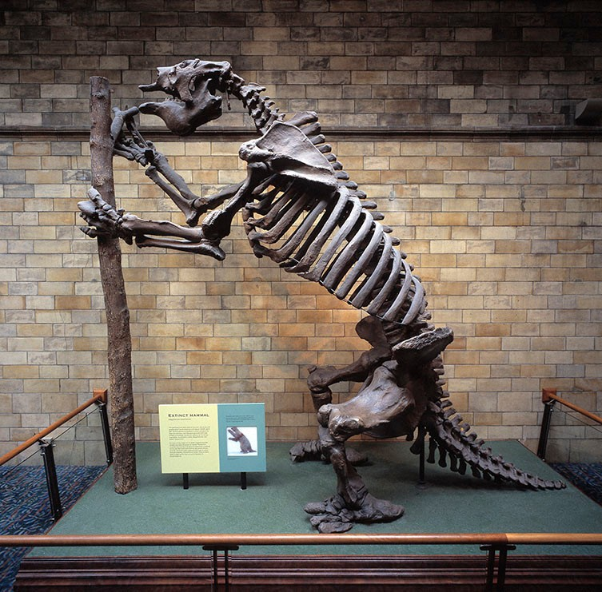
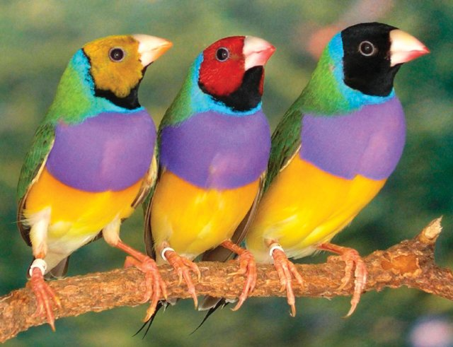

# Introduction {#Introduction}

## A brief history of genetics

Humankind has long sought to understand the basis of biological variation. What gives rise to the wondrous variety of life forms on Earth? Why do individuals of a particular species differ from one another? How do children inherit traits that are similar to those of their parents, yet on the whole remain distinct from both their parents and their siblings? And are the traits we care about -- our health, our intelligence, our ability to thrive in a changing world -- pre-determined from birth, or continuously pliable throughout our lives? 

### Ancient Greece

Around 500 BC, the Ancient Grecian Pythagoras applied his understanding of triangles to this question, proposing the theory known as "spermism". He posited that hereditary information was passed down from parent to child via male sperm, with the female only providing the nutrients that would allow it to grow, and, like the theorem that bears his name, that these two sides of the "triangle" would determine the length of the third side: the characteristics of the child [@mukherjeeGeneIntimateHistory2016].

Over a century later, in 380 BC, Plato extended this metaphor in *The Republic* to argue that this principle could be applied in order to perfect humanity, by breeding perfect combinations of parents at perfect times. 

Aristotle joined the discussion with his treatise *Generation of Animals*, where he noted that children inherited features from their mothers as well as their fathers, and raised cases where human skin colour and other traits could skip generations, and thus hereditary information must not only be transmitted through sperm. He suggested an idea of "movement" -- the transmission of information -- from the father's sperm, which sculpts the mother's menstrual blood in the same way a carpenter carves a piece of wood [@mukherjeeGeneIntimateHistory2016]. Aristotle, however, could not deduce the form in which the information was conveyed.

### Medieval times

In medieval times, the prevailing theory was that a tiny human -- a homunculus -- sat within the sperm, waiting to be inflated upon its introduction to a woman's uterus. However, this would require a homunculus to sit within another homunculus, *ad infinitum*, like Matryoshka dolls, all the way back to the Biblical first man, Adam. Even the inventor of the microscope, Nicolaas Hartsoeker, thought he saw one in a sperm he was studying. But what then triggered the expansion of the human form, involving the development of new parts from embryo to fetus? The answer could only have been some instruction, blueprint, or code, but any specifics were out of reach.

### Charles Darwin

In 1831, a 22-year-old English Clergyman named Charles Darwin boarded the HMS Beagle to commence what would turn out to be a XX-year-long voyage around PLACES. He had previously studied medicine and theology, although he was drawn to study the natural world, and had apprenticed with his fellow clergyman John Henslow, a botanist and geologist who curated the Cambridge Botanic Garden. At the time, natural historians were subject to their enquiries being restricted by the prevailing doctrine of the time, namely that of Creationism. A mechanistic description of how species -- and individuals within the same species -- differed from one another was a dangerous idea, as it was thought to threaten the doctrine of creation. 

(ref:charles-darwin-young-portrait) Portrait of Charles Darwin from the late 1830s by George Richmond [@charlesDarwinYoung].

(\#fig:charles-darwin-young-portrait)(ref:charles-darwin-young-portrait)

In 1831, a young Charles Darwin boarded the HMS *Beagle* to embark on an expedition to collect specimens from South America. After collecting a huge number of fossils from the along the eastern coast and shipping them back to England, the *Beagle* spent 5 weeks touring through the 18 volcanic islands of the Galàpagos, where Darwin collected 

Two months after Darwin graduated from Cambridge, he received a letter from Henslow suggesting that he join the *Beagle*'s exploratory survey of South America as the "gentleman scientist" they were seeking to assist with the collection of specimens. As the *Beagle* travelled down the eastern coast of South America, Darwin collected a vast amount of living specimens and ancient fossils, including large extinct mammals such as the megatherium, near Punta Alta.

(ref:megatherium) Megatherium fossil collected by Charles Darwin, housed in the Natural History Museum, London. Photograph from @WhatWasMegatherium.

(\#fig:megatherium)(ref:megatherium)

The *Beagle* eventually reached the Galápagos Islands on the coast of Peru, and archipelago of 18 islands formed from volcanic lava. They stayed there for five weeks, during which period Darwin collected carcasses of birds, lizards, and plants. Upon his return to England, Darwin was hailed as a minor celebrity among natural historians due to the collections of specimens he had gathered and shipped back. John Gould -- the ornithologist after whom the Gouldian finch is named -- told him that the various birds that Darwin thought were a vareity of wrens, warblers, blackbirds, and "Gross-beaks" were in fact all 13 different species of finches.

(ref:gouldian-finch) The Gouldian Finch, an Australian native bird described by British ornithological artist John Gould in 1844 and named after his deceased wife Elizabeth [@bancroftPartIntroductionGouldian]. Photograph by Sarah R. Pryke, published in @prykeRedDominatesBlack2006.

(\#fig:gouldian-finch)(ref:gouldian-finch)

(ref:alfred-wallace) Alfred Russel Wallace, taken around 1895. Image from @alfredWallace1895.

(\#fig:alfred-wallace)(ref:alfred-wallace)

Each site had produced its own variant, and this caused Darwin to consider whether they had all arisen from a common ancestral finch, branching off like the boughs of a tree over time. He understood that animal breeders took advantage of the natural variation in populations to select for desired traits, but he questioned what force had guided the development of these different varieties of finches in the wild.

In 1798, Thomas Malthus, a curate and amateur economist, had published a paper titled *An Essay on the Principle of Population*, in which he argued that the human population was in constant struggle with its limited resource pool, which in turn was affected by droughts, floods, epidemics, and diseases [@mukherjeeGeneIntimateHistory2016]. Darwin read the paper and identified this struggle for resources as the natural hand that selected those who possessed traits that would allow them to be more likely to survive. 

In 1855, Alfred Russel Wallace published a paper in the *Annals and Magazine of Natural History*. Like Darwin, he had set off on a voyage to distant lands, and had observed the stunning variation across the Malay Archipelago in populations separated by channels of water. And like Darwin, he also derived his theory on the basis of this variation from Malthus's paper. In June 1858, he sent a draft paper to Darwin outlining his general theory of evolution and natural selection. Darwin panicked and sent both papers to Lyell, who advised Darwin to have both papers presented simultaneously at the meeting of the Linnean Society so that they could both be credited for the discovery. 

The presentation made few waves at the time, but Darwin proceeded to complete his opus, *On the Origin of Species by Means of Natural Selection*, published in 1859. The book was met with ecstatic reviews.

The question yet remained: how was the variation within species generated in the first place? 

### Mendel

### Breeding programs in agriculture

## Mixed models for genetic association analysis

"The distinction between Mendelian loci and QTLs is artificial, as the same mapping techniques can be applied to both. In fact, the classification of genetic (and allelic) effects should be considered as a continuum. At one end of the spectrum is the dichotomous Mendelian trait with only two detectable and distinct phenotypes, which are governed by a single gene. At the other end are traits, such as growth, which are likely to be affected by many genes that each contribute a small portion to the overall phenotype." [@membersofthecomplextraitconsortiumNatureIdentificationQuantitative2003]

Since it became possible to sequence the genotypes of individuals at scale, it has been an ongoing point of debate as to how best to model the effects that genetic variants have on a trait of interest.

Population structure and unequal relatedness among individuals in a given cohort can lead to false discoveries [@ewensTransmissionDisequilibriumTest1995; @membersofthecomplextraitconsortiumNatureIdentificationQuantitative2003]. This is because individuals who share common ancestries will share both variants that do affect the trait of interest, and variants that do not, and these variants will be correlated with one other due to that shared ancestry. Therefore, if an association is found between the causal variants and a trait of interest, the non-causal variants that are correlated with the causal variants will also be found to be statistically associated with the trait.

How then does one control for population structure? 

Three methods were formerly used [@zhangMixedLinearModel2010]: 

1. Structured association [@pritchardInferencePopulationStructure2000]

1. Genomic control [@devlinGenomicControlAssociation1999]

1. Family-based tests of association [@abecasisGeneralTestAssociation2000]

"Ronald fished introduced random effects models to study the correlations of trait values between relatives" [@fisherXVCorrelationRelatives1919].

## Somites

Vertebral number is precisely defined for a given species [@gomezControlSegmentNumber2008], but is the most variable physical trait across species [@kimuraGeneticAnalysisVertebral2012]; for example, frogs have 6-10, humans have 33, and snakes can have more than 300 [@gomezControlSegmentNumber2008; @kimuraGeneticAnalysisVertebral2012]. The total number of vertebrae is a function of both how long the somite segmentation process persists for, and the  
