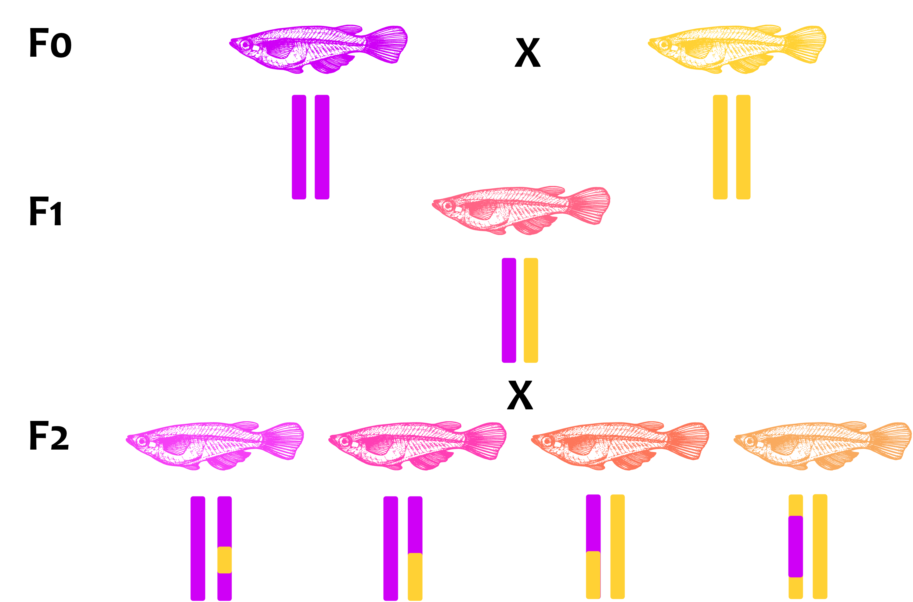
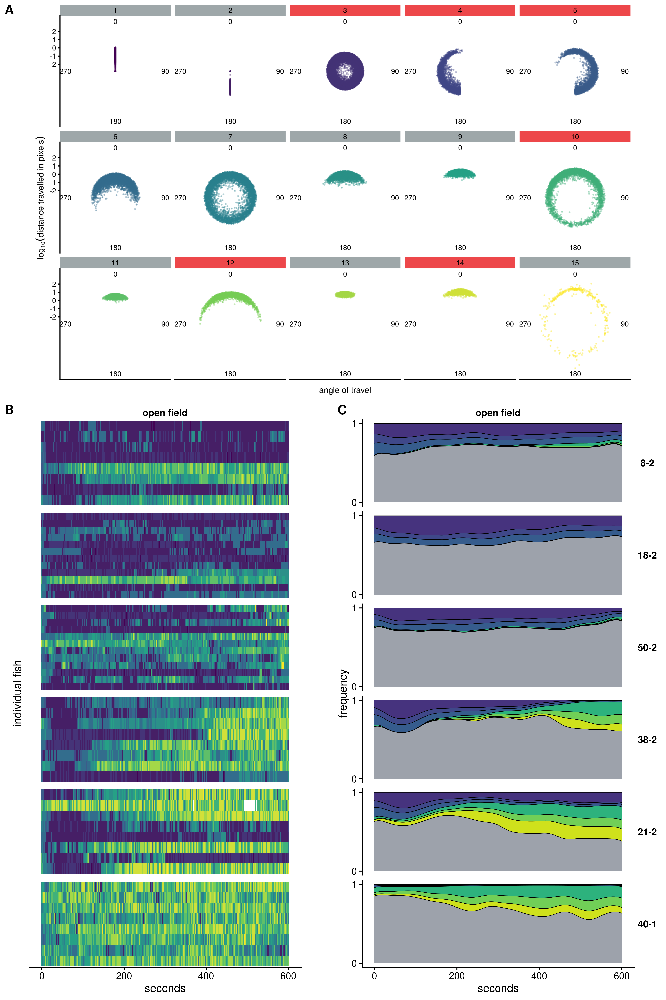
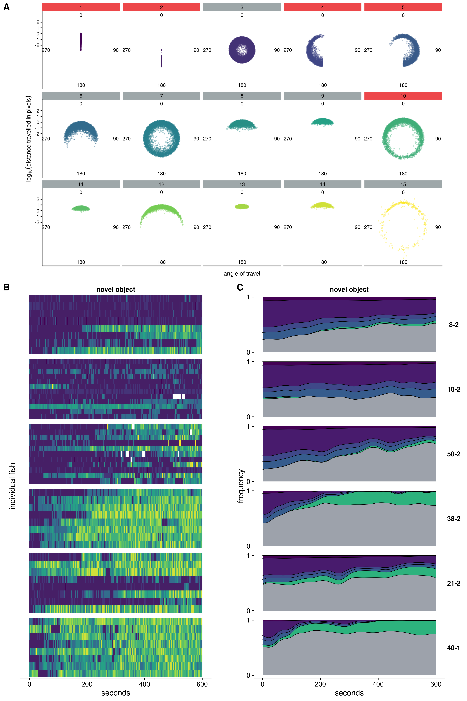
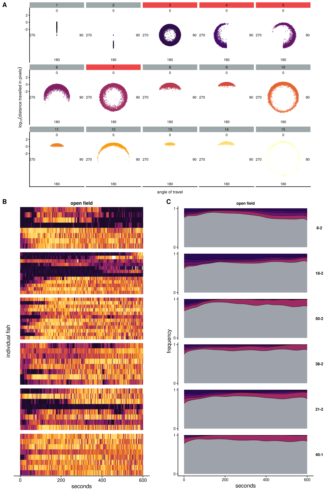
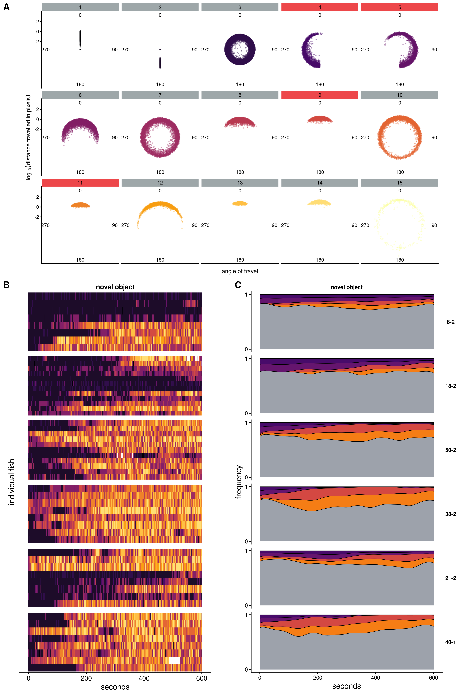

# Genetic linkage study of bold/shy behaviours in the MIKK panel {#MIKK-F2-chap}

The purpose of the study described in this chapter was to run the behavioural analysis described in Chapter  \@ref(Pilot-chap) over the MIKK panel described in Chapter \@ref(MIKK-genomes-chap), identify the lines that diverged in both their behaviour, and the level of transmission of their behaviour onto their *iCab* reference tank partner, and then use them as the parental strains in an F2 cross to attempt to identify the genetic variants associated with those differences.

## The F2 cross experimental setup {#MIKK-F2-cross}

The F2 cross is a traditional method for mapping genetic variants associated with traits of interest. A schema for the method is presented in **Figure \@ref(fig:F2-cross-schema)**. In essence, it involves starting with two inbred strains that diverge for the trait of interest (the 'parental strains', or F0 generation F0). One then crosses the parental strains to create a generation of F1 hybrid individuals who each possess, for every pair of their chromosomes, one chromosome from each of their parents. The individuals in this F1 generation are genetically identical to their parents with respect to their germline. Finally, one inter-crosses the F1 generation to create a set of F2 individuals that share unique combinations of the original F0 strains' genotypes, and tend to display values for the trait of interest that span across the spectrum between the extreme values of their parents.

(ref:F2-cross-schema) Schema of the F2-cross experimental setup. The F0 generation comprises two medaka strains that have extreme, opposing values for a trait of interest, represented by the colours red and blue. Below them is an illustrative single pair of chromosomes. The chromosomes within each pair are depicted as the same colour, as the strains are homozygous through successive generations of inbreeding. Their F1 offspring is heterozygous for each pair of their 24 chromosomes, and all F1 individuals are therefore almost genetically identical to one another (with the exception of somatic mutations and the regions of the genome that were not homozygous in the parental generations). The F1 individuals are then inter-crossed with one another to produce the F2 generation, which, due to recombination events during gamete formation, have unqiue combinations of the parental strains' genotypes, and tend to span the phenotypic spectrum between the extremes of their F0 parental strains, represented by their colours.

(\#fig:F2-cross-schema)(ref:F2-cross-schema)

## Data collection - F0 generation

In November 2019 I traveled to the fish facility managed by our collaborator, Felix Loosli at KIT in Karlsruhe, and over the course of 11 days from 11 to 21 November 2019, I ran the behavioural assay described in Chapter \@ref(pilot-data-collection) another 206 times. I again used the *iCab* strain as the reference fish, and for the test fish I used either an individual from one of the MIKK panel lines, individuals captured from the same Kiyosu population as the MIKK panel but permitted to breed freely within a separate tank in the facility ('Kiyosu closed-capture', or 'Kiyosu CC'), or individuals from a related but different species of medaka from the Philippines, *Oryzias luzonensis*. I ensured that I performed at least 2 assay runs for each MIKK panel line that was available, generating a minimum of 8 test fish replicates per line. As there were four pairs of fish in the test tank during each run, the complete dataset comprises 824 videos of pairs of fish, which I further divided by assay component (open field and novel object) to create 1648 videos. 

I again used the software *idtrackerai* [@romero-ferreroIdtrackerAiTracking2019] to track the movement of the fishes across frames of each video. After adjusting the software parameters for each video to maximise the number of frames that were successfully tracked, I was left with 1610 out of the 1648 videos (~97.7%) where both fishes were tracked over at least 85% of frames, and I only included these 1610 videos in the downstream analysis. The first question to address was whether the MIKK panel lines differed in their behaviours. I therefore computed each individual fish's mean speed (measured as the distance traveled in pixels per 0.08 seconds) over the course of the full 20-minute video, grouped them by line, and plotted the results presented in **Figure \@ref(fig:mikk-mean-speed)**. I continue to use the same order and colour palette for the MIKK panel lines as in this Figure throughout the rest of this Chapter.

(ref:mikk-mean-speed) Mean speed of the MIKK panel and other strains over the course of the entire 20-minute video (measured as the distance traveled in pixels per 0.05 seconds). *iCab* fishes in the *iCab*-*iCab* control condition are at the top, the MIKK panel lines are sorted by their group median, and the Kiyosu closed capture and *O. luzonensis* fishes are at the bottom.

(\#fig:mikk-mean-speed)(ref:mikk-mean-speed)

This figure shows that there are clear differences between some MIKK panel lines at the extremes, and that the lines differ in the amount of within-line variance observed. This figure acted as a guide to determine which lines to select as the parental strains in the F2 cross. To identify genetic variants directly associated with bold-shy behaviours, I sought to select lines that showed either high or low levels of movement, and preferably low within-line variance. 

(ref:mikk-mean-speed-variance) Line median (vertical axis) and line variance (horizontal axis) for individual mean speed across the full 20-minute video (i.e. both the open field and novel object assay components).

(\#fig:mikk-mean-speed-variance)(ref:mikk-mean-speed-variance)

## HMM states

To examine these behaviours at a finer resolution, as for the pilot study described in \@ref(Pilot-chap), I again applied a hidden markov model (**HMM**) to classify the fishes' movements based on their distance and angle of travel between time intervals. I used the same method to select the best choice of time interval and number of states (**Figure \@ref(mikk-param-comp)**). Here I observed the same phenomenon where the parameter combinations that performed the best showed an asymmetry between some states that would make interpretation difficult. For example, a time interval of 0.08 seconds combined with a state space of 17 caused state 4 to appear to get carved out of state 3 (**Figure \@ref(fig:mikk-hmm-asym)**).

(\#fig:mikk-param-comp)(ref:mikk-param-comp)

(ref:mikk-hmm-asym) The best apparent combination of parameters (0.08 time interval with a 17-state space) created an asymmetry between states 3 and 4, which would causes difficulties in interpreting their biological relevance. 

(\#fig:mikk-hmm-asym)(ref:mikk-hmm-asym)

The best combination of parameters without this asymmetry was a time interval of 0.05 seconds with a state space of 15 (see the polar plots for the states in **Appendix \@ref(fig:hmm-states-0.05)**). However, due to a glitch in the video recording software, several videos recorded on 13 November 2019 were incorrectly recorded with a frame rate of 14 instead of the desired 30. The insufficient number of frames for those videos meant that it was impossible to measure the distance and angle of travel between a time interval as low as 0.05 seconds. So that these videos could be included in the dataset, I accordingly selected the combination of 15 states and a 0.08-second interval for all downstream analyses.

(ref:mikk-hmm-sym) The HMM states used for the downstream analysis, with the model classified based on the distance of travel (log10 pixels, radial axis) and angle of travel (angle). A straight forward movement would sit around 0°, a left movement around 270°, and a right movement around 90°. 

(\#fig:mikk-hmm-sym)(ref:mikk-hmm-sym)

## Social genetic effects

As discussed above, in this project our traits of interest include not only direct genetic behaviours, but also social genetic behaviours. We therefore sought to identify the MIKK panel lines that transmitted their behaviour onto the reference *iCab* tank partners either to the largest or smallest degrees. I formulated two methods to measure this, referred to as a) HMM state co-occupancy; and b) reference deviation. The first, HMM state co-occupancy, measured the proportions of time that the *iCab* reference fish spent in the same HMM state as its tank partner. The second, deviation of the reference fishes' deviation from the behaviour exhibited in the control condition, seeks to quantify the extent to which the *iCab*'s behaviour changes when partnered with 

### State co-occupancy

**Figure \@ref(fig:F0-sge-cooc-box)** sets out the proportions of total time for each assay sub-component that each pair of individual fish spent in the same HMM state, grouped by line and ranked in the same order as their group median for individual mean speed as shown above in **Figure \@ref(fig:mikk-mean-speed)**. **\@ref(fig:F0-sge-cooc-box)A** shows the data as boxplots, with $p$-values from the Kruskal-Wallis test comparing all groups. **Figure \@ref(fig:F0-sge-cooc-box)B** shows the same data but with each group's median represented by columns to make it easier to compare group medians. Of the slower-moving lines, 8-2 and 18-2 tend to show relatively higher state co-occupancy in the open field component, but during the novel object component, the slow-moving line 139-4 has the highest median co-occupancy of all lines. Of the faster-moving lines, 43-2 and 13-2 showed the highest state co-occupancy during the open field assay component. However, the moderate-to-fast line 21-2 had relatively high state co-occupancy during both assay components.

(ref:F0-sge-cooc-box) Frequency of HMM state co-occupancy

(\#fig:F0-sge-cooc-box)(ref:F0-sge-cooc-box)

To visualise which states are driving the higher co-occupancy measures, for a selection of lines I generated a heatmap of the states occupied simultaneously by the *iCab* reference and MIKK test fishes, combining the observations for all individuals within each test fish group (**Figure \@ref(F0-sge-cooc-heat)**). When *iCab* is paired with 18-2 or 8-2, the fishes most frequently occupy states 3 or 1 in both open field and novel object components. In pairings with line 139-4, while the test fishes remain in the still states 1 or 3 during the open field assay, *iCab* tends to be moving much faster in states 11 and 13. However, during the novel object component, they co-occupy state 3 more than in any other combination. This general pattern is observed with line 14-2 as well, albeit to a lesser extent. For 38-2, the fishes tend not to show a strong preference for co-occupying a particular state for either assay component, but the diagonal spread indicates that they tend to move at similar speeds. When paired with the faster moving 21-2, the novel object component appears to accentuate the co-occupancy of state 3 that is also observed in the open field component. Finally, when paired with line 40-1, in both assay components, both fishes show a strong preference for the faster-moving states.

(ref:F0-sge-cooc-heat) Heatmaps for a selection of MIKK panel lines (including those ultimately selected as the parental strains in the F2 cross) showing the frequency of HMM states simultaneously occupied by the reference (x-axis) and test (y-axis) fishes, aggregated over all replicates in each line. 

(\#fig:F0-sge-cooc-heat)(ref:F0-sge-cooc-heat)

### Deviation of *iCab* from its control condition

The second method for quantifying the level of behavioural transmission from test fish to *iCab* reference fish was to determine the proportion of time that the *iCab* spent in a particular state when paired with another *iCab*, and then quantify the degree to which those proportions change when in the presence of a fish from another line (**Figure \@ref(fig:F0-sge-deviation)**). **Figure \@ref(fig:F0-sge-deviation)A** presents boxplots for state frequencies for all *iCab* individuals in *iCab*-*iCab* pairings. I further calculated the state frequencies for all *iCab* reference fishes for all other MIKK line pairings. For each combination of assay component, line-pairing, and HMM state, I then ran Welch's t-test [@ruxtonUnequalVarianceTtest2006] comparing the proportions of time the *iCab* individuals spent in that state when paired with another *iCab*, against the proportions of time the *iCab* reference individuals spent in that state when paired with a different MIKK line. I then summed the t-statistics across states to generate a single metric for each combination of line and assay component, and plotted the results in **Figure \@ref(fig:F0-sge-deviation)B**.

(ref:F0-sge-deviation) Deviation of state frequency for *iCab* reference fishes when paired with MIKK panel lines relative to when paired with another *iCab*. **A**: Boxplots of HMM state frequency for *iCab* individuals when paired with another *iCab*. **B**: 

(\#fig:F0-sge-deviation)(ref:F0-sge-deviation)

The first thing to note in this Figure is that *iCab*'s deviations from its behaviour exhibited in the control condition tend to be smaller when paired with faster-moving fishes. This was expected given *iCab* is also a faster-moving fish, but it strengthens the observation that when paired with slower-moving fishes, those tank partners are causing the *iCab* reference fish to move slower than they would otherwise. Of the slower-moving MIKK lines, 4-2 and 14-2 causing the largest deviations of the *iCab* reference fishes' behaviours from their control condition behaviour in the open field and novel object components respectively. I also observe large deviations for the moderately-moving 106-2 and 71-1 during the novel object components. There are no clear outliers for either assay component for any of the faster moving lines.

## Selection of lines for the F2 cross

On the basis of the above findings, I selected 6 MIKK panel lines as the parental lines for the F2 cross (**Figure \@ref(F0-line-mean-speed-select**). Conceptually, I sought to select lines that diverged on two measures: a) bold-shy behaviours; and b) the extent to which the lines transmitted their behaviours onto their tank partners. As *iCab* is a fast-moving line, it was more difficult to detect instances where fast-moving MIKK panel lines were influencing its behaviour. I was therefore more confident of identifying slow-movement/high-charisma lines, and so to increase the likelihood of identifying genetic variants that are responsible for a stronger transmission of slow-moving behaviours, I chose two slow-movement/high-charisma lines for the F2 cross: 18-2 and 8-2. In the event that both lines possessed the same genetic variants that influence this behavioural transmission trait, it would vastly increase the power of detecting it during the genetic linkage analysis. Both these lines were one of the most slow-moving lines, had high levels of state co-occupancy during both assay components, and 18-2 caused a high level of deviation from the *iCab* control condition.

(\#fig:F0-line-mean-speed-select)(ref:F0-line-mean-speed-select)

For the slow-movement/low-charisma line, I selected 50-2 which exhibited a moderately slow level of movement, low within-line variance for mean speed, and low measures for both state co-occupancy and *iCab* deviation. For the high-movement/high-charisma line, I selected 22-1. Despite its high within line variance (**Figure \@ref(fig:F2-time-dge-of)**), this potentially made it easier to detect its social genetic effects, as the slower-moving individuals appeared to transmit those behaviours strongly to their *iCab* tank partners, giving it a high score among fast-moving lines for state co-occupancy across both assay components. For the high-movement/low-charisma line I selected 40-1, as it has low within-line variance, and low-to-moderate metrics for state co-occupancy and *iCab* deviation. However, I note that these measures may be confounded by the possibility that 40-1 behaves in a similar way to *iCab*, which would be difficult to determine whether it was behaving differently. 

In addition to these extreme lines, I also selected a line that was intermediate for both traits in an attempt to avoid breeding incompatibilities that might arise from attempting to cross lines with such divergent behavioural traits. For this purpose I selected line 38-2 for its intermediate speed, low within-line variance for mean speed, and intermediate measures for HMM state co-occupancy and *iCab* deviation.

(ref:F0-line-mean-speed-var-select) Line median (vertical axis) and line variance (horizontal axis) for individual mean speed across the full 20-minute video (i.e. both the open field and novel object assay components), coloured for the lines selected as the parental strains for the F2 cross.

(\#fig:F0-line-mean-speed-var-select)(ref:F0-line-mean-speed-var-select)

## Direct genetic effects

With these lines selected, I ran a similar analysis to what I described in \@ref(Pilot-chap), where I ran multi-way ANOVAs to determine whether certain lines differed in the proportions of time they spent in these HMM states, while including the date of assay, time of assay, tank quadrant and tank side as covariates. **Table \@ref(tab:mikk-dge-F0)** sets out the states which showed a significant difference between these 6 lines, with p-values adjusted for the False Discovery Rate (**FDR**).

Table: (\#tab:mikk-dge-F0)Significant differences in the proportion of time spent in each HMM state across test fish lines selected for the F2 cross for the open field and novel object assay components.

|Assay        |State |Variance explained (%) |p-value (FDR-adjusted) |
|:------------|:-----|:----------------------|:----------------------|
|open field   |3     |21.53                  |2.67e-03               |
|open field   |4     |23.28                  |1.60e-02               |
|open field   |5     |20.61                  |3.15e-02               |
|open field   |10    |29.06                  |1.41e-03               |
|open field   |12    |24.91                  |1.45e-02               |
|open field   |14    |29.52                  |1.29e-03               |
|novel object |1     |16.21                  |1.90e-02               |
|novel object |2     |15.14                  |4.86e-02               |
|novel object |4     |26.90                  |5.21e-03               |
|novel object |5     |27.84                  |4.27e-03               |
|novel object |10    |23.73                  |2.81e-02               |

**Figures \@ref(fig:F2-time-dge-of)** and **\@ref(fig:F2-time-dge-no)** highlight the states that showed significant differences in the proportions of time that these lines spent in those states for the open field and novel object assay components respectively. In both figures, **A** highlights the significant states, **B** shows how the individuals moved through those states over the course of the 10-minute assay component, and **C** shows the densities of the significant states within each line. For the open field component, although the tile plots show a notable level of variance within each line, the density plots clarify how the three slow-moving lines (8-2, 18-2 and 50-2) spent little time in the fast-moving states 10, 12 and 14 relative to the fast-moving lines. Interestingly, the intermediate line 38-2 tended to transition into these states around the middle of the video, presumably a period of habituating to the new environment.

(ref:F2-time-dge-of) Differences between MIKK F0 lines in the HMM states they occupied during the open field assay component. **A**: 15 HMM states with panels coloured red to indicate significant differences between MIKK F0 lines in the proportion of time spent in those states. **B**: Transitions between HMM states across time for each individual test fish, grouped by MIKK line Tiles are coloured by the state most frequently occupied by each fish within 2-second intervals. **C**: Densities within each MIKK line for the occupation of states that significantly differed between strains (colour), with other states consolidated (grey).

(\#fig:F2-time-dge-of)(ref:F2-time-dge-of)

In contrast, during the novel object component the HMM states that showed significant differences between lines 

(ref:F2-time-dge-no) Differences between MIKK F0 lines in the HMM states they occupied during the novel object assay component. **A**: 15 HMM states with panels coloured red to indicate significant differences between MIKK F0 lines in the proportion of time spent in those states. **B**: Transitions between HMM states across time for each individual test fish, grouped by MIKK line Tiles are coloured by the state most frequently occupied by each fish within 2-second intervals. **C**: Densities within each MIKK line for the occupation of states that significantly differed between strains (colour), with other states consolidated (grey).

(\#fig:F2-time-dge-no)(ref:F2-time-dge-no)

### Social genetic effects

(ref:F2-time-sge-of) Differences between HMM states occupied by the reference fish when paired with different MIKK F0 lines during the open field assay component. **A**: 15 HMM states with panels coloured red to indicate significant differences between the reference fishes under different line-pairings in the proportion of time spent in those states. The HMM states are the same as those in **Figure \@ref(fig:F2-time-dge-of)** above, but coloured with a different palette. **B**: Transitions between HMM states across time for each individual *iCab* reference fish, grouped by the strain of its tank partner. Tiles are coloured by the state most frequently occupied by each fish within 2-second intervals. **C**: Densities within each strain-pairing for the occupation of states that significantly differed between strain-pairings (colour), with other states consolidated (grey).

(\#fig:F2-time-sge-of)(ref:F2-time-dge-of)

(ref:F2-time-sge-no) Same layout as **Figure \@ref(fig:F2-time-sge-of)** above, but for the novel object assay.

(\#fig:F2-time-sge-no)(ref:F2-time-dge-no)

## F2 generation

### Behavioural data collection

Around August 2019, our collaborators in the Loosli Group at KIT commenced the breeding program for this experiment with the 6 MIKK panel lines I had selected above.^[Although the breeding program began in 2019, we understand from our collaborators that from around mid-2020 the F1 generation was producing poorly. After lengthy investigations, they discovered that the Covid pandemic had caused disruptions to the supply chains of their fish food manufacturer, which had compelled them to change the recipe. This change in the fish food recipe was the cause of the poor breeding. While the issue has since been resolved, it has resulted in a much smaller number of F2 individuals than anticipated.] 

### Genotyping

### Genetic linkage analysis

### Candidate SNPs for CRISPR-knockouts

## Discussion

## Future directions

## Lessons

* Describe using a different MIKK panel line as the reference, preferring a moderate-moving line to enable easier detection of social genetic effects from fast-moving lines, i.e. which lines cause *iCab* to move more boldly? 

* Chosen different strains for the F2 cross. 139-4 had low within-line variance for mean speed, and the highest median state co-occupancy in the novel object component. From the conclusions of Chapter \@ref(Pilot-chap), which were carried out after the F2 cross lines were already selected, it became apparent that the novel object assay was particularly useful for revealing social genetic effected. I hypothesise that at times of higher stress or predation threat, the individual fish take more behavioural cues from their tank partners. It therefore would have been a good candidate for the slow-moving, high-charisma line. 

* Explain why I didn't choose 22-1 or 10-1.

