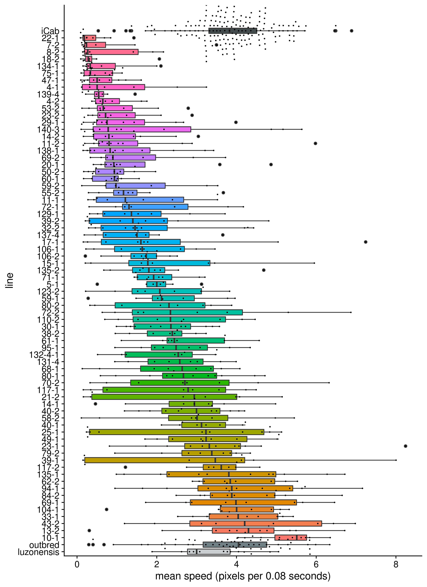
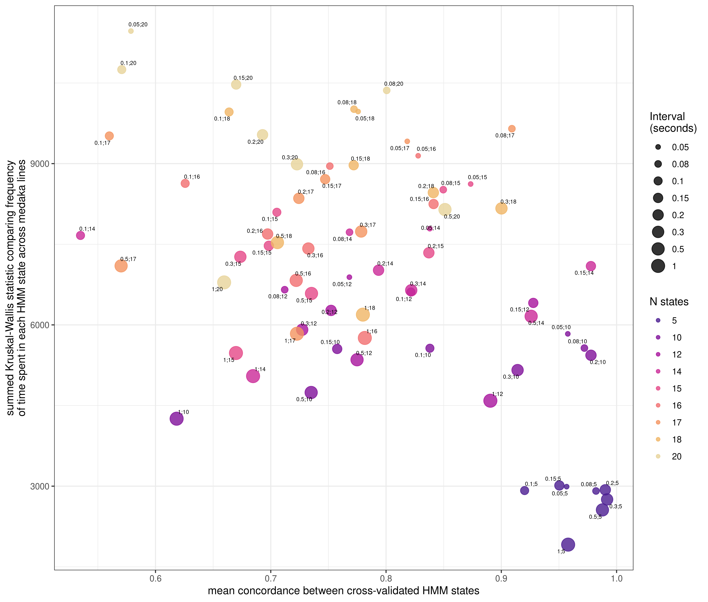
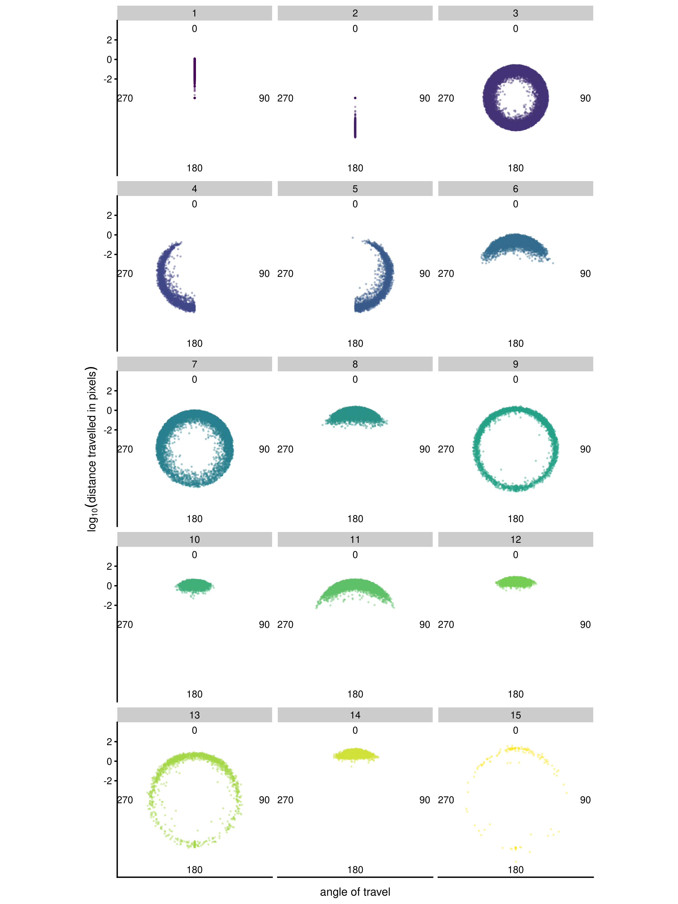

# Genetic linkage study of bold/shy behaviours in the MIKK panel {#MIKK-F2-chap}

## Mean speed for all MIKK lines

(\#fig:mikk-mean-speed)(ref:mikk-mean-speed)

## HMM states

(\#fig:mikk-param-comp)(ref:mikk-param-comp)

(\#fig:mikk-hmm-asym)(ref:mikk-hmm-asym)

(\#fig:mikk-hmm-sym)(ref:mikk-hmm-sym)

