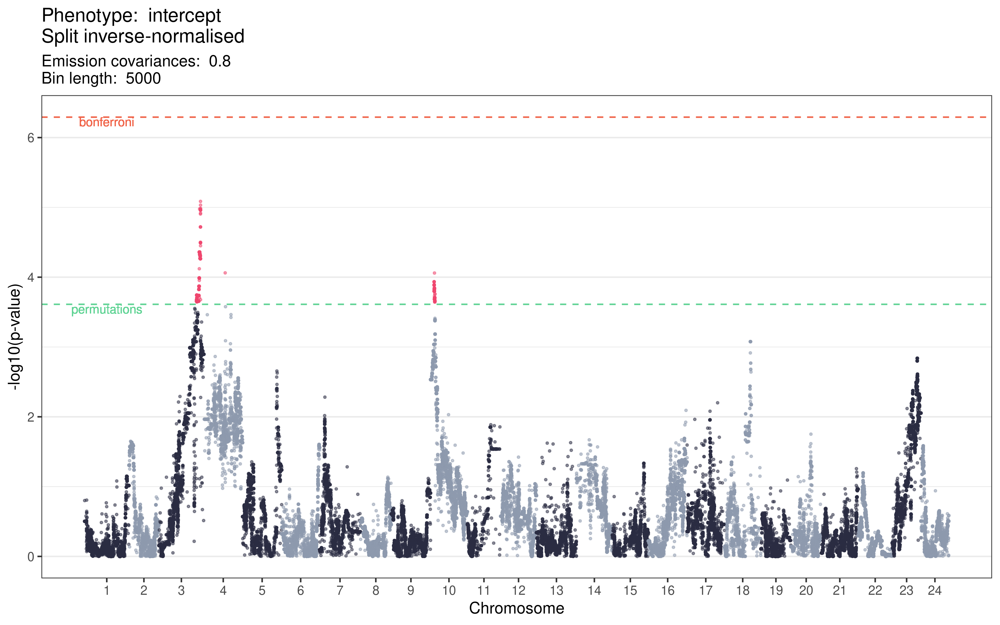

# Genetic loci associated with somite period development

## Background

"The distinction between Mendelian loci and QTLs is artificial, as the same mapping techniques can be applied to both. In fact, the classification of genetic (and allelic) effects should be considered as a continuum. At one end of the spectrum is the dichotomous Mendelian trait with only two detectable and distinct phenotypes, which are governed by a single gene. At the other end are traits, such as growth, which are likely to be affected by many genes that each contribute a small portion to the overall phenotype." [@membersofthecomplextraitconsortiumNatureIdentificationQuantitative2003]

Since it became possible to sequence the genotypes of individuals at scale, it has been an ongoing point of debate as to how best to model the effects that genetic variants have on a trait of interest.

Population structure and unequal relatedness among individuals in a given cohort can lead to false discoveries [@ewensTransmissionDisequilibriumTest1995; @membersofthecomplextraitconsortiumNatureIdentificationQuantitative2003]. This is because individuals who share common ancestries will share both variants that do affect the trait of interest, and variants that do not, and these variants will be correlated with one other due to that shared ancestry. Therefore, if an association is found between the causal variants and a trait of interest, the non-causal variants that are correlated with the causal variants will also be found to be statistically associated with the trait.

How then does one control for population structure? 

Three methods were formerly used [@zhangMixedLinearModel2010]: 

1. Structured association [@pritchardInferencePopulationStructure2000]

1. Genomic control [@devlinGenomicControlAssociation1999]

1. Family-based tests of association [@abecasisGeneralTestAssociation2000]

"Ronald fished introduced random effects models to study the correlations of trait values between relatives" [@fisherXVCorrelationRelatives1919].

## Somite period development

## F2-cross linkage study experimental plan

## F0 homozygosity and F1 heterozygosity

I aligned the high-coverage sequencing data for the F0 *Cab* and *Kaga* lines to the medaka *HdrR* reference (Ensembl release 104, build ASM223467v1) using BWA-MEM2, sorted the aligned .sam files, marked duplicate reads, and merged the paired reads with picard, and indexed the .bam files with Samtools. 

To then call variants, I followed the GATK best practices (to the extent they were applicable) with GATK's HaplotypeCaller and GenotypeGVCFs tools, then merged all calls into a single .vcf file with picard.

Finally, I extracted the biallelic calls for *Cab* and *Kaga* with bcftools, counted the number of SNPs within non-overlapping, 5-kb bins, and calculated the proportion of SNPs that were homozgyous. 

**Figure \@ref(fig:somite-f0-cab)** is a circos plot generated with circlize for the *Cab* F0 lines

(ref:somite-f0-cab) Proportion of homozygous SNPs within 5 kb bins in the *Cab* F0 generation genome (green), and number of SNPs in each bin (yellow).

(\#fig:somite-f0-cab)(ref:somite-f0-cab)

(ref:somite-f0-kaga) Proportion of homozygous SNPs within 5 kb bins in the *Kaga* F0 generation genome (red), and number of SNPs in each bin (yellow).

(\#fig:somite-f0-kaga)(ref:somite-f0-kaga)

To determine whether the low levels of observed homozygosity in Kaga was affected by its alignments to the southern Japanese *HdrR* reference, we also aligned the F0 samples to the northern Japanese *HNI* reference (**Figure \@ref(fig:somite-f0-kaga-hni)**. This did not make differences to the levels of observed homozygosity in either sample, which gave us confidence that the low homozygosity observed in *Kaga* was not driven by reference bias. 

(ref:somite-f0-kaga-hni) Proportion of homozygous SNPs within 5 kb bins in the *Kaga* F0 generation genome when aligned to the *HNI* reference (red), and number of SNPs in each bin (yellow).

(\#fig:somite-f0-kaga-hni)(ref:somite-f0-kaga-hni)

## F1 homozygosity {#f1-homozygosity}

We next examined the level of heterozygosity in the F1 generation from the *Cab*-*Kaga* cross. 

(ref:somite-f1) Proportion of heterozygous SNPs within 5 kb bins in the *Cab*-*Kaga* F1 cross (brown), and number of SNPs in each bin (yellow).

(\#fig:somite-f1)(ref:somite-f1)

For the purpose of mapping the F2 sample sequences to the genomes of their parental strains, we selected only biallelic SNPs that were homozygous-divergent in the F0 generation (i.e. homozygous reference allele in *Cab* and homozygous alternative allele in *Kaga* or vice versa) *and* heterozygous in the F1 generation. 

The number of SNPs that met these criteria per chromosome are set out in **Figure \@ref(snp-counts-per-chrom)**. 

(ref:snp-counts-per-chrom) Number of SNPs per chromosome that were homozygous-divergent in the F0 *Cab* and *Kaga* generations, and heterozygous in the F1 generation.

(\#fig:snp-counts-per-chrom)(ref:snp-counts-per-chrom)

## F2 genotyping

To maximise the efficiency of our sequencing runs, we "shallow-sequenced" the F2 generation with the short-read Illumina platform at a depth of ~1x. We then aligned these sequences to the *HdrR* reference with BWA-MEM2, sorted the reads and marked duplicates with Picard, then indexed the resulting BAM files with samtools. Genotyping these shallow sequences with the same method as used for the high-coverage sequences for the F0 and F1 generation would be inappropriate. We therefore used a different method whereby we used *bam-readcount* to count the reads that supported either the *Cab* or the *Kaga* allele for all SNPs that met the criteria described above in section \@ref(f1-homozygosity), summed the read counts within 5 kb blocks, and calculated the frequency of reads within each bin that supported the *Kaga* allele. This generated a value for each bin between 0 and 1, where 0 signified that all reads within that bin supported the *Cab* allele, and 1 signified that all reads within that bin supported the *Kaga* allele. Bins containing no reads were imputed with a value of 0.5. 

We then used these values for all F2 individuals as the input to a Hidden Markov Model (HMM) with *hmmlearn*, which we applied to classify each bin as one of three states, with state 0 corresponding to homozygous-*Cab*, 1 corresponding to heterozygous, and 2 corresponding to homozygous-*Kaga*. 

Across each chromosome of every sample, we expected the output of the HMM to produce a sequence of states. Based on previous biological knowledge that crossover events occur on average once per chromosome [CITE], we expected to observe the same state persisting for long stretches of the chromosome, only changing to another state between 0 and 3 times, and rarely more. 

**Figure @\ref(fig:hmm-standard)** shows how adjusting the HMM parameters changed the called genotypes for 10 F2 samples on chromosome 18. Allowing the HMM to train itself for the transition probabilities and emission variances, the HMM produced an apparently noisy output (**Figure @\ref(fig:hmm-standard)A**). Fixing the transition probabilities to make it very likely for a state to transition 

(ref:hmm-standard) HMM states called for each bin across chr18 for 10 F2 samples. States 0, 1, and 2 correspond to homozygous *Cab*, heterozygous, and homozygous *Kaga*. Each point represents a 5-kb bin. Y-axis is the proportion of reads within each bin that align to the *Kaga* allele. X-axis is the bp location of the start of each bin. **A**: Standard HMM with all model parameters trained on the data. **B**. HMM with fixed transition probabilities of 0→0/1→1/2→2 = 0.999, 0→1/2→1 = 0.00066, 0→2/2→0 = 0.000333, 1→0/1→2 = 0.0005. **C**-**F** retain those transition probabilities but with different fixed emission variances of 0.01 (**C**), 0.33 (**D**), 0.8 (**E**), and 1 (**F**). 

(\#fig:hmm-scatter-diagnoses)(ref:hmm-standard)

(\#fig:karyo-wi-missing)(ref:karyo-wi-missing)

(\#fig:karyo-no-missing)(ref:karyo-no-missing)

(\#fig:prop_sites_total)(ref:prop_sites_total)

## Genome-wide linkage anlaysis

### Period intercept

(\#fig:somite-manhattan)(ref:somite-manhattan)

### PSM area

