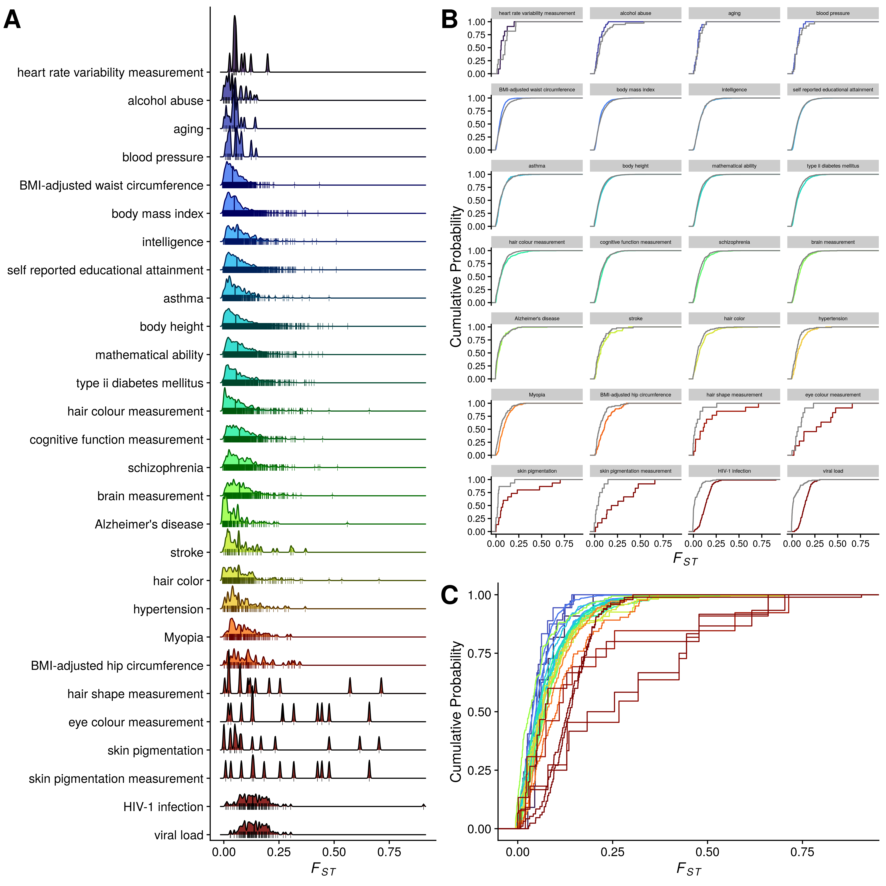

# Variation in the frequency of trait-associated alleles across global human populations {#Fst-chap}

## Background {#Fst-background}

As seen in previous chapters, an individual's phenotypic value at a given point in time is the product of complex interactions between their genome and their environment, accumulating during their initial development and continuing throughout their lifetimes. 

A richer understanding of the cumulative effect of genetic variants on any trait allows for the prediction of the value that an individual is most likely to have for that trait. Of all human traits, diseases are particularly salient -- in 2018, the global healthcare industry was valued at US\$8 trillion, and predicted to increase to US\$12 trillion by 2022 [@11TrillionGlobal2019]. This strong financial imperative complements the moral imperative to reduce suffering, together driving many to determine how to use genetic information to improve human health.

Humans have long sought to use genetic information to predict an individual's likely value for a given trait, in humans and other organisms (Chapter \@ref(Introduction)). More recently, since it became possible to sequence human genomes at scale, it is thought that by combining detailed genetic information with with other environmental and phenotypic information (such as lifestyle or clinical factors), clinicians could move towards the practice of "precision medicine", where interventions could be tailored to their patients' unique risk profiles [@wrayPredictionIndividualGenetic2007]. 

### Polygenic Risk Scores (PRS) and Genome-Wide Association Studies (GWAS)

The genetic component of precision medicine requires the construction of "polygenic risk scores" (**PRS**), also known as genetic risk profiling. PRS seek to predict the likelihood of a given trait based on an individual's genomic variants. To date, PRS studies have shown reliable yet modest improvement above clinical models to predictions for a variety of health-related traits including blood pressure, breast cancer [@maasBreastCancerRisk2016], prostate cancer, [@schumacherAssociationAnalysesMore2018], type I diabetes [@sharpDevelopmentStandardizationImproved2019].

PRS scores can further be combined with lifestyle and clinical factors to more accurately predict the risk of cardiovascular disease [@kheraGenomewidePolygenicScores2018; @kulloIncorporatingGeneticRisk2016; @natarajanPolygenicRiskScore2017; @paquettePolygenicRiskScore2017; @tikkanenGeneticRiskPrediction2013].

The scores are calculated by summing the trait-associated alleles identified through genome-wide association studies (**GWAS**), as weighted by the alleles' effect sizes [@duncanAnalysisPolygenicRisk2019]. However, most GWAS have been performed with individuals of European ancestry, despite only constituting 16% of the current global population. Although the proportion of participants in GWAS from a non-European background increased from 4% in 2009 to 16 % in 2016 [@popejoyGenomicsFailingDiversity2016]), as of 2019, 79% of all GWAS participants recorded in the GWAS Catalog were of European ancestry, and the proportion of non-European individuals has remained the same or reduced since late 2014 [@martinClinicalUseCurrent2019]. This bias also extends to PRS studies, where as of 2019, only 67% of them included only participants of European ancestry, with another 19% including only East Asian ancestry participants, and only 3.8% with cohorts of African, Hispanic, or Indigenous ancestry [@duncanAnalysisPolygenicRisk2019]. 

The consequence of this under-representation of non-European populations is that PRS scores are far better at predicting disease risk in individuals of European ancestry than in those of non-European ancestry [@martinHumanDemographicHistory2017; @martinClinicalUseCurrent2019]. For example, @martinHumanDemographicHistory2017 found that height was predicted to decrease with genetic distance from Europeans, despite robust evidence that West Africans are as tall as Europeans on average. Indeed, the predictive accuracy of PRS scores decays with genetic divergence of the GWAS "independent" or "test" sample from the  "discovery" - or "training" - sample, as established in both humans [@martinHumanDemographicHistory2017; @martinClinicalUseCurrent2019], and livestock [@clarkImportanceInformationRelatives2012; @habierImpactGeneticRelationship2010; @pszczolaReliabilityDirectGenomic2012].

These differences in representation cause PRS scores to have a lower accuracy for individuals of non-European ancestry. For example, compared to PRS scores for those of European ancestry, PRS scores across multiple traits for individuals of African ancestry are ~64-78% less accurate [@duncanAnalysisPolygenicRisk2019; @martinClinicalUseCurrent2019], and for individuals of South-Asian ancestry ~37% less accurate, and ~50% less accurate for individuals of East-Asian ancestry [@martinClinicalUseCurrent2019].

### Potential factors for PRS non-transferability

What explains this disparity in predictive value? A number of factors may be responsible, including:

1. GWAS neglect causal variants that do not exist within the "discovery" sample [@martinClinicalUseCurrent2019].

1. The sample populations may differ in linkage disequilibrium (**LD**) -- the correlation structure of the genome -- which would change the estimated effect sizes of the causal variants, even when the causal variants themselves are the same [@martinClinicalUseCurrent2019].

1. Allele frequencies of the causal variants, and the distribution of the effect sizes of the causal variants, may differ between populations [@martinHumanDemographicHistory2017; @scutariUsingGeneticDistance2016]. 

1. The environments and demographies may differ between populations. These differences are often correlated with genetic divergence due to geography, making it difficult to determine whether the associations are driven by the differences between population in their genetics, or their environments [@martinClinicalUseCurrent2019; @kerminenGeographicVariationBias2019]. 

The first three factors can degrade predictive performance even in the absence of biological and environmental differences, whereas environmental and demographic differences can drive forces of natural selection can in turn drive differences in causal genetic architecture [@martinClinicalUseCurrent2019]. 

Differences in LD and allele frequencies between populations can explain 70-80% of the loss of PRS relative accuracy for traits like body mass index and type 2 diabetes [@wangTheoreticalEmpiricalQuantification2020]. 

I discuss each of these factors in turn

#### Failure to discover causal variants in diverse populations

The power to discover a causal variant through GWAS depends on the variant's effect size and frequency in the study population [@martinClinicalUseCurrent2019; @shamPowerLinkageAssociation2000]. That is to say, the greater the effect of the variant, or the more common it is, the more likely it is to be discovered.

Many SNP arrays used for GWAS do not sequence the whole genome, but rather a selection (from several hundred thousand to millions) of genetic markers intended to present common genomic variation [@porcuGenotypeImputationGenomeWide2013]. To increase the density of genotypes, which would increase the likelihood of refining the association signal and identifying causal variants, researchers often "impute" variants that aren't sequenced directly [@porcuGenotypeImputationGenomeWide2013]. The imputation process involves "phasing" the study genotypes onto the genotypes of a "reference panel" [@mccarthyReferencePanel642016]. However, if the reference panel does not sufficiently represent the populations in the study sample, they are likely to miss or incorrectly impute those genotypes [@martinClinicalUseCurrent2019].

#### Differences in LD between populations

To illustrate the problem, if a SNP has an LD $r^2$ with a causal variant of 0.8 in the discovery population and 0.6 in the target population, it would explain 25% = (1 - 0.6/0.8) less trait variation in the target population, and would therefore be less predictive [@wangTheoreticalEmpiricalQuantification2020]. Differences in effect-size estimates may typically be small for most regions of the genome, but PRS sum across these effects, therefore aggregating these population differences [@martinClinicalUseCurrent2019]. Previous empirical and simulation studies have shown that accruacy of PRS scores decay wtih increased genetic differentation ($F_{ST}$) and LD differences between populations [@habierImpactGeneticRelationship2010; @pszczolaReliabilityDirectGenomic2012; @scutariUsingGeneticDistance2016; @wangTheoreticalEmpiricalQuantification2020].

It was demonstrated in simulations that using LD information from an external reference panel as a prior to infer the posterior mean effect size of a genetic variant can improve PRS predictive accuracy  [@vilhjalmsson2015modeling].

Genetic divergence between popoulations can be measured by $F_{ST}$, and the correlation between true and predicted phenotypic valaues decays approximately linearly with respect to $F_{ST}$ [@scutariUsingGeneticDistance2016].

#### Differences in allele frequencies between populations

Causal variants can differ in both frequency and effect size between different ancestry groups (e.g. for lactase persistence)

As $F_{ST}$ does not take into account the effect size or direction of the effect of the trait-associated allele, for highly-polygenic traits like the ones shown here, $F_{ST}$ is almost entirely decoupled from the mean additive genetic value (or polygenic risk score) between populations [@bergPopulationGeneticSignal2014a].

## Analysis {#Fst-analysis-chap}

In this chapter I illustrate the distribution of $F_{ST}$ scores for loci associated with 587 traits, a subset of the GWAS Catalog that passed our criteria for suitable polygenic traits (see Chapter \@ref(Fst-analysis-chap)). Our analysis is empirical, in that we do not explicitly formulate a statistical test for drift or selection, differential or otherwise. Using high-coverage sequence data for 2,504 individuals from the 1000 Genomes Project phase 3 release, for each trait in the GWAS Catalog we calculated the distribution of $F_{ST}$ across all approximately-unlinked SNPs associated with it (trait SNPs), and compared these $F_{ST}$ distributions with the $F_{ST}$ distributions of random-selected SNPs that were matched to the trait SNPs by their allele frequencies in European populations (control SNPs). Our results show that traits related to the physical correlates of "race" (such as skin-pigmentation, eye colour, and hair shape) tend to have relatively high $F_{ST}$ values – signifying relatively high variance in allele frequencies between populations – whereas traits related to intelligence (such as self-reported EA, mathematical ability, and cognitive function measurement) tend to have lower $F_{ST}$ values that are similar to those of most polygenic traits such as height and body mass index.

### 1000 Genomes

As the reference for human genomic variation across diverse populations, we used the New York Genome Center high-coverage, phased .vcf files[@IndexVol1Ftp] for the 2,504 individuals described in the 1000 Genomes phase 3 release.[@10002015global] We then annotated those .vcf files with human SNP IDs from dbSNP release 9606.[@smigielskiDbSNPDatabaseSingle2000]

### GWAS Catalog

We used the R package *gwasrapidd*[@magnoGwasrapiddPackageQuery2020] to query all traits in the GWAS Catalog[@macarthurNewNHGRIEBICatalog2017] as of 9 August 2021 ($N_{TRAITS}$ = 3,459). For 541 of these traits, no matching variant IDs could be pulled out from the 1000 Genomes VCFs, leaving $N_{TRAITS}$ = 3,008. 

### Linkage disequilibrium

To obtain the "trait SNP" dataset, for each trait, we sought to isolate the SNP closest to each of its true causal variants, and exclude the SNPs in linkage disequilibrium (LD) with them. To this end, we used PLINK 1.9[@changSecondgenerationPLINKRising2015; @purcellPLINK] to "clump" the SNPs associated with each of the remaining 3,008 traits, using an index variant p-value threshold of $10^{-8}$,[@panagiotouWhatShouldGenomewide2012] $r^2$ threshold of 0.1,[@hillLinkageDisequilibriumFinite1968] and base window size of 1 Mb. This process left us with 2,045 traits with at least one index SNP that met the p-value threshold. The index SNPs for each trait formed our set of trait SNPs. In order to target relatively polygenic traits, we further filtered out traits with fewer than 10 trait SNPs, leaving $N_{TRAITS}$ = 587. Supplementary Fig. 4 shows the counts of unique SNP IDs associated with each trait before and after clumping, and an interactive version is available in the notebook cited above. 

### Control SNPs

To obtain our "control SNP" dataset, we assigned each trait SNP to one of 20 bins based on its minor allele frequency in European populations (as provided in the original 1000 Genomes .vcf files under the column header ‘INFO/AC_EUR’). For example, if a trait SNP had a minor allele frequency of 0.08 in European populations, it was assigned to the $(0.05, 0.1]$ bin. We did the same for all (unassociated) SNPs in the .vcf files, then paired each trait SNP with a random SNP from the .vcf file in the equivalent bin. These allele-frequency-paired random SNPs formed our set of "control SNPs", which we used to infer the $F_{ST}$ distribution of a random set of SNPs with the same allele frequencies as the trait SNPs, and against which we could compare the $F_{ST}$ distribution of the trait SNPs.

### $F_{ST}$ and ranking traits by signed Kolmogorov-Smirnov $D$ statistic

We then calculated $F_{ST}$ for each of the trait SNPs and their matched control SNPs using the Weir and Cockerham method,[@weirEstimatingFStatisticsAnalysis1984] as implemented in the R package *pegas*.[@paradisPegasPackagePopulation2010] To rank all traits based on the directional difference in $F_{ST}$ distributions between trait and control SNPs, we ran three Kolmogorov-Smirnov (KS) tests for each trait $t$ with $x_t$ = $F_{ST, trait SNPs}$ and $y_t$ = $F_{ST, control SNPs}$:

1. two-sided ($D_t$) ; 

1. one-sided "greater" ($D_t^+$) ; and 

1. one-sided "less" ($D_t^-$).

I note that $D_{t} = max(D_t^+, D_t^-)$, where $D_t^+$ is the greatest vertical distance attained by the eCDF of $x_t$ over the eCDF of $y_t$, and $D_t^-$ is the greatest vertical distance attained by the eCDF of $y_t$ over the eCDF of $x_t$.[@conoverPracticalNonparametricStatistics1999; @durbinDistributionTheoryTests1973] Accordingly, we used a comparison of $D_t^+$ and $D_t^-$ to created a signed D statistic ($D$), based on the logic that trait SNPs with a lower overall $F_{ST}$ than control SNPs tend to have a higher $D$ under the "greater" test than the "less" test, and vice versa. 

Therefore, ${D_t^S}$:

$$
\begin{aligned}
D_t^- > D_t^+ &: &-D_t \\
D_t^- = D_t^+ &: &0 \\
D_t^- < D_t^+ &: &D_t \\
\end{aligned}
$$

In **Figure \@ref(fig:FstMain)** we present the $F_{ST}$ distributions of trait SNPs for an illustrative subset of 28 human traits, ranked by ${D_t^S}$ when compared with their matched control SNPs. **Figure \@ref(fig:FstMain)A** shows the densities of SNPs as a function of $F_{ST}$, and **Figure \@ref(fig:FstMain)B and C** show their empirical Cumulative Distribution Functions (eCDFs). **Figure \@ref(fig:FstMain)B** includes the eCDFs of control SNPs in grey. eCDF figures for all 587 traits that passed our filters (Methods) are provided in Supplementary Fig. 1.

(ref:FstMain) Distributions of $F_{ST}$ across 28 illustrative human traits, ranked by signed-D (Kolmogorov-Smirnov test) comparing trait and control SNPs. **A**. $F_{ST}$ density ridge plots with SNP markers. **B**. Empirical Cumulative Distribution Functions (eCDFs) of $F_{ST}$ for trait-associated (colour) and random control (grey) SNPs, faceted by trait. **C**. Consolidated eCDFs of trait-associated SNPs from (B). eCDFs for all traits are included in Supplementary Figure 1.  

(\#fig:FstMain)(ref:FstMain)

