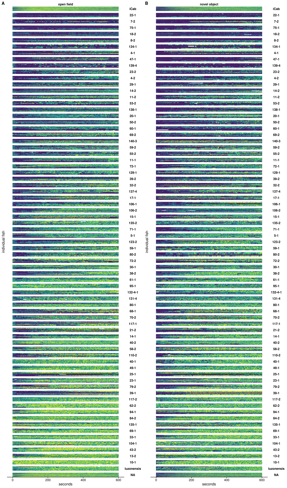
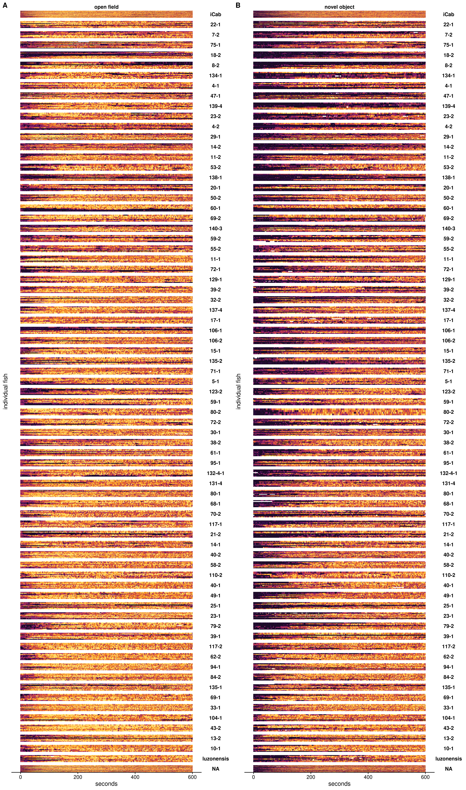

# (APPENDIX) Appendix {-}

# eCDF of all polygenic traits in the GWAS Catalog ranked by ${D_t^S}$ 

(ref:eCDFall) 587 traits from the GWAS Catalog that passed our filters for polygenic traits, ranked by ${D_t^S}$.

(\#fig:eCDFall)(ref:eCDFall)

# 15 HMM states with 0.05 second interval

(\#fig:hmm-states-0.05)(ref:hmm-states-0.05)

# HMM state time dependence for all MIKK panel lines

## Direct genetic effects

### Tile plot

(ref:mikk-all-tile-dge) Tile plot for all 1610 test fishes included in the MIKK panel behaviour analysis, ordered by each line's group median for individual mean speed over the course of the 20-minute video (open field and novel object combined). The order of lines is identical to that shown in **Figure \@ref(fig:mikk-mean-speed)**. 

(\#fig:mikk-all-tile-dge)(ref:mikk-all-tile-dge)

### Density plot

(ref:mikk-all-dens-dge) Density plot for all 1610 test fishes included in the MIKK panel behaviour analysis, ordered by each line's group median for individual mean speed over the course of the 20-minute video (open field and novel object combined). The order of lines is identical to that shown in **Figure \@ref(fig:mikk-mean-speed)**. 

(\#fig:mikk-all-dens-dge)(ref:mikk-all-tile-dge)

## Social genetic effects

### Tile plot

(ref:mikk-all-tile-sge) Tile plot for all 1610 reference fishes included in the MIKK panel behaviour analysis, ordered by each line's group median for individual mean speed over the course of the 20-minute video (open field and novel object combined). The order of lines is identical to that shown in **Figure \@ref(fig:mikk-mean-speed)**. 

(\#fig:mikk-all-tile-sge)(ref:mikk-all-tile-sge)

### Density plot

(ref:mikk-all-dens-sge) Density plot for all 1610 test fishes included in the MIKK panel behaviour analysis, ordered by each line's group median for individual mean speed over the course of the 20-minute video (open field and novel object combined). The order of lines is identical to that shown in **Figure \@ref(fig:mikk-mean-speed)**. 

(\#fig:mikk-all-dens-sge)(ref:mikk-all-tile-sge)

