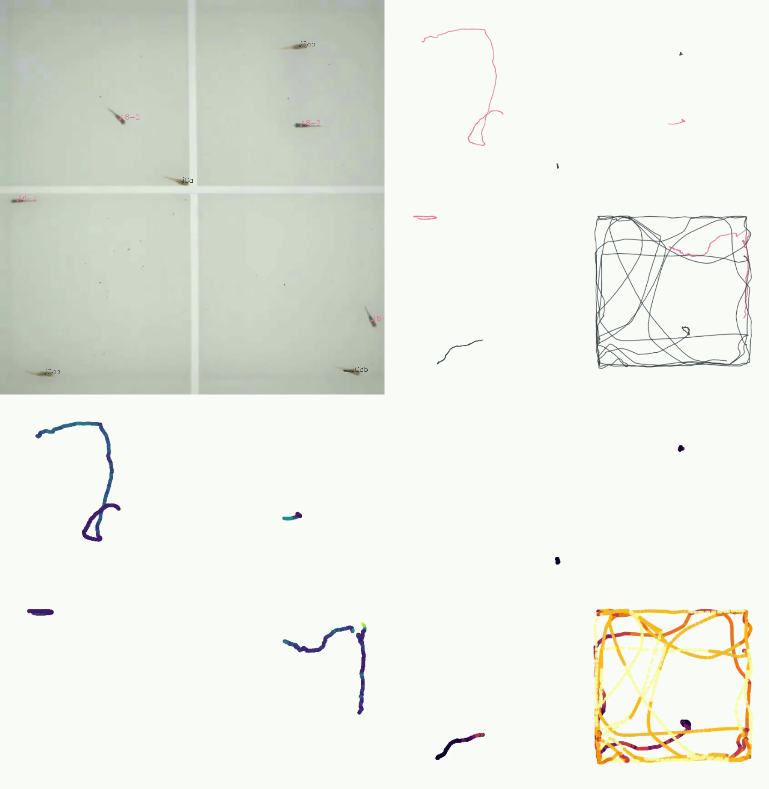
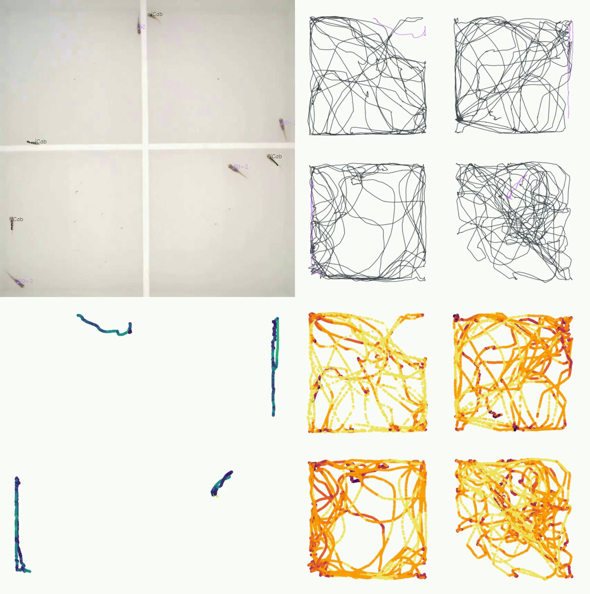
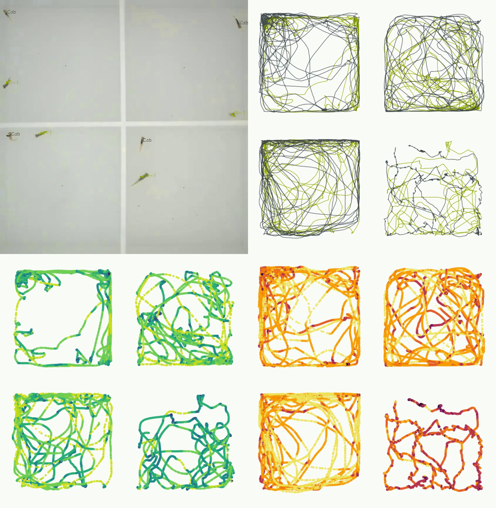
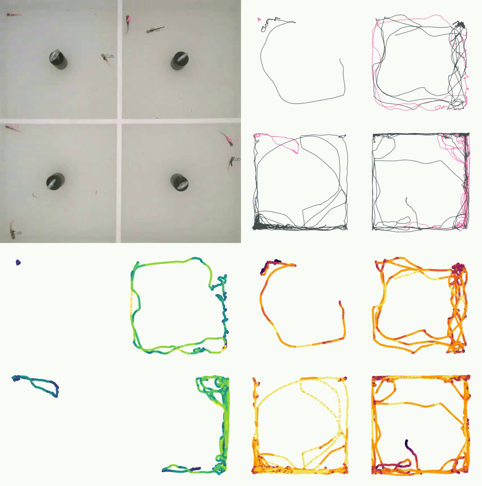
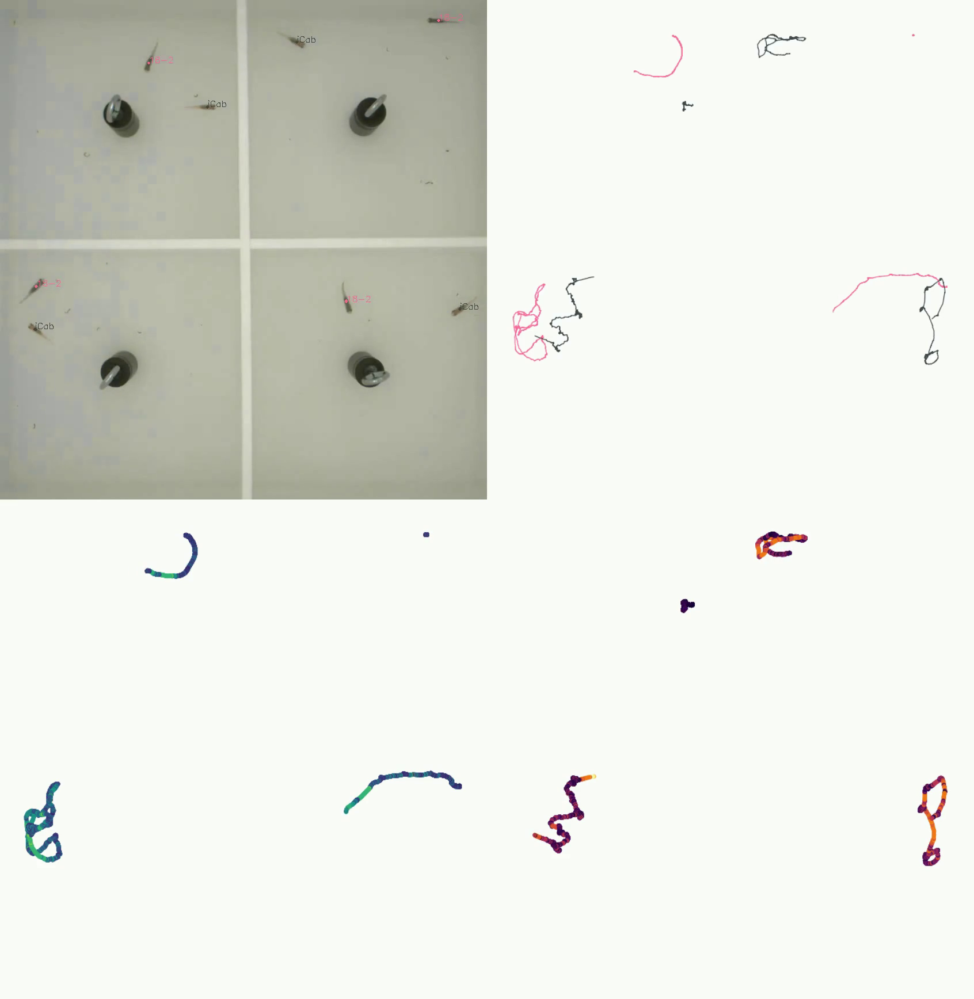
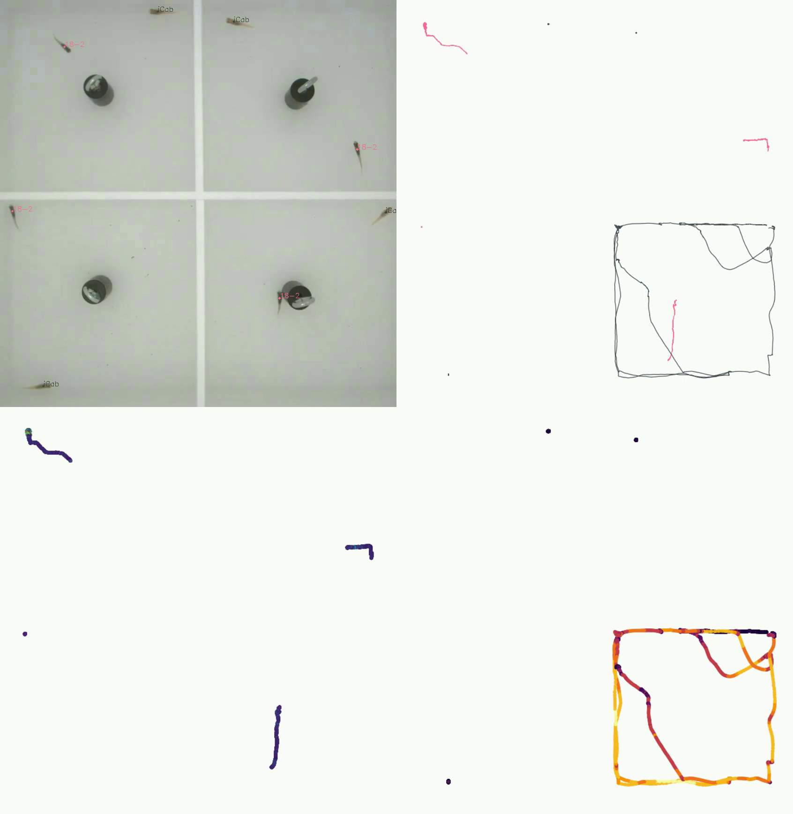

# (APPENDIX) Appendix {-}

# 15 HMM states with 0.05 second interval

(ref:hmm-states-05) HMM states predicted for the F0 dataset, using the combination of a 0.05-second interval between which the distance and angle variables were calculated.

(\#fig:hmm-states-05)(ref:hmm-states-05)

# Four-panel plots for MIKK lines selected for the F2 cross {#four-panel-app}

All frame grabs were taken at the 300th second (5-minute mark) of each 10-minute assay component.

## Open field

### 8-2

(ref:4p-8-2-of-A) Line 8-2, open field, run A.

(\#fig:4p-8-2-of-A)(ref:4p-8-2-of-A)

(ref:4p-8-2-of-B) Line 8-2, open field, run B.

(\#fig:4p-8-2-of-B)(ref:4p-8-2-of-B)

### 18-2

(ref:4p-18-2-of-A) Line 18-2, open field, run A.

(\#fig:4p-18-2-of-A)(ref:4p-18-2-of-A)

(ref:4p-18-2-of-B) Line 18-2, open field, run B.

(\#fig:4p-18-2-of-B)(ref:4p-18-2-of-B)

(ref:4p-18-2-of-C) Line 18-2, open field, run C.

(\#fig:4p-18-2-of-C)(ref:4p-18-2-of-C)

### 50-2

(ref:4p-50-2-of-A) Line 50-2, open field, run A.

(\#fig:4p-50-2-of-A)(ref:4p-50-2-of-A)

(ref:4p-50-2-of-B) Line 50-2, open field, run B.

(\#fig:4p-50-2-of-B)(ref:4p-50-2-of-B)

(ref:4p-50-2-of-C) Line 50-2, open field, run C.

(\#fig:4p-50-2-of-C)(ref:4p-50-2-of-C)

### 38-2

(ref:4p-38-2-of-A) Line 38-2, open field, run A.

(\#fig:4p-38-2-of-A)(ref:4p-38-2-of-A)

(ref:4p-38-2-of-B) Line 38-2, open field, run B.

(\#fig:4p-38-2-of-B)(ref:4p-38-2-of-B)

### 21-2

(ref:4p-21-2-of-A) Line 38-2, open field, run A.

(\#fig:4p-21-2-of-A)(ref:4p-21-2-of-A)

(ref:4p-21-2-of-B) Line 38-2, open field, run B.

(\#fig:4p-21-2-of-B)(ref:4p-21-2-of-B)

### 40-1

(ref:4p-40-1-of-A) Line 40-1, open field, run A.

(\#fig:4p-40-1-of-A)(ref:4p-40-1-of-A)

(ref:4p-40-1-of-B) Line 40-1, open field, run B.

(\#fig:4p-40-1-of-B)(ref:4p-40-1-of-B)

## Novel object

### 8-2

(ref:4p-8-2-no-A) Line 8-2, novel object, run A.

(\#fig:4p-8-2-no-A)(ref:4p-8-2-no-A)

(ref:4p-8-2-no-B) Line 8-2, novel object, run B.

(\#fig:4p-8-2-no-B)(ref:4p-8-2-no-B)

### 18-2

(ref:4p-18-2-no-A) Line 18-2, novel object, run A.

(\#fig:4p-18-2-no-A)(ref:4p-18-2-no-A)

(ref:4p-18-2-no-B) Line 18-2, novel object, run B.

(\#fig:4p-18-2-no-B)(ref:4p-18-2-no-B)

(ref:4p-18-2-no-C) Line 18-2, novel object, run C.

(\#fig:4p-18-2-no-C)(ref:4p-18-2-no-C)

### 50-2

(ref:4p-50-2-no-A) Line 50-2, novel object, run A.

(\#fig:4p-50-2-no-A)(ref:4p-50-2-no-A)

(ref:4p-50-2-no-B) Line 50-2, novel object, run B.

(\#fig:4p-50-2-no-B)(ref:4p-50-2-no-B)

(ref:4p-50-2-no-C) Line 50-2, novel object, run C.

(\#fig:4p-50-2-no-C)(ref:4p-50-2-no-C)

### 38-2

(ref:4p-38-2-no-A) Line 38-2, novel object, run A.

(\#fig:4p-38-2-no-A)(ref:4p-38-2-no-A)

(ref:4p-38-2-no-B) Line 38-2, novel object, run B.

(\#fig:4p-38-2-no-B)(ref:4p-38-2-no-B)

### 21-2

(ref:4p-21-2-no-A) Line 38-2, novel object, run A.

(\#fig:4p-21-2-no-A)(ref:4p-21-2-no-A)

(ref:4p-21-2-no-B) Line 38-2, novel object, run B.

(\#fig:4p-21-2-no-B)(ref:4p-21-2-no-B)

### 40-1

(ref:4p-40-1-no-A) Line 40-1, novel object, run A.

(\#fig:4p-40-1-no-A)(ref:4p-40-1-no-A)

(ref:4p-40-1-no-B) Line 40-1, novel object, run B.

(\#fig:4p-40-1-no-B)(ref:4p-40-1-no-B)

# HMM state time dependence for all MIKK panel lines

## Direct genetic effects

### Tile plot

(ref:mikk-all-tile-dge) Tile plot for all 1610 test fishes included in the MIKK panel behaviour analysis, ordered by each line's group median for individual mean speed over the course of the 20-minute video (open field and novel object combined). The order of lines is identical to that shown in **Figure \@ref(fig:mikk-mean-speed)**. 

(\#fig:mikk-all-tile-dge)(ref:mikk-all-tile-dge)

### Density plot

(ref:mikk-all-dens-dge) Density plot for all 1610 test fishes included in the MIKK panel behaviour analysis, ordered by each line's group median for individual mean speed over the course of the 20-minute video (open field and novel object combined). The order of lines is identical to that shown in **Figure \@ref(fig:mikk-mean-speed)**. 

(\#fig:mikk-all-dens-dge)(ref:mikk-all-tile-dge)

## Social genetic effects

### Tile plot

(ref:mikk-all-tile-sge) Tile plot for all 1610 reference fishes included in the MIKK panel behaviour analysis, ordered by each line's group median for individual mean speed over the course of the 20-minute video (open field and novel object combined). The order of lines is identical to that shown in **Figure \@ref(fig:mikk-mean-speed)**. 

(\#fig:mikk-all-tile-sge)(ref:mikk-all-tile-sge)

### Density plot

(ref:mikk-all-dens-sge) Density plot for all 1610 test fishes included in the MIKK panel behaviour analysis, ordered by each line's group median for individual mean speed over the course of the 20-minute video (open field and novel object combined). The order of lines is identical to that shown in **Figure \@ref(fig:mikk-mean-speed)**. 

(\#fig:mikk-all-dens-sge)(ref:mikk-all-tile-sge)

# F2 recombination karyoplot with missing calls

(ref:F2-recomb-blocks-missing) Karyoplot for F2 samples, coloured by genotype. Samples are sorted in the order in which they were phenotyped. Blocks are filled with the colour of the paternal F0 line for the homozygous paternal haplotype block, black for heterozygous, and the colour of the maternal F0 line for the homozygous maternal haplotype block. 

(\#fig:F2-recomb-blocks-missing)(ref:F2-recomb-blocks-missing)

# LOCO GRM for chromosome 1 

(ref:loco-grm-chr1) "Leave-one-chromosome-out" genetic relationship matrix for 271 F2 samples based on 44,284 non-missing SNPs, having excluded 76 SNPs on chromosome 1.

(\#fig:loco-grm-chr1)(ref:loco-grm-chr1)

# eCDF of all polygenic traits in the GWAS Catalog ranked by ${D_t^S}$ 

(ref:eCDFall) 587 traits from the GWAS Catalog that passed our filters for polygenic traits, ranked by ${D_t^S}$.

(\#fig:eCDFall)(ref:eCDFall)

